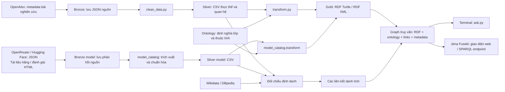

# AI Models & Research — dự án Semantic Web

## Overview: hệ thống làm gì?

Dự án thu thập thông tin về nghiên cứu AI và các model AI, tổ chức chúng thành một mạng dữ liệu có liên kết, rồi cho phép người dùng truy vấn. Ví dụ: tìm tác giả và tổ chức của một bài nghiên cứu, hoặc tìm những bên cung cấp API Claude Opus và giá của từng bên.

Thông tin mô tả, hay **metadata**, gồm tên bài, tác giả, năm, tên model, khả năng và nguồn thông tin. Project thu thập và liên kết các thông tin này để trả lời câu hỏi bằng dữ liệu có cấu trúc.

**Semantic Web** là cách biểu diễn dữ liệu trên Web để máy tính hiểu các thực thể và quan hệ giữa chúng. Trong dự án, máy đọc được “bài báo có tác giả”, “tác giả thuộc tổ chức trong bài đó”, “dịch vụ cung cấp model” và “dịch vụ có giá”. Mạng các thực thể và quan hệ này được gọi là **knowledge graph**, hay đồ thị tri thức.

Repo hiện có hai phần:

| Phần | Dữ liệu và câu hỏi chính | Ontology / dữ liệu RDF |
|---|---|---|
| Nghiên cứu AI | Bài nào nhiều trích dẫn? Ai viết? Thuộc tổ chức nào? Công bố ở đâu? | [ontology.ttl](res/ontology.ttl): 10 lớp; [research.ttl](src/data/gold/research.ttl) |
| Model và API | Model có thông số gì? Những bên nào cung cấp API? Giá và kết quả đánh giá ra sao? | [model-ontology.ttl](res/model-ontology.ttl): 13 lớp; [models.ttl](src/data/gold/models.ttl) |

Hai phần có pipeline riêng. Dữ liệu bài báo chưa được tự nối với model bằng quan hệ “bài này tạo ra model này”. Năm bước bên dưới giải thích đầy đủ phần nghiên cứu OpenAlex theo yêu cầu ontology 10 lớp; mỗi bước cũng chỉ ra file tương ứng của phần model/API.

### Luồng tổng thể

Các tên Bronze, Silver và Gold chỉ ba giai đoạn xử lý: dữ liệu nguồn, bảng đã chuẩn hóa và dữ liệu RDF dùng để truy vấn.



Ontology mô tả cấu trúc; Gold chứa các thực thể thật; links nối thực thể với nguồn bên ngoài; metadata ghi nguồn, thời điểm và thông tin về tập dữ liệu. Người dùng truy vấn graph kết hợp bốn thành phần này.

### Tình trạng hiện tại

Các con số dưới là của snapshot đã lưu trong repo, không phải dữ liệu cập nhật trực tiếp mỗi lần query.

| Phần | Snapshot / kết quả đã ghi nhận |
|---|---|
| Nghiên cứu — 04/10/2026 | 200 bài, 1.807 người, 307 tổ chức, 65 nguồn xuất bản, 19 publisher, 2.128 lượt tham gia viết bài |
| Phân loại nghiên cứu | 101 topic, 33 subfield, 11 field, 4 domain |
| RDF nghiên cứu | 49.459 triples dữ liệu; graph kết hợp ontology, links và metadata có 52.251 triples |
| Liên kết nghiên cứu | 2.593 links: 2.547 về OpenAlex, 35 về Wikidata, 11 về DBpedia |
| Model/API — 05/10/2026 | 481 model/listing, 1.909 dịch vụ/cấu hình cung cấp API, 8.174 bản ghi giá |
| Thông tin model bổ sung | 92 bộ thông tin mô tả model từ đơn vị phát hành trên Hugging Face; 471 kết quả đánh giá; 4 bản ghi model–bài nhận xét từ 3 bài |
| Kiểm chứng đã lưu | Nghiên cứu: 10 query và báo cáo không có lỗi; model: 13 query, graph kết hợp có 353.882 triples; [báo cáo](docs/MODEL_VALIDATION.md) ghi 27 tests đạt |

Một mục trong danh mục (listing) có thể là tên gọi khác, bản dùng miễn phí (free) hoặc bản xử lý theo lô (batch) của cùng model. Vì vậy, 481 mục không đồng nghĩa 481 bộ trọng số độc lập. Điểm đánh giá và bài nhận xét chỉ có cho một phần model. Cấu hình chạy Fuseki đã có; kết quả trên server phụ thuộc các file bạn đã nạp vào dataset.

## 1. Define an ontology — định nghĩa cấu trúc dữ liệu

### Ontology là gì và được thiết kế thế nào?

Ontology là bộ định nghĩa cho các loại thực thể, thuộc tính và quan hệ của miền dữ liệu. **Class/lớp** là một loại, ví dụ `Person`; **instance/thực thể** là một đối tượng cụ thể, ví dụ Daniel Povey. **Property/thuộc tính** mô tả một giá trị hoặc nối hai thực thể, ví dụ năm xuất bản hoặc quan hệ bài–tác giả.

Dự án thiết kế ontology theo [ONTOLOGY_ENGINEERING_SKILL.md](../ONTOLOGY_ENGINEERING_SKILL.md):

| Bước thiết kế | Quyết định cụ thể của project | Tài liệu |
|---|---|---|
| Phạm vi | Metadata bài nghiên cứu AI/LLM trong mẫu OpenAlex: tác giả, tổ chức, nơi xuất bản, phân loại, tài liệu tham khảo. Giữ thông tin affiliation theo từng bài. | [requirements.md](docs/requirements.md) |
| Kịch bản | Sinh viên tìm bài; nhóm nghiên cứu xem tổ chức/hợp tác; người đánh giá kiểm tra nguồn và liên kết dữ liệu. | [requirements.md](docs/requirements.md) |
| Câu hỏi | Bài nào nhiều trích dẫn? Ai viết và thuộc tổ chức nào trong bài đó? Topic nằm trong ngành nào? Thực thể nào có link ngoài? | [competency-questions.md](docs/competency-questions.md) |
| Glossary | Bảng giải nghĩa thống nhất: Paper là công trình; Person là người; Authorship là một người tham gia viết một bài cụ thể; Source khác Publisher. | [glossary.md](docs/glossary.md) |
| 10 lớp | Chọn các loại thực thể cần để trả lời những câu hỏi trên. | [ontology.ttl](res/ontology.ttl) |
| Properties/axioms | Định nghĩa quan hệ, kiểu giá trị và các quy tắc suy luận. | [ontology-design.md](docs/ontology-design.md) |
| Kiểm tra | Đọc được RDF, kiểm tra cấu trúc/kiểu dữ liệu, chạy query có kết quả kỳ vọng và kiểm tra suy luận. | [validate.py](src/validate.py), [test_pipeline.py](tests/test_pipeline.py) |

“Competency question” là câu hỏi dùng để kiểm tra ontology có mô tả đủ dữ liệu cho bài toán không. Ví dụ câu “ai viết bài và thuộc tổ chức nào?” dẫn đến ba lớp Person, Authorship, ResearchInstitution và các quan hệ nối chúng.

### Cụ thể có 10 lớp nào?

| Class | Ý nghĩa / ví dụ | Bảng CSV tương ứng |
|---|---|---|
| `ResearchPaper` | Một công trình: article, conference paper, preprint hoặc review | `papers.csv` |
| `Person` | Người tham gia viết bài, như Daniel Povey | `people.csv` |
| `ResearchInstitution` | Tổ chức được ghi trong affiliation: trường, phòng thí nghiệm, công ty | `institutions.csv` |
| `PublicationSource` | Nơi công bố/lưu bài: tạp chí, hội nghị, repository như arXiv | `sources.csv` |
| `Publisher` | Tổ chức xuất bản được OpenAlex nhận diện bằng ID P | `publishers.csv` |
| `ResearchTopic` | Chủ đề chi tiết, ví dụ Topic Modeling | `topics.csv` |
| `ResearchSubfield` | Nhóm chủ đề, ví dụ Artificial Intelligence | `subfields.csv` |
| `ResearchField` | Ngành, ví dụ Computer Science | `fields.csv` |
| `ResearchDomain` | Nhóm ngành rộng, ví dụ Physical Sciences; “domain” ở đây là lĩnh vực | `domains.csv` |
| `Authorship` | Một người tham gia viết một bài, kèm vị trí tác giả và affiliation | `authorships.csv` |

Authorship giải quyết việc cùng một người có thể thuộc tổ chức I1 khi viết bài W1 và tổ chức I2 khi viết bài W2. Project tạo hai Authorship riêng, nhận diện bằng cặp work ID + author ID.

### Quan hệ, giá trị và quy tắc

**Object property** nối hai thực thể; **datatype property** gắn thực thể với giá trị như số, ngày hoặc chuỗi.

| Quan hệ / giá trị | Cách đọc |
|---|---|
| `ResearchPaper —hasAuthorship→ Authorship —authorPerson→ Person` | Bài có một lượt tham gia viết của người này |
| `Authorship —affiliatedInstitution→ ResearchInstitution` | Người báo affiliation này trong bối cảnh bài đó |
| `ResearchPaper —publishedIn→ PublicationSource —publishedBy→ Publisher` | Bài ở nguồn xuất bản; nguồn do publisher này xuất bản |
| `ResearchPaper —hasTopic/primaryTopic→ ResearchTopic` | Bài được OpenAlex gán chủ đề/chủ đề chính |
| `ResearchTopic —inSubfield→ ResearchSubfield —inField→ ResearchField —inDomain→ ResearchDomain` | Các cấp phân loại chủ đề |
| `dcterms:references`, `schema:author`, `dcterms:source` | Bài tham khảo công trình; bài có tác giả; bản ghi lấy từ nguồn nào |
| `publicationYear`, `citationCount`, `isOpenAccess` | Năm xuất bản, số lần được trích dẫn, trạng thái truy cập mở |
| `authorPosition`, `isCorresponding` | Vị trí first/middle/last và trạng thái tác giả liên hệ của Authorship |

**Axiom** là một quy tắc logic của ontology. `ResearchPaper` là lớp con của `schema:ScholarlyArticle`; Person là lớp con của `schema:Person`; tổ chức tái sử dụng `schema:Organization`; các lớp phân loại là `skos:Concept`.

`hasAuthorship` và `authoredPaper` là hai quan hệ ngược nhau: biết bài có Authorship thì bộ suy luận có thể tạo cạnh Authorship thuộc bài. `primaryTopic` là quan hệ con của `hasTopic`. Topic thuộc subfield qua quan hệ phân loại; project không định nghĩa Topic là lớp con của Subfield.

`domain/range` cho biết loại thực thể ở hai đầu thuộc tính và có thể suy ra type. Ví dụ `authorPerson` có domain Authorship, range Person. Chúng không phải kiểm tra “bắt buộc điền cột”. Ontology khai báo một số loại tách biệt, như Paper và Person; Publisher và ResearchInstitution được phép cùng mô tả một tổ chức.

### Kiểm tra cụ thể ra sao?

[validate.py](src/validate.py) kiểm tra tên/tiêu đề, đúng datatype, mỗi Authorship có đúng một người và thuộc đúng một bài trong bản xuất; affiliation được gắn đúng Authorship. Nó chạy 10 query trong `queries/cq*.rq` và lưu số dòng cùng dòng kết quả đầu tiên.

[Tests](tests/test_pipeline.py) dựng dữ liệu nhỏ có đáp án biết trước: cùng một người viết hai bài với hai affiliations; query phải giữ được từng bối cảnh. Chế độ `--reasoning` dùng OWL RL, một tập quy tắc suy luận, để kiểm tra quan hệ ngược, lớp con và xung đột giữa các loại tách biệt.

```bash
# Chạy từ aimodels/ sau khi chuẩn bị môi trường Python ở bước 5
python -m unittest discover -s tests
python src/validate.py
python src/validate.py --reasoning
```

Ontology 13 lớp của phần model/API gồm: AIModel, ModelFamily, Organization, ModelOffering, Capability, Modality, PriceSpecification, Benchmark, Evaluation, Review, SourceDocument, FactObservation và ExternalLink. Chúng mô tả model, dịch vụ API, khả năng, kiểu đầu vào/đầu ra, giá, đánh giá, tài liệu nguồn và bằng chứng cho từng thông tin. Xem [MODEL_ONTOLOGY.md](docs/MODEL_ONTOLOGY.md).

## 2. Collect relevant data — thu thập từ nguồn nào?

**API** là giao diện cho chương trình yêu cầu dữ liệu từ một dịch vụ. OpenAlex trả JSON, dạng dữ liệu có các cặp tên–giá trị và danh sách lồng nhau. Một work chứa thông tin bài, danh sách tác giả, tổ chức, chủ đề và tài liệu tham khảo.

| Nguồn | Dạng cung cấp và thông tin dùng trong project | Code / file |
|---|---|---|
| OpenAlex `/works` | API JSON: ID, tên bài, DOI, năm/ngày, citation count, open access, authorships, nguồn xuất bản, topics, referenced works | [collect_data.py](src/collect_data.py) → [openalex_works.json](src/data/bronze/openalex_works.json) |
| OpenAlex `/institutions/{id}` | API JSON: tên tổ chức, quốc gia/loại, ROR và ID Wikidata nếu có; bổ sung full record cho tổ chức hay xuất hiện | [openalex_institutions.json](src/data/bronze/openalex_institutions.json) |
| OpenAlex `/sources/{id}` | API JSON: tên/loại nguồn xuất bản, ISSN-L, tổ chức quản lý/publisher, ID Wikidata nếu có | [openalex_sources.json](src/data/bronze/openalex_sources.json) |
| Wikidata | SPARQL trả JSON kết quả: thực thể và ROR để đối chiếu tổ chức | [link_entities.py](src/link_entities.py), dùng ở bước 4 |
| DBpedia | SPARQL trả JSON kết quả: URI resource nối bằng `owl:sameAs` tới QID đã biết | [external_lookups.json](src/data/bronze/external_lookups.json), dùng ở bước 4 |
| DOI / ORCID / ROR | ID có sẵn trong metadata OpenAlex: nhận diện công trình / người / tổ chức | Giữ trong CSV/RDF; project không gọi API riêng để thu thập toàn bộ các hệ thống này |

[collect_data.py](src/collect_data.py) tìm `"large language models"`, lọc primary field Computer Science, loại paratext và giữ article/conference-paper/preprint/review; chọn tối đa 200 bài theo citation count giảm dần. Authors và topics được lấy từ thông tin lồng trong works. Collector lấy thêm full records của tối đa 25 institutions và 25 sources phổ biến.

[collection_manifest.json](src/data/bronze/collection_manifest.json) ghi URL requests, điều kiện tìm, giới hạn, thời điểm, số bài và lỗi. Bronze giữ các đối tượng JSON từ nguồn để chuẩn hóa lại và đối chiếu; collector OpenAlex lưu danh sách works/records, không lưu nguyên vẹn HTTP headers hoặc toàn bộ response envelope.

Đây là mẫu metadata theo tìm kiếm/phân loại của OpenAlex. Toàn văn bài và toàn bộ nghiên cứu AI trên thế giới nằm ngoài tập đã thu thập.

### Nguồn của phần model/API

| Nguồn | Dạng dữ liệu và nội dung |
|---|---|
| OpenRouter | API JSON: danh sách model, mô tả, đầu vào/đầu ra, khả năng API, context; endpoint từng model bổ sung provider, giá và giới hạn |
| Tài liệu hãng: OpenAI, Anthropic, Google, MiniMax, Z.AI, Mistral, Alibaba Cloud, xAI, Meta | Trang HTML về model/giá. Parser hiện trích giá trực tiếp cho OpenAI, Anthropic, MiniMax, Z.AI; các hãng khác có tài liệu liên quan và giá qua OpenRouter |
| Hugging Face | API JSON mô tả model do đơn vị phát hành đăng: giấy phép, tổng số tham số model khi có, thư viện phần mềm và loại tác vụ |
| Artificial Analysis | Một đơn vị đánh giá model. Project lấy một số điểm do đơn vị này đánh giá từ các trường trong JSON OpenRouter; không gọi trực tiếp API Artificial Analysis |
| Aider | Công cụ trợ lý lập trình có bảng đánh giá khả năng giải bài lập trình của model. Project đọc bảng HTML và dùng bảng đối chiếu tên Aider với ID model để gắn kết quả đúng model |
| Các bài review (nhận xét) đã chọn | HTML của bài viết, hiện từ Simon Willison; lưu tác giả, ngày, URL và tóm tắt ngắn có ghi nguồn |

Các nguồn được khai báo trong [model-sources.json](res/model-sources.json). Code thu thập là [collect.py](src/model_catalog/collect.py), [model_cards.py](src/model_catalog/model_cards.py); snapshot và URL/checksum nằm trong [bronze/models](src/data/bronze/models/). Checksum là mã tính từ nội dung, dùng kiểm tra file nguồn có bị thay đổi không. Phần này có hướng dẫn riêng tại [MODEL_CATALOG.md](docs/MODEL_CATALOG.md).

## 3. Transform into 4-star data — từ dữ liệu nguồn sang RDF

### Bronze → Silver → Gold biến đổi những gì?

| Tầng | Dữ liệu đầu vào → xử lý → đầu ra | Code |
|---|---|---|
| Bronze | API OpenAlex → lưu các đối tượng JSON lồng nhau và URL/thời điểm thu thập | [collect_data.py](src/collect_data.py) |
| Silver | JSON Bronze → dùng ID để loại trùng, giữ giá trị đã biết, tách thực thể và quan hệ → CSV trong [silver/](src/data/silver/) | [clean_data.py](src/clean_data.py) |
| Gold | CSV Silver + manifest → tạo URI, triples và typed literals → [research.ttl](src/data/gold/research.ttl), [research.rdf](src/data/gold/research.rdf) | [transform.py](src/transform.py) |
| Liên kết và metadata | ID CSV + nguồn/cache → links có bằng chứng; manifest → mô tả dataset | [link_entities.py](src/link_entities.py), hàm `metadata()` trong transform |
| Graph truy vấn | Ontology + Gold + links + metadata → graph cho SPARQL | `load_graph()` trong [common.py](src/common.py) |

Silver có 10 bảng thực thể tương ứng 10 lớp ở bước 1, cùng ba bảng quan hệ: `authorship_institutions.csv`, `paper_topics.csv`, `references.csv`. ID là khóa nối các bảng. Một người có một dòng trong people nhưng có thể có nhiều dòng trong authorships.

Ví dụ rút gọn từ snapshot: work Kaldi chứa một tác giả Daniel Povey và affiliation Microsoft.

```json
{
  "id": "https://openalex.org/W1524333225",
  "display_name": "Kaldi Speech Recognition Toolkit",
  "authorships": [{
    "author": {
      "id": "https://openalex.org/A5084286453",
      "display_name": "Daniel Povey"
    },
    "author_position": "first",
    "institutions": [{
      "id": "https://openalex.org/I1290206253",
      "display_name": "Microsoft (United States)"
    }]
  }]
}
```

`clean_data.py` tách cấu trúc này ra các bảng:

| Bảng | Phần dữ liệu trong một dòng |
|---|---|
| papers | W1524333225, Kaldi Speech Recognition Toolkit |
| people | A5084286453, Daniel Povey |
| institutions | I1290206253, Microsoft (United States) |
| authorships | W1524333225-A5084286453, paper ID, person ID, first |
| authorship_institutions | W1524333225-A5084286453, institution ID |

Bảng trên viết gọn ID cho dễ đọc; CSV thực tế dùng URL OpenAlex đầy đủ ở các cột entity IDs. Dữ liệu thiếu được giữ là thiếu. Snapshot ghi 445 entries tác giả thiếu author ID bị bỏ qua; đây là số entries, không khẳng định 445 người khác nhau.

### URI, prefix, RDF và typed literal

**URI** là tên định danh duy nhất của thực thể. Hàm `resource()` trong [common.py](src/common.py) lấy ID nguồn để tạo URI HTTP ổn định:

```text
https://openalex.org/W1524333225
→ https://example.org/aimodels/resource/paper/W1524333225
```

Cùng ID luôn tạo cùng URI; đổi tên bài không đổi URI. W/A/I/S/P/T là các ID loại work/author/institution/source/publisher/topic của OpenAlex; phần số không phải số dòng hay thứ hạng.

**RDF** biểu diễn một phát biểu bằng ba thành phần: subject — predicate — object. Ví dụ: bài — có Authorship — lượt viết bài của Daniel. Mỗi phát biểu là một **triple**.

**Prefix** viết tắt phần đầu URI. `ex:ResearchPaper` là `https://example.org/aimodels/ResearchPaper`. `a` viết tắt `rdf:type`, nghĩa là “thuộc lớp”.

```turtle
@prefix ex: <https://example.org/aimodels/> .
@prefix rdfs: <http://www.w3.org/2000/01/rdf-schema#> .

<https://example.org/aimodels/resource/paper/W1524333225>
    a ex:ResearchPaper ;
    rdfs:label "Kaldi Speech Recognition Toolkit" ;
    ex:hasAuthorship <https://example.org/aimodels/resource/authorship/W1524333225-A5084286453> .

<https://example.org/aimodels/resource/authorship/W1524333225-A5084286453>
    a ex:Authorship ;
    ex:authorPerson <https://example.org/aimodels/resource/person/A5084286453> ;
    ex:affiliatedInstitution <https://example.org/aimodels/resource/institution/I1290206253> .
```

`transform.py` tái sử dụng vocabulary chuẩn: RDF/RDFS/OWL cho cấu trúc và ontology; Schema.org cho bài/người/tác giả; Dublin Core (`dcterms`) cho tiêu đề/ngày/nguồn/tham khảo; SKOS cho phân loại. Vocabulary là tập các tên lớp/thuộc tính có ý nghĩa đã được định nghĩa, giúp nguồn khác hiểu cùng cách.

**Literal** là giá trị trực tiếp, như tên, năm hoặc số. **Typed literal** ghi thêm kiểu để SPARQL xử lý đúng:

| Giá trị | Ví dụ Turtle | Cách dùng |
|---|---|---|
| Năm | `"2024"^^xsd:gYear` | Năm xuất bản |
| Ngày | `"2024-01-01"^^xsd:date` | Ngày xuất bản; giá trị minh họa |
| Số nguyên không âm | `"4837"^^xsd:nonNegativeInteger` | Citation count trong snapshot Kaldi |
| Boolean | `"true"^^xsd:boolean` | Trạng thái open access |
| Số thập phân | `"5.0"^^xsd:decimal` | Giá trong graph model/API |

`xsd:` viết tắt `http://www.w3.org/2001/XMLSchema#`; `^^` gắn giá trị với datatype. Giá có kiểu số thì query có thể so `?price < 10`. Đơn vị và tiền tệ vẫn cần trường riêng để biết số đó là USD/token hay USD/triệu token.

`research.ttl` dùng Turtle; `research.rdf` dùng RDF/XML. Chúng chứa cùng graph, nên chỉ chọn một bản để nạp. [dataset-metadata.ttl](res/dataset-metadata.ttl) mô tả nguồn, license metadata OpenAlex, thời điểm và các bản RDF; file này mô tả tập dữ liệu.

4-star LOD dùng định danh URI và chuẩn RDF để liên kết/diễn giải dữ liệu. Project đã tạo các thành phần kỹ thuật này ở local. Muốn công bố đạt 4-star trên Web cần URI truy cập được và dữ liệu tải công khai với license phù hợp. `example.org` hiện là namespace minh họa, chưa trả dữ liệu dự án khi mở URL.

Phần model/API cũng đi qua Bronze → Silver → Gold: [official_sources.py](src/model_catalog/official_sources.py) trích thông tin từ tài liệu; [benchmarks.py](src/model_catalog/benchmarks.py) đọc bảng Aider; [normalize.py](src/model_catalog/normalize.py) tạo CSV model, tổ chức, offering, giá, đánh giá và nguồn; [transform.py](src/model_catalog/transform.py) xuất RDF. “Offering” là một dịch vụ/cấu hình cung cấp model; giá và giới hạn gắn với dịch vụ đó.

## 4. Link toward 5-star data — nối với dataset khác

**QID** là ID một thực thể trong Wikidata, bắt đầu bằng Q; Microsoft có Q2283. URI tương ứng là `http://www.wikidata.org/entity/Q2283`.

**ROR** (Research Organization Registry) là hệ thống định danh tổ chức nghiên cứu. Ví dụ Microsoft được snapshot nhận diện bằng `https://ror.org/00d0nc645`. ID này giúp đối chiếu tổ chức dù tên hiển thị khác nhau.

**owl:sameAs** khẳng định hai URI chỉ cùng một thực thể. Đây là quan hệ danh tính mạnh; tên gần giống nhau hoặc hai trang nói về cùng chủ đề không đủ làm bằng chứng.

[link_entities.py](src/link_entities.py) đọc ID từ CSV rồi nối theo bốn cách:

| Cách nối | Kiểm tra trước khi xuất link |
|---|---|
| Local → OpenAlex | URI local được tạo trực tiếp từ đúng OpenAlex ID, nên giữ link tới ID nguồn |
| Local → Wikidata bằng QID nguồn | Full record institution/source của OpenAlex khai báo QID; dùng QID đó |
| Local → Wikidata bằng exact ROR | Khi institution chưa có QID, hỏi Wikidata thuộc tính `P6782` (ROR ID) có đúng mã ROR đó; chỉ nhận khi có một ứng viên duy nhất. Mặc định thử tối đa 10 institutions |
| Local → DBpedia bằng QID | Hỏi DBpedia resource nào khai báo `owl:sameAs` tới đúng Wikidata URI đã xác định; dùng URI DBpedia trả về |

Ví dụ có thật trong [entity_links.csv](res/entity_links.csv):

```turtle
@prefix owl: <http://www.w3.org/2002/07/owl#> .

<https://example.org/aimodels/resource/institution/I1290206253>
    owl:sameAs <https://openalex.org/I1290206253> ,
               <http://www.wikidata.org/entity/Q2283> ,
               <http://dbpedia.org/resource/Microsoft> .
```

Ba URI ngoài và URI local cùng nhận diện Microsoft. Nhờ liên kết, hệ thống khác có thể đi từ thực thể local sang hồ sơ tương ứng ở các dataset này. Project lưu link; các query local hiện không tự tải mọi thuộc tính của Microsoft từ DBpedia.

| File | Chứa gì / dùng khi nào? |
|---|---|
| [linked_output.nt](res/linked_output.nt) | RDF N-Triples chứa `owl:sameAs`; nạp vào graph truy vấn |
| [entity_links.csv](res/entity_links.csv) | Bằng chứng từng link: URI, phương pháp, ID chung, nguồn, trạng thái, thời điểm |
| [external_lookups.json](src/data/bronze/external_lookups.json) | Query, endpoint, phản hồi JSON và thời điểm; dùng lại với `--offline` |
| [linking-report.json](res/linking-report.json) | Số links theo phương pháp và cảnh báo; snapshot có lỗi DBpedia 503 nên chưa phủ hết ứng viên |

Đây là phần liên kết hướng đến 5-star LOD. Việc công bố Web vẫn cần các điều kiện ở bước 3. Với graph model, [link.py](src/model_catalog/link.py) xác nhận định danh một số tổ chức qua website chính thức trong Wikidata rồi đối chiếu DBpedia; hiện xuất 5 links trong [model-links.nt](res/model-links.nt). URI bài review/tài liệu giá được lưu như nguồn thông tin, không tự trở thành `sameAs` của model.

## 5. SPARQL endpoint/terminal — chạy và đọc kết quả

**SPARQL** là ngôn ngữ truy vấn RDF. Query mô tả mẫu quan hệ cần tìm; `SELECT` chọn các cột kết quả. File `.rq` chứa câu query.

| Công cụ / file | Vai trò |
|---|---|
| [ask.py](src/ask.py) | Đọc query; chạy trên file RDF local hoặc gửi tới endpoint; in CSV ra terminal |
| [queries/](queries/) | Query bài, tác giả, tổ chức, phân loại, open access, tham khảo, định danh và links ngoài |
| [queries/models/](queries/models/) | Query tên/thông số model, bên cung cấp/giá, hỗ trợ gọi công cụ hoặc nhận ảnh, số tham số/giấy phép, kết quả đánh giá và bài nhận xét |
| Apache Jena / Fuseki | Jena xử lý RDF; Fuseki cung cấp server SPARQL. UI để dán query, TDB2 lưu graph trên đĩa |
| Protégé | Mở và xem/sửa ontology: Classes, Object properties, Data properties và Individuals; dùng riêng với server query |
| [fuseki-config.ttl](res/fuseki-config.ttl), [scripts/](scripts/) | Cấu hình dataset `aimodels`, script chạy server và nạp RDF |

### Query local từ snapshot có sẵn

Mở terminal tại root `semantic-web/`. Chuẩn bị môi trường lần đầu:

```bash
cd aimodels
python -m venv .venv
source .venv/bin/activate
python -m pip install -r requirements.txt
```

Nếu đã có môi trường thì chỉ cần `cd aimodels` và `source .venv/bin/activate`. Các lệnh tiếp theo chạy từ thư mục này:

```bash
# Nghiên cứu: local, không gọi API
python src/ask.py queries/cq02_authorship_affiliations.rq --dataset research

# Model/API: local, không gọi API
python src/ask.py queries/models/opus_providers_prices.rq --dataset models
```

`--dataset research` đọc ontology + research + links + metadata nghiên cứu; `models` đọc bộ file model; `all` kết hợp cả hai. Nếu bỏ flag, mặc định là research. Cài dependencies lần đầu cần mạng; query snapshot local hoạt động offline.

### Chạy Fuseki và query trên web

Cần Java 21+ và Fuseki theo [hướng dẫn cài đặt](docs/FUSEKI.md). Binary được script tìm tại `tools/apache-jena-fuseki-6.2.0/`.

Terminal thứ nhất:

```bash
cd aimodels
bash scripts/start_fuseki.sh
```

Terminal thứ hai, từ root repo:

```bash
cd aimodels

# Nạp ontology + research + links + metadata vào /aimodels
bash scripts/load_fuseki.sh

# Nạp thêm graph model/API vào cùng dataset nếu muốn query cả hai
bash scripts/load_models_fuseki.sh http://localhost:3030/aimodels/data
```

Mở **http://localhost:3030/** → dataset **aimodels** → tab **Query** → dán SPARQL → bấm ▶. Các script nạp vào **default graph**, tức graph mặc định để các query bên dưới tìm trực tiếp. Nếu upload thủ công, để trống graph name.

SPARQL endpoint là địa chỉ nhận câu query qua HTTP: **http://localhost:3030/aimodels/sparql**. Ví dụ query bằng terminal tới server:

```bash
python src/ask.py queries/cq02_authorship_affiliations.rq \
  --endpoint http://localhost:3030/aimodels/sparql
```

Với `--endpoint`, dữ liệu được quyết định bởi URL server, không bởi `--dataset`. Loader mặc định của model dùng dataset `aimodels-models`; lệnh trên truyền URL `/aimodels/data` để dùng dataset đã tạo bởi start script. Muốn dataset riêng, xem [MODEL_CATALOG.md](docs/MODEL_CATALOG.md).

File RDF trong repo và dữ liệu Fuseki là hai bản riêng. Tạo lại Gold không tự cập nhật server. Loader dùng POST để thêm dữ liệu; nếu nạp snapshot mới vào dataset cũ, quan sát cũ có thể vẫn còn. Chọn một bản Turtle hoặc RDF/XML của cùng graph khi upload.

### Một query cụ thể và ý nghĩa kết quả

Query dưới lấy tác giả cùng affiliation trong từng bài, tương ứng [cq02_authorship_affiliations.rq](queries/cq02_authorship_affiliations.rq):

```sparql
PREFIX ex: <https://example.org/aimodels/>
PREFIX rdfs: <http://www.w3.org/2000/01/rdf-schema#>

SELECT ?paper ?title ?person ?author ?position ?institution ?institutionName
WHERE {
  ?paper a ex:ResearchPaper ;
         rdfs:label ?title ;
         ex:hasAuthorship ?role .
  ?role ex:authorPerson ?person .
  ?person rdfs:label ?author .
  OPTIONAL { ?role ex:authorPosition ?position }
  OPTIONAL {
    ?role ex:affiliatedInstitution ?institution .
    ?institution rdfs:label ?institutionName
  }
}
ORDER BY ?paper ?author ?person ?institution
LIMIT 100
```

`PREFIX` khai báo viết tắt URI. Biến bắt đầu bằng `?`; `WHERE` tìm các triples khớp mẫu. Query đi theo đường Paper → Authorship → Person/Institution. `OPTIONAL` giữ tác giả trong kết quả ngay cả khi thiếu vị trí/affiliation. `ORDER BY` sắp kết quả; `LIMIT 100` giới hạn số dòng trả về, không giới hạn số bài trong graph.

Một dòng trong [báo cáo snapshot](res/validation-report.json), viết gọn URI để dễ đọc:

| paper | title | person | author | position | institution | institutionName |
|---|---|---|---|---|---|---|
| paper/W1524333225 | Kaldi Speech Recognition Toolkit | person/A5084286453 | Daniel Povey | first | institution/I1290206253 | Microsoft (United States) |

Dòng này nghĩa là Daniel Povey được snapshot ghi là tác giả vị trí first của bài Kaldi, với affiliation Microsoft trong bài đó. Nó không xác nhận nơi làm việc hiện tại của người này. URI trong kết quả thật có đầy đủ prefix `https://example.org/aimodels/resource/`.

Một người có nhiều affiliations sẽ có nhiều dòng kết quả. `SELECT` trả bảng thông tin; ví dụ `COUNT(?paper)` mới tính số lượng, và khi join nhiều tác giả/affiliations có thể cần `COUNT(DISTINCT ?paper)` để tránh đếm cùng bài nhiều lần.

### Có thể query những gì khác?

| Câu hỏi | File query |
|---|---|
| Bài nào nhiều trích dẫn, xuất bản năm nào? | [cq01_top_papers.rq](queries/cq01_top_papers.rq) |
| Tổ chức nào có nhiều bài trong mẫu? | [cq03_institution_productivity.rq](queries/cq03_institution_productivity.rq) |
| Topic thuộc subfield/field/domain nào? | [cq04_topic_hierarchy.rq](queries/cq04_topic_hierarchy.rq) |
| Nguồn xuất bản/publisher, open access theo năm? | [CQ5](queries/cq05_sources_publishers.rq), [CQ6](queries/cq06_open_access_by_year.rq) |
| Links ngoài, tài liệu tham khảo, hợp tác, ID nguồn? | [CQ7](queries/cq07_external_links.rq), [CQ8](queries/cq08_references.rq), [CQ9](queries/cq09_collaboration.rq), [CQ10](queries/cq10_identifiers_provenance.rq) |
| Các model Claude; thông số có nguồn của một model? | [claude_models.rq](queries/models/claude_models.rq), [model_details.rq](queries/models/model_details.rq) |
| Những bên cung cấp Opus và giá? | [opus_providers_prices.rq](queries/models/opus_providers_prices.rq) |
| Kết quả đánh giá và bài review của model? | [benchmarks.rq](queries/models/benchmarks.rq), [reviews.rq](queries/models/reviews.rq) |

Giá trả về là giá đã thu thập kèm điều kiện/thời điểm, không tự cập nhật theo giá live. `direct` là giá từ tài liệu hãng; `openrouter_endpoint` là giá provider báo qua OpenRouter. Cần đọc unit, category và conditions khi so sánh.

### Xem ontology bằng Protégé

Mở Protégé → File → Open → chọn [ontology.owl.xml](res/ontology.owl.xml) hoặc [ontology.ttl](res/ontology.ttl). Tab Classes hiển thị 10 lớp; Object properties xem quan hệ; Data properties xem thuộc tính có giá trị; phần domain/range xem loại ở hai đầu. Ontology file chứa định nghĩa; muốn xem instances thì mở/nạp thêm RDF dữ liệu. Ontology model/API dùng [model-ontology.ttl](res/model-ontology.ttl).

## Chạy lại pipeline và đọc thêm

Để dựng lại phần nghiên cứu từ snapshot hiện có, sau khi activate `.venv`:

```bash
python src/clean_data.py
python src/transform.py
python src/link_entities.py --offline
python src/validate.py
```

Để thu thập lại, chạy `python src/collect_data.py --limit 200 --enrich-limit 25` trước các lệnh trên, rồi chạy linker không có `--offline` nếu cần đối chiếu online. Collector hỗ trợ biến môi trường `OPENALEX_API_KEY`; yêu cầu truy cập theo chính sách dịch vụ tại thời điểm chạy. Chạy ETL tạo lại các file snapshot/CSV/RDF; sao lưu trước nếu muốn giữ nhiều phiên bản. OWL RL là kiểm tra tùy chọn và có thể tốn vài phút trên graph lớn.

| Tài liệu / thư mục | Đọc khi cần |
|---|---|
| [CAPSTONE_WALKTHROUGH.md](docs/CAPSTONE_WALKTHROUGH.md) | Giải thích chi tiết từng file phần nghiên cứu |
| [MODEL_CATALOG.md](docs/MODEL_CATALOG.md) | Nguồn, từng file xử lý, cách thu thập/chạy/query model/API |
| [FUSEKI.md](docs/FUSEKI.md) | Cài Java/Fuseki, cấu hình, port và upload |
| [VALIDATION.md](docs/VALIDATION.md), [MODEL_VALIDATION.md](docs/MODEL_VALIDATION.md) | Kết quả kiểm chứng và giới hạn đã ghi |
| [src/](src/), [res/](res/), [queries/](queries/), [docs/](docs/) | Code + dữ liệu; ontology/config/links; SPARQL; mô tả |

Metadata OpenAlex có thông tin license trong dataset metadata; điều đó không cấp license cho toàn văn bài báo hoặc mọi nguồn của phần model. Dữ liệu còn phụ thuộc độ chính xác ID, affiliations và phân loại của nguồn; topic scores hiện giữ trong CSV, chưa xuất thành RDF observations. Bài tham khảo ngoài mẫu giữ URI OpenAlex và có thể chưa có tên/metadata local.
