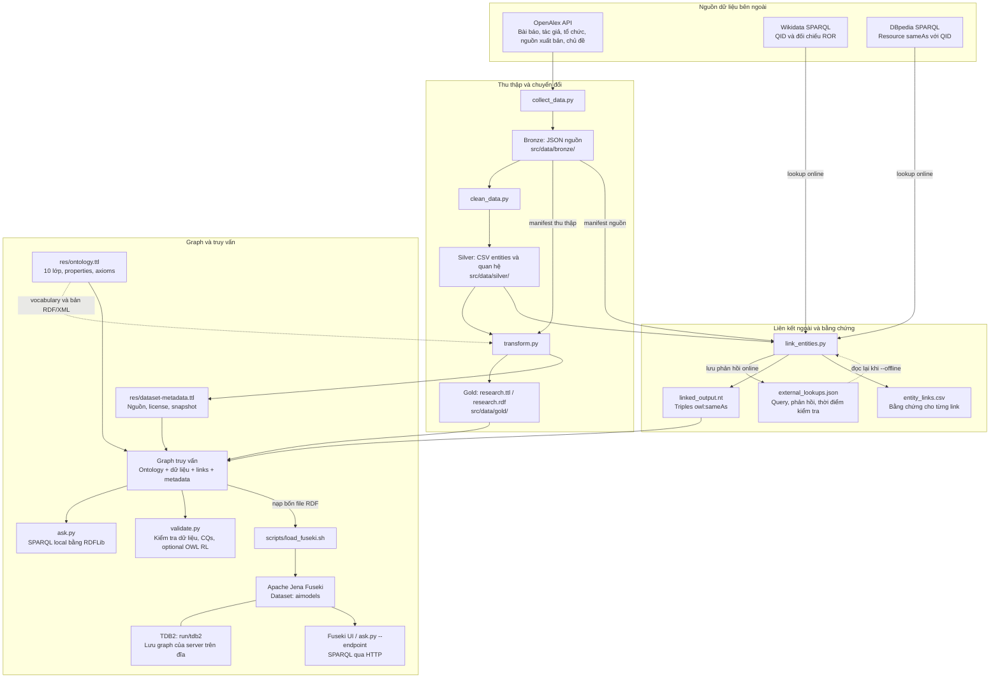
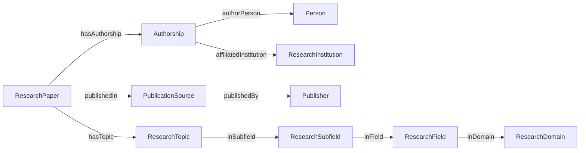
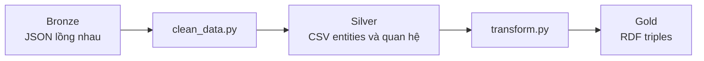

# AI Research Linked Open Data Capstone

Knowledge graph về **nghiên cứu AI và large language models**: bài báo,
người viết, affiliation theo từng bài, nguồn xuất bản, publisher và hệ chủ
đề OpenAlex. Có ontology 10 lớp, thu thập nguồn thật, RDF Turtle/RDF/XML,
liên kết OpenAlex–Wikidata–DBpedia và truy vấn terminal/Apache Jena Fuseki.

Project giữ cấu trúc của `hust-semantic-web`: **src/** xử lý dữ liệu,
**res/** chứa ontology/liên kết/cấu hình, **docs/** mô tả, dữ liệu qua ba tầng
bronze → silver → gold. Thiết kế ontology tuân theo
[ONTOLOGY_ENGINEERING_SKILL.md](../ONTOLOGY_ENGINEERING_SKILL.md).

## Overview hệ thống

Hệ thống thu thập metadata nghiên cứu từ OpenAlex, tách JSON thành các bảng
CSV, chuyển các bảng thành RDF theo ontology, rồi bổ sung liên kết danh tính
đến Wikidata/DBpedia. Người dùng truy vấn graph đã kết hợp bằng terminal
hoặc Apache Jena Fuseki.



Mũi tên liền thể hiện đầu vào/đầu ra hoặc đường truy vấn; mũi tên nét đứt
thể hiện vocabulary hướng dẫn chuyển đổi và đường dùng cache offline.
`research.ttl` và `research.rdf` là hai cách ghi **cùng một graph**; chọn một
file để nạp. `entity_links.csv` và JSON cache dùng để kiểm tra bằng chứng;
file links được nạp vào Fuseki là `linked_output.nt`.

**Hai cách truy vấn cùng dữ liệu:** `ask.py` local đọc các file RDF trong
project mỗi lần chạy; Fuseki truy vấn bản đã nạp vào TDB2 qua HTTP. Chạy lại
ETL làm thay đổi các file trong repo; để server sử dụng snapshot mới, bạn
cần chủ động cập nhật dataset Fuseki. Ontology và dữ liệu có thể xem qua
SPARQL mà không cần bật suy luận; OWL RL là lựa chọn riêng của CLI/validator.

## 1. Năm yêu cầu capstone nằm ở đâu?

Đọc [Giải thích project theo 5 bước capstone](docs/CAPSTONE_WALKTHROUGH.md)
để xem cách phân tích ontology ở bước 1 và từng file xử lý gì, nhận đầu vào
nào, tạo đầu ra nào ở các bước tiếp theo.

| Yêu cầu | Code / file cần mở | Nội dung |
|---|---|---|
| **1. Define an ontology** | [res/ontology.ttl](res/ontology.ttl), [ontology-design](docs/ontology-design.md), [requirements](docs/requirements.md), [CQs](docs/competency-questions.md), [glossary](docs/glossary.md) | Phạm vi → kịch bản → câu hỏi → glossary → 10 lớp → properties/axioms → kiểm tra |
| **2. Collect relevant data** | [src/collect_data.py](src/collect_data.py), [bronze manifest](src/data/bronze/collection_manifest.json) | OpenAlex API: works, institutions, sources; giữ JSON gốc và URL truy xuất |
| **3. Transform into 4-star data** | [src/clean_data.py](src/clean_data.py), [src/transform.py](src/transform.py), [research.ttl](src/data/gold/research.ttl) | Chuẩn hóa CSV; định danh HTTP URI ổn định; RDF/vocabulary chuẩn và typed literals |
| **4. Link toward 5-star data** | [src/link_entities.py](src/link_entities.py), [linked_output.nt](res/linked_output.nt), [entity_links.csv](res/entity_links.csv) | Khớp ID OpenAlex; QID từ nguồn; exact ROR trong Wikidata; sameAs Wikidata trong DBpedia |
| **5. SPARQL endpoint/terminal** | [src/ask.py](src/ask.py), [queries/](queries/), [Fuseki guide](docs/FUSEKI.md) | CLI offline, Fuseki UI và endpoint `/aimodels/sparql` |

Đây là bản thực hành local các bước RDF và linking. Để công bố thành LOD
4/5 sao trên Web, còn cần namespace do bạn quản lý, URI HTTP dereference
được và bản dữ liệu tải công khai có license phù hợp. `example.org` hiện
là namespace minh họa; mở URI đó trên trình duyệt chưa trả dữ liệu dự án.
Không cần mua tên miền chỉ để chạy/demo capstone local.

## 2. Dữ liệu và nguồn

Snapshot đi kèm có **200 bài**, **1.807 người**, **307 tổ chức**, **65 sources**,
**19 publishers**, **101 topics**, **33 subfields**, **11 fields**, **4 domains**,
**2.128 authorships** và **49.459 triples instance data**. Thống kê cập nhật
xem [cleaning report](src/data/silver/cleaning-report.json),
[linking report](res/linking-report.json), [validation](docs/VALIDATION.md).

Có **2.593 identity links**, gồm 35 links Wikidata và 11 links DBpedia đã
xác nhận; phần còn lại nối về IDs OpenAlex. Một số lookup DBpedia trả HTTP
503 nên coverage còn thiếu. Các links đã xuất có bằng chứng và dùng được
offline; xem VALIDATION.md.

| Nguồn | Lấy gì? | Cách sử dụng |
|---|---|---|
| [OpenAlex](https://help.openalex.org/api/) | Metadata works/authorships/topics, institutions, sources/publishers | Nguồn dữ liệu chính; API JSON; ID W/A/I/S/P/T và IDs phân loại |
| [Wikidata](https://www.wikidata.org/wiki/Wikidata:SPARQL_query_service) | URI QID; đối chiếu ROR bằng [P6782](https://www.wikidata.org/wiki/Property:P6782) | Nhận QID được khai báo trong OpenAlex; tra thêm institutions thiếu QID bằng ROR |
| [DBpedia](https://dbpedia.org/sparql) | URI resource có `owl:sameAs` tới QID đã biết | SPARQL identity lookup; chỉ xuất link khi phản hồi endpoint xác nhận exact identity |
| [ORCID](https://orcid.org/) / [ROR](https://ror.org/) / DOI | Persistent identifiers có sẵn trong metadata | Giữ bằng `ex:orcid`, `ex:ror`, `ex:doi`; không nói rằng đã crawl API riêng của các nguồn này |

Search mặc định là `"large language models"`, lọc
`primary_topic.field.id:17` (Computer Science), loại paratext và chỉ giữ
`article|conference-paper|preprint|review`; sắp xếp `cited_by_count:desc`.
Đây là cách chọn mẫu theo search và classification của OpenAlex. Không phải
toàn bộ bài AI; primary field là Computer Science nhưng secondary topics có
thể ở lĩnh vực khác. Nhãn topic là dự đoán của nguồn.

Tối đa 25 institutions và 25 sources phổ biến được lấy full records để
enrich. Các entity khác vẫn được giữ từ nested records của works. Sources
có publisher ID `P...` mới ánh xạ Publisher; repository do institution `I...`
quản lý không bị gán nhầm là publisher.

[OpenAlex metadata là CC0](https://help.openalex.org/api/); điều này không
cấp license cho toàn văn bài báo. `dataset-metadata.ttl` mô tả riêng bản
metadata OpenAlex đã chuyển đổi. Ontology, code và bản đồ liên kết ngoài
cần quyết định license riêng khi công bố; README không tự gán chúng là CC0.

### 2.1. Các project và tập dữ liệu trong repo semantic-web

| Thư mục project | Miền dữ liệu | Các tập dữ liệu chính | README tương ứng |
|---|---|---|---|
| `aimodels/` | Nghiên cứu AI/LLM | OpenAlex works, authorships, institutions, sources, topics; mapping Wikidata/DBpedia | [README này](README.md) |
| `vnschools/` | Trường học Việt Nam | CSV trường học, tên/ID tỉnh và địa phương; RDF trường–địa phương–tỉnh | [Vietnam School LOD](../vnschools/README.md) |
| `hust-semantic-web/` | Điện thoại thông minh | Dữ liệu smartphone, ontology thiết bị, dữ liệu DBpedia để đối chiếu bằng Silk | [HUST Semantic Web](../hust-semantic-web/README.md) |
| `Movie-Knowledge-Graph/` | Phim | TMDB movies, cast, crew, genres, companies, countries/languages; movie links Wikidata/DBpedia | [Movie Knowledge Graph](../Movie-Knowledge-Graph/README.MD) |

Mỗi thư mục là một project riêng, có dữ liệu và ontology riêng. Pipeline
`aimodels/` xử lý các file bên trong project này; dataset Fuseki `aimodels`
được xây từ ontology, research data, links và metadata của nghiên cứu AI.
Các phần tiếp theo giải thích chi tiết những tập dữ liệu đó.

### 2.2. Bronze — dữ liệu gốc và bằng chứng từ nguồn

Các file dưới nằm trong `src/data/bronze/`. Đây là JSON lưu từ API hoặc
endpoint, giúp kiểm tra dữ liệu đã đến từ đâu và rebuild khi không có mạng.

| File | Nội dung | Quy mô snapshot / vai trò |
|---|---|---|
| [openalex_works.json](src/data/bronze/openalex_works.json) | Một danh sách works: ID, title, DOI, năm/ngày, cited_by_count, open access, authorships, primary location, topics và referenced_works | 200 bài; dữ liệu lồng nhau là đầu vào chính của bước chuẩn hóa |
| [openalex_institutions.json](src/data/bronze/openalex_institutions.json) | Full records của institutions phổ biến: ID, name, ROR, country/type, external IDs như Wikidata | Tối đa 25 tổ chức được enrich; các tổ chức còn lại vẫn có thể xuất hiện trong nested works |
| [openalex_sources.json](src/data/bronze/openalex_sources.json) | Full records của publication sources: ID, name, type, ISSN-L, host organization/publisher, external IDs | Tối đa 25 sources được enrich; một source có thể là journal, repository hoặc venue |
| [collection_manifest.json](src/data/bronze/collection_manifest.json) | Search, filter, sort, giới hạn, số works, URL requests, thời điểm thu thập và warnings | Metadata của lần lấy mẫu; không phải một danh sách bài báo |
| [external_lookups.json](src/data/bronze/external_lookups.json) | Query/endpoint Wikidata hoặc DBpedia, JSON response, thời điểm kiểm tra và warnings | Cache bằng chứng cho linker; `--offline` đọc file này thay vì gọi endpoint |

Vì một work có nhiều tác giả, mỗi tác giả nhiều affiliations và mỗi bài
nhiều topics/references, JSON nguồn không tương đương một bảng CSV phẳng.
Các full records bổ sung thông tin cho entities đã xuất hiện trong works;
chúng không làm tăng số bài nghiên cứu của mẫu.

### 2.3. Silver — các bảng entities và quan hệ

Các file dưới nằm trong `src/data/silver/`, được tạo bởi `clean_data.py`.
Một entity chỉ có một dòng trong bảng định danh; các quan hệ nhiều–nhiều
được tách thành bảng riêng. ID OpenAlex là khóa để nối các bảng.

| Bảng entity | Số dòng | Một dòng đại diện cho | Các cột chính |
|---|---:|---|---|
| [papers.csv](src/data/silver/papers.csv) | 200 | Một bài nghiên cứu | `id`, `name`, `doi`, `year`, `date`, `citations`, `is_oa`, `type`, `source_id`, `primary_topic_id` |
| [people.csv](src/data/silver/people.csv) | 1.807 | Một người có author ID | `id`, `name`, `orcid` |
| [institutions.csv](src/data/silver/institutions.csv) | 307 | Một tổ chức có affiliation trong mẫu | `id`, `name`, `ror`, `country`, `type`, `wikidata_id` |
| [sources.csv](src/data/silver/sources.csv) | 65 | Một nguồn xuất bản/venue | `id`, `name`, `type`, `issn_l`, `publisher_id`, `wikidata_id` |
| [publishers.csv](src/data/silver/publishers.csv) | 19 | Một OpenAlex publisher entity | `id`, `name` |
| [topics.csv](src/data/silver/topics.csv) | 101 | Một topic concept | `id`, `name`, `subfield_id` |
| [subfields.csv](src/data/silver/subfields.csv) | 33 | Một subfield concept | `id`, `name`, `field_id` |
| [fields.csv](src/data/silver/fields.csv) | 11 | Một field concept | `id`, `name`, `domain_id` |
| [domains.csv](src/data/silver/domains.csv) | 4 | Một domain concept | `id`, `name` |
| [authorships.csv](src/data/silver/authorships.csv) | 2.128 | Một người tham gia viết một bài cụ thể | `id`, `paper_id`, `person_id`, `position`, `is_corresponding` |

`sources.csv` chứa nơi bài xuất hiện; `publishers.csv` chứa tổ chức xuất bản.
Ví dụ repository và tổ chức quản lý repository là những thực thể khác nhau.
Các bảng topics → subfields → fields → domains giữ phân loại bốn cấp của
OpenAlex, trong đó mỗi concept có ID riêng.

| Bảng quan hệ | Số dòng | Các cột | Ý nghĩa |
|---|---:|---|---|
| [authorship_institutions.csv](src/data/silver/authorship_institutions.csv) | 1.608 | `authorship_id`, `institution_id` | Một affiliation được báo trong bối cảnh người viết bài đó; một authorship có thể có nhiều hoặc thiếu affiliation |
| [paper_topics.csv](src/data/silver/paper_topics.csv) | 578 | `paper_id`, `topic_id`, `score` | Một bài được gán một topic cùng score của OpenAlex; một bài có thể có nhiều topics |
| [references.csv](src/data/silver/references.csv) | 15.715 | `paper_id`, `referenced_id` | Một cạnh bài → công trình được tham khảo; target có thể nằm ngoài 200 bài của mẫu |

**Cách đọc số lượng:** 1.807 người khác nhau có 2.128 lần tham gia viết bài,
vì một người có thể viết nhiều bài. 15.715 dòng references là số cạnh tham
khảo, không phải 15.715 bài đầy đủ đã thu thập và cũng không phải tổng số
lần 200 bài được người khác trích dẫn. Số lần được trích dẫn theo snapshot
nằm trong cột `papers.citations`.

Score trong `paper_topics.csv` thuộc cặp paper–topic; transformer hiện chỉ
xuất quan hệ topic, giữ score ở CSV. Nó không gắn một score chung lên mọi
lần xuất hiện của Topic trong RDF.

[cleaning-report.json](src/data/silver/cleaning-report.json) ghi số dòng,
duplicates và các records bị bỏ qua. Snapshot hiện ghi **445 bản ghi tác
giả thiếu author ID** bị bỏ qua; đây là số entries trong authorships nguồn,
không phải kết luận rằng có 445 người khác nhau. ORCID/DOI/affiliation thiếu
được giữ là thiếu, không điền dữ liệu giả.

### 2.4. Gold — graph nghiên cứu bằng RDF

| File | Nội dung | Dùng để làm gì? |
|---|---|---|
| [research.ttl](src/data/gold/research.ttl) | 49.459 triples instances và relations, ghi bằng Turtle | Đọc RDF tương đối dễ, truy vấn local và nạp Fuseki |
| [research.rdf](src/data/gold/research.rdf) | Cùng graph như Turtle, ghi bằng RDF/XML | Dùng với công cụ nhận RDF/XML; không phải dataset bổ sung |
| [transformation-report.json](src/data/gold/transformation-report.json) | Thời điểm tạo file và triple count | Đối chiếu kết quả chuyển đổi |
| `research-inferred.ttl` — tùy chọn | Closure gồm các facts assert và suy ra bởi OWL RL | Chỉ được tạo khi bạn tự chạy validator với `--reasoning --export-inferred` |

Một dòng CSV thường tạo nhiều triples: loại entity, label, ID, provenance,
các thuộc tính và quan hệ. Vì vậy số triples không bằng số dòng CSV.
References đến bài trong mẫu dùng local paper URI; references ngoài mẫu
giữ URI OpenAlex, nên target ngoài mẫu có thể chưa có title để hiển thị.

### 2.5. res/ — ontology, links, metadata và artifacts hỗ trợ

| File | Loại nội dung | Vai trò |
|---|---|---|
| [ontology.ttl](res/ontology.ttl) / [ontology.owl.xml](res/ontology.owl.xml) | Schema/vocabulary | Định nghĩa 10 lớp, properties, domain/range và axioms; cùng ontology ở hai cú pháp |
| [linked_output.nt](res/linked_output.nt) | RDF identity links | 2.593 triples `owl:sameAs`: 2.547 OpenAlex, 35 Wikidata, 11 DBpedia |
| [entity_links.csv](res/entity_links.csv) | Bảng bằng chứng linking | Local/external URI, method, shared identifier, evidence source, status và checked_at cho từng link |
| [dataset-metadata.ttl](res/dataset-metadata.ttl) | Metadata cấp dataset | Tên/mô tả, nguồn OpenAlex, license metadata, thời điểm snapshot và hai RDF distributions local |
| [example-data.ttl](res/example-data.ttl) | Fixture synthetic | Ví dụ nhỏ để hiểu ontology; tách khỏi graph dữ liệu thật |
| [fuseki-config.ttl](res/fuseki-config.ttl) | Cấu hình server bằng Turtle | Tên dataset/endpoints và vị trí TDB2; không phải instance graph nghiên cứu |
| [linking-report.json](res/linking-report.json) | Report linking | Số links theo method, mode online/offline và warnings nguồn/cache |
| [validation-report.json](res/validation-report.json) | Report kiểm tra | Errors, class counts, kết quả CQs và thông tin reasoning của lần chạy gần nhất |
| [reproducibility-report.json](res/reproducibility-report.json) / [fuseki-validation.json](res/fuseki-validation.json) | Report kiểm tra đã lưu | Đối chiếu rebuild offline và kết quả local/endpoint ở thời điểm kiểm tra |

`owl:sameAs` diễn tả cùng một thực thể, chẳng hạn local institution và
Wikidata/DBpedia URI của tổ chức đó. Nó khác với `hasTopic` (bài có chủ đề)
và `dcterms:references` (bài tham khảo bài khác). Các URI DOI/ORCID/ROR được
giữ làm định danh trên entity tương ứng; project chưa tải toàn bộ datasets
DOI, ORCID, ROR, Wikidata hoặc DBpedia về repo.

Trong mode offline, `HTTP 503` của lần lookup trước có thể xuất hiện lại từ
warnings lưu trong cache. `No cached DBpedia response` nghĩa là không có
phản hồi thành công để thiết lập link cho QID đó. Những records thiếu bằng
chứng không được bổ sung sameAs; các links đã xác nhận vẫn được xuất.

### 2.6. Bốn graph được kết hợp để truy vấn

```text
res/ontology.ttl                  184 triples
src/data/gold/research.ttl     49.459 triples
res/linked_output.nt           2.593 triples
res/dataset-metadata.ttl           15 triples
                            ───────────────
Graph truy vấn snapshot       52.251 triples
```

Đây là bốn phần bổ sung ngữ nghĩa cho nhau: định nghĩa mô hình, facts về
nghiên cứu, danh tính liên kết ngoài và metadata của dataset. CLI kết hợp
chúng trong bộ nhớ; script load nạp chúng vào default graph của Fuseki.
`run/tdb2` là bản lưu của server sau khi nạp, không phải nguồn dữ liệu thứ
năm. Các con số thuộc snapshot hiện tại; ontology hoặc dữ liệu thay đổi,
hay nạp lại anonymous nodes của ontology nhiều lần, có thể làm tổng khác đi.

## 3. Cấu trúc thư mục

```text
aimodels/
├── README.md
├── requirements.txt
├── src/
│   ├── collect_data.py          # API → bronze JSON
│   ├── clean_data.py            # bronze JSON → silver CSV
│   ├── transform.py             # silver CSV → RDF + metadata
│   ├── link_entities.py         # identifiers/endpoint → links + evidence
│   ├── validate.py              # graph checks + CQs + optional OWL RL
│   ├── ask.py                   # query local / SPARQL HTTP
│   ├── common.py                # paths, I/O, namespace, stable URI
│   └── data/
│       ├── bronze/              # JSON nguồn + manifest + lookup snapshots
│       ├── silver/              # entity/relation CSVs + cleaning report
│       └── gold/                # research.ttl, research.rdf, report
├── res/
│   ├── ontology.ttl             # 10 lớp + properties + axioms
│   ├── ontology.owl.xml         # cùng ontology, cú pháp RDF/XML
│   ├── example-data.ttl         # ví dụ synthetic; không load vào graph thật
│   ├── linked_output.nt         # các triples owl:sameAs
│   ├── entity_links.csv         # bằng chứng cho từng link
│   ├── dataset-metadata.ttl     # dataset/source/license/snapshot metadata
│   ├── fuseki-config.ttl        # SPARQL service và TDB2
│   ├── linking-report.json
│   └── validation-report.json
├── queries/                     # 10 CQs + counts/inference/DBpedia extraction
├── scripts/                     # start_fuseki.sh, load_fuseki.sh
├── tests/test_pipeline.py       # offline regression/competency tests
├── docs/                        # ontology engineering, Fuseki, validation
├── tools/                       # binary Fuseki, được gitignore
└── run/                         # TDB2/log khi chạy, được gitignore
```

## 4. Ontology có những lớp nào?

| Class | Đại diện cho |
|---|---|
| ResearchPaper | Công trình nghiên cứu, bài báo/preprint |
| Person | Người tham gia viết bài; subclass của schema:Person |
| ResearchInstitution | Tổ chức có affiliation trong mẫu |
| PublicationSource | Journal/conference/repository/venue |
| Publisher | Tổ chức xuất bản có OpenAlex publisher ID |
| ResearchTopic | Concept topic chi tiết |
| ResearchSubfield | Concept subfield, ví dụ Artificial Intelligence |
| ResearchField | Concept field, ví dụ Computer Science |
| ResearchDomain | Concept domain rộng, ví dụ Physical Sciences |
| Authorship | Quan hệ có bối cảnh: một người viết một bài |



Ví dụ: cùng người A1 có affiliation I1 trong W1 và I2 trong W2. Ta tạo
Authorship W1-A1 và W2-A1, không gán hai nơi làm việc toàn cục lên Person.
Các thuộc tính first/middle/last và corresponding cũng gắn vào Authorship.

URI mẫu `https://example.org/aimodels/resource/paper/W...` giữ W ID của
OpenAlex; tác giả dùng `person/A...`; authorship dùng `W...-A...`. Con số
không phải thứ hạng bài hay số dòng CSV. Turtle có thể sắp theo ký tự URI;
muốn thứ tự năm/trích dẫn dùng SPARQL `ORDER BY`.

## 5. Luồng: mỗi file Python nhận gì và tạo gì?



| File code | Đầu vào | Đầu ra |
|---|---|---|
| collect_data.py | API, search/limit/enrich-limit | `bronze/openalex_works.json`, `openalex_institutions.json`, `openalex_sources.json`, `collection_manifest.json` |
| clean_data.py | 3 JSON snapshots | CSV papers/people/institutions/sources/publishers/topics/subfields/fields/domains/authorships; CSV cạnh authorship_institutions/paper_topics/references; cleaning report |
| transform.py | silver CSV + ontology Turtle + manifest | gold `research.ttl`/`research.rdf`; ontology RDF/XML; dataset metadata; transformation report |
| link_entities.py | silver IDs + manifest; external SPARQL hoặc cache | sameAs N-Triples; evidence CSV; raw lookup JSON; linking report |
| validate.py | ontology + gold + links + metadata | validation report; optional inferred graph |
| ask.py | `.rq` và graph local hoặc URL endpoint | CSV trên terminal, hay boolean với ASK |

Bronze ở đây là JSON thay vì một `raw/data.csv`: một bài chứa nhiều tác giả,
mỗi tác giả nhiều institutions, nhiều topics và references. Giữ nested JSON
tránh mất quan hệ; silver mới tách thành các CSV dễ đọc. `papers.csv` gồm ID,
title, DOI, year/date, citation count, open access, work type, source ID,
primary topic ID. Các tác giả và affiliations nằm ở CSV quan hệ riêng.

`research.ttl` và `research.rdf` chứa **cùng graph** ở Turtle và RDF/XML.
`ontology.ttl` định nghĩa vocabulary; `research.ttl` là instances;
`linked_output.nt` là links; `dataset-metadata.ttl` mô tả dataset, không phải
một bài nghiên cứu.

## 6. Chạy thử nhanh, không cần Internet

Các snapshots, CSV, RDF và links đã tạo được giữ trong project. Chỉ lần cài
dependencies đầu tiên cần tải Python packages. Yêu cầu Python 3.10+.

Từ root `semantic-web/`:

```bash
cd aimodels
python -m venv .venv
source .venv/bin/activate
python -m pip install -r requirements.txt
python src/ask.py queries/count_classes.rq
python src/ask.py queries/cq01_top_papers.rq
python src/ask.py queries/cq07_external_links.rq
```

Các command sau trong README đều chạy từ `aimodels/`, với `.venv` đã activate.
Scripts tìm data theo vị trí project, không theo current working directory;
đường dẫn query CLI vẫn theo directory bạn đang đứng.

Kiểm tra:

```bash
python -m unittest discover -s tests -v
python src/validate.py
python src/validate.py --reasoning
```

OWL RL trên graph hàng chục nghìn triples có thể mất vài phút tùy máy;
không cần bật suy luận cho các CQ thông thường.

## 7. Chạy lại toàn bộ pipeline

Lấy lại dữ liệu thật, cần Internet:

```bash
python src/collect_data.py --limit 200 --enrich-limit 25
python src/clean_data.py
python src/transform.py
python src/link_entities.py
python src/validate.py --reasoning
```

Theo [OpenAlex API](https://help.openalex.org/api/), truy cập cơ bản không
bắt buộc key; key tăng budget. Có thể cung cấp `OPENALEX_API_KEY` qua
environment nếu cần. Không ghi key vào source, manifest hoặc commit `.env`.
Collector dùng page size tối đa 100 và retry lỗi mạng/429/5xx.

Lấy nhiều hơn hoặc đổi search (vẫn giữ filter Computer Science):

```bash
python src/collect_data.py --limit 500 --search '"machine learning"' --enrich-limit 50
```

Sau đó chạy tiếp clean → transform → link → validate. Commands tạo lại các
artifact của snapshot hiện tại; nên sao chép project/snapshots nếu muốn giữ
hai lần thu thập để so sánh. Không suy ra tỷ lệ open access/xếp hạng toàn
cầu từ mẫu top-cited này.

Rebuild từ snapshot đi kèm, không gọi API:

```bash
python src/clean_data.py
python src/transform.py
python src/link_entities.py --offline
python src/validate.py
```

Offline dùng `bronze/external_lookups.json`; chỉ trả lại links có bằng chứng
đã ghi, giữ thời điểm kiểm tra gốc. Nếu bạn thay corpus và lookup cache không
còn khớp, cần chạy linker online để lấy bằng chứng mới.

## 8. Liên kết đến DBpedia như thế nào?

```text
Local institution URI
   ├─ exact OpenAlex ID ───────────────→ OpenAlex institution URI
   └─ OpenAlex-declared QID / exact ROR → Wikidata QID
                                         ↑ owl:sameAs (DBpedia trả về)
                                  DBpedia resource URI
```

Linker không đoán `dbpedia.org/resource/...` từ tên trường. Nó lấy QID của
cùng tổ chức bằng ID metadata/ROR, hỏi DBpedia resource nào sameAs QID đó,
rồi mới xuất local `owl:sameAs` DBpedia resource.

Mỗi link có local URI, external URI, method, shared_identifier,
evidence_source, accepted status và checked_at trong `res/entity_links.csv`.
Response Wikidata/DBpedia, query và endpoint ở
`src/data/bronze/external_lookups.json`. Institution/source chưa có mapping
không bị ép sameAs. Endpoint lỗi/ambiguity được ghi trong linking report;
không tạo link giả để đủ số lượng.

So với HUST: cả hai đều có ontology + instance graph + DBpedia links và nạp
vào Fuseki. HUST dùng Silk matching smartphone; project này dùng linker
Python dựa trên persistent identifiers. Không cần Silk để đạt yêu cầu
linking khi đã có exact identifiers. Có query
[dbpedia_extract.rq](queries/dbpedia_extract.rq) để xem nguồn trực tiếp.

## 9. Chạy SPARQL endpoint Apache Jena Fuseki

Chi tiết cài Java/Fuseki, checksum, upload UI/curl và suy luận:
**[docs/FUSEKI.md](docs/FUSEKI.md)**.

Khi binary Fuseki nằm trong `tools/apache-jena-fuseki-6.2.0/`, mở hai terminals.

Terminal 1:

```bash
cd aimodels
bash scripts/start_fuseki.sh
```

Terminal 2, từ root `semantic-web/`:

```bash
cd aimodels
source .venv/bin/activate
bash scripts/load_fuseki.sh
python src/ask.py queries/count_classes.rq --endpoint http://localhost:3030/aimodels/sparql
python src/ask.py queries/cq07_external_links.rq --endpoint http://localhost:3030/aimodels/sparql
```

Mở <http://localhost:3030/>, chọn dataset `aimodels`, vào Query và paste một
file `.rq`. Server dùng TDB2 nên graph giữ được sau Ctrl+C; nạp default graph
cả ontology, data, links và metadata. Nếu cổng bận, xem hướng dẫn port 3031
trong FUSEKI.md.

## 10. Demo khi bảo vệ và hướng mở rộng

1. Mở ontology bằng Protégé hoặc đọc docs: giải thích scope, 10 lớp và
   Authorship là contextual relation.
2. Mở một work JSON trong bronze, một dòng papers CSV trong silver, rồi tìm
   cùng W ID trong gold RDF: cho thấy raw → normalized → triples.
3. Chạy CQ1/CQ4 để tìm bài/chủ đề; CQ2 để thấy affiliation theo bài.
4. Chạy CQ7; mở evidence CSV và lookup snapshot cho một link DBpedia.
5. Chạy cùng query trong Fuseki UI; giải thích endpoint và default graph.
6. Tùy chọn demo inverse authoredPaper trước/sau OWL RL bằng
   `queries/inference_authored_paper.rq` với `--reasoning`.

Giới hạn đã biết: OpenAlex entity resolution/topics có thể sai; dữ liệu
authorship của nguồn có thể cắt ở 100 tác giả; enrichment chỉ lấy subset;
DOI/ORCID/ROR/affiliation không phải bài/người nào cũng có. `cited_by_count`
là số theo snapshot, còn `dcterms:references` là outgoing references.

Mở rộng hợp lý: thêm source độc lập cho paper metadata; kiểm tra liên kết
mẫu thủ công; thu thập nhiều search có phân trang/dedup; SHACL cho data
constraints; giao diện tìm kiếm; công bố namespace có dereference và các
RDF distributions thật. Nếu chuyển sang catalog AI models thì cần scope,
CQs và ontology khác, bổ sung model family/task/license/benchmark thay vì
chỉ đổi tên các lớp nghiên cứu.
