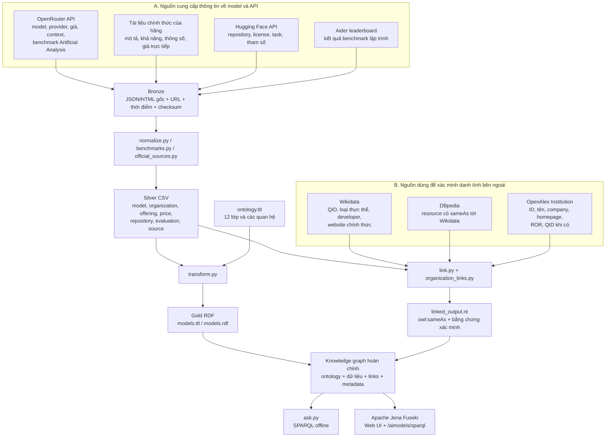
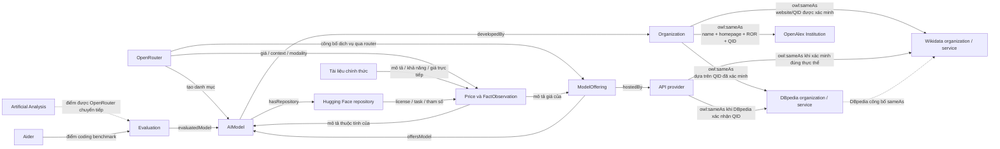

# AI Models — capstone Linked Open Data về model và API

## Overview: hệ thống làm gì?

Project giúp tra cứu model AI, khả năng, thông số, bên cung cấp API, giá và kết quả đánh giá. Ví dụ: “Claude Opus 4.6 có API ở đâu, giá input/output bao nhiêu và thông tin đó lấy từ nguồn nào?”

Nếu cần hiểu toàn bộ repo theo từng file Python, đầu vào, đầu ra và bốn file nạp Fuseki,
xem [Luồng toàn bộ project](docs/REPOSITORY_FLOW.md).

Thông tin đến từ nhiều nơi: OpenRouter, tài liệu hãng, Hugging Face và bảng đánh giá có cấu trúc. Project lưu nguồn, chuẩn hóa dữ liệu và nối chúng thành một **knowledge graph**, tức mạng thực thể có quan hệ. **Semantic Web** dùng các định danh và thuộc tính có ý nghĩa rõ ràng để máy tính hiểu mạng này. Người dùng truy vấn bằng **SPARQL**, ngôn ngữ truy vấn RDF.

**RDF** ghi từng phát biểu dưới dạng subject — predicate — object, ví dụ “dịch vụ Azure — cung cấp — Opus 4.6”. **Ontology** định nghĩa các loại thực thể và quan hệ được phép dùng. Project này chỉ xử lý model/API; mọi code và dữ liệu cần chạy đều nằm trong `aimodels/`.

Website công khai được chuẩn bị tại
`https://brodsmaster.github.io/semantic-web-ai-models/`. GitHub Actions sẽ build và
deploy giao diện sau mỗi lần push vào nhánh `main`. Website cho phép tìm model, xem
offering/giá, kiểm tra liên kết tổ chức, đọc ontology và tải RDF; Fuseki vẫn là
SPARQL endpoint chạy ở máy local.

### Luồng overview



**Bronze** giữ dữ liệu lấy từ nguồn; **Silver** là bảng đã chuẩn hóa; **Gold** là RDF dùng để query. URL nguồn và thời điểm đi cùng thông tin để người đọc kiểm tra được.

### Quan hệ giữa các nguồn và thực thể trong graph



Đọc sơ đồ thứ hai từ giữa ra ngoài: `AIModel`, `ModelOffering` và `Organization` là các thực thể local của project. OpenRouter, tài liệu hãng, Hugging Face, Aider và Artificial Analysis cung cấp **thông tin về** các thực thể đó. Wikidata, DBpedia và OpenAlex dùng để tạo `owl:sameAs` cho thực thể đã kiểm chứng. OpenAlex nối tổ chức; Wikidata/DBpedia nối tổ chức hoặc dịch vụ provider như Azure.

Hugging Face nối bằng `hasRepository` vì repository chứa model card hoặc trọng số liên quan nhưng repository không phải bản thân model. Aider và Artificial Analysis tạo `Evaluation` vì điểm benchmark là một kết quả đánh giá. Tài liệu hãng tạo provenance bằng `prov:wasDerivedFrom` vì trang tài liệu là bằng chứng cho một thuộc tính hoặc mức giá. Artificial Analysis hiện không được tải trực tiếp; project chỉ giữ các điểm có attribution Artificial Analysis nằm trong phản hồi OpenRouter.

### Tình trạng hiện tại

Snapshot thu thập ngày 05/10/2026 có:

| Thành phần | Quy mô / ý nghĩa |
|---|---|
| Model | 466 listing OpenRouter + 15 model chỉ có trong phần giá chính thức = 481 mục |
| Dịch vụ API | 1.909 offerings: 466 danh mục OpenRouter, 1.390 cấu hình provider qua router, 53 giá/dịch vụ từ tài liệu trực tiếp |
| Giá | 8.174 bản ghi; gồm loại token, đơn vị, điều kiện, chiết khấu và các mức giá theo ngữ cảnh |
| Thông tin bổ sung | 92 bộ metadata model từ đơn vị phát hành trên Hugging Face |
| Đánh giá | 471 kết quả benchmark có model, phép đo, điểm, cấu hình và nguồn |
| Liên kết ngoài | 77 identity links: 42 Wikidata + 26 DBpedia + 9 OpenAlex; 43 URI local của tổ chức/dịch vụ có liên kết (developer/provider có thể cùng công ty); 102 quan hệ model → repository Hugging Face |
| Graph kết hợp | 355.218 triples; 15 file query; query Opus trả 336 dòng giá. Các liên kết OpenAlex được xác minh ngày 08/10/2026 |

Một listing là một mục trong danh mục. Tên gọi khác, bản miễn phí hoặc bản chạy theo lô có thể cùng dùng một model; số listing không phải số bộ trọng số độc lập. Điểm đánh giá chỉ có cho một phần model.

Xem [coverage.json](res/coverage.json), [validation-report.json](res/validation-report.json) và [VALIDATION.md](docs/VALIDATION.md). Giá/query đọc snapshot đã lưu; chúng không tự lấy giá live.

### Build và xem website trước khi push

```bash
cd /home/puda14/Desktop/Project/semantic-web/aimodels
PYTHONPATH=src .venv/bin/python scripts/build_site.py
cd site
python -m http.server 8000
```

Mở `http://localhost:8000`. Thư mục `site/` được sinh tự động từ Silver CSV và
Gold RDF nên không commit. Workflow [pages.yml](.github/workflows/pages.yml) sẽ
build lại thư mục này trên GitHub. Khi push lên `main`, xem tiến trình tại tab
**Actions**; deploy xong thì mở URL Pages ở trên.

URI public của ontology và thực thể dùng namespace:

```text
https://brodsmaster.github.io/semantic-web-ai-models/data/aimodels.ttl#
```

Ví dụ URI của một model là URL của file Turtle cộng fragment `#resource/model/...`.
Trình duyệt tải được tài liệu RDF chứa định nghĩa của URI đó. Đây là phần giúp dữ
liệu có HTTP URI công khai khi Pages đã deploy.

License được tách rõ: [LICENSE](LICENSE) dùng MIT cho code; [DATA_LICENSE.md](DATA_LICENSE.md)
dùng CC BY 4.0 cho ontology, mapping và dữ liệu do project tạo trong phạm vi quyền
của tác giả. Dữ liệu lấy từ bên thứ ba vẫn theo điều khoản của từng nguồn.

## 1. Define an ontology — định nghĩa miền model/API

### Phạm vi → kịch bản → câu hỏi → glossary → lớp → quy tắc → kiểm tra

Thiết kế theo [ONTOLOGY_ENGINEERING_SKILL.md](../ONTOLOGY_ENGINEERING_SKILL.md), chi tiết tại [ONTOLOGY.md](docs/ONTOLOGY.md).

| Bước | Quyết định trong project |
|---|---|
| Phạm vi | Model và phiên bản, hãng phát triển, dịch vụ cung cấp API, giá, khả năng, thông số, kết quả đánh giá và bằng chứng nguồn |
| Kịch bản | Người dùng chọn model; so nhà cung cấp và giá; kiểm tra thông số/khả năng; xem kết quả benchmark có nguồn |
| Câu hỏi kiểm tra | Có những model Claude nào? Ai cung cấp Opus? Model nhận ảnh không? Dịch vụ hỗ trợ gọi công cụ không? Giá theo đơn vị gì và nguồn nào? |
| Glossary | Model là sản phẩm/phiên bản; family là họ model; offering là dịch vụ/cấu hình cung cấp model; benchmark là phép đánh giá; evaluation là một kết quả cụ thể |
| Lớp | 12 loại thực thể dưới đây |
| Properties/axioms | Quan hệ có hướng, kiểu giá trị, lớp chuẩn tái sử dụng và quy tắc suy luận |
| Kiểm tra | Fixtures có đáp án biết trước, đối chiếu CSV/RDF, checksum nguồn, query graph thật và OWL RL trên mẫu đại diện |

**Class** là một loại thực thể; **instance** là một thực thể cụ thể. Ví dụ AIModel là class, Opus 4.6 là instance. Một **competency question** là câu hỏi dùng để kiểm tra ontology có đủ dữ liệu/quan hệ để trả lời bài toán.

### 12 lớp cụ thể

| Class | Đại diện cho / ví dụ |
|---|---|
| `AIModel` | Một model/phiên bản theo ID nguồn, như `anthropic/claude-opus-4.6` |
| `ModelFamily` | Họ model, như Claude, Gemini, Qwen |
| `Organization` | Tổ chức có vai trò phát triển hoặc cung cấp dịch vụ, như Anthropic/OpenAI |
| `ModelOffering` | Một dịch vụ/cấu hình truy cập model, như Azure global qua OpenRouter |
| `Capability` | Khả năng/tham số API được công bố, như hỗ trợ tools |
| `Modality` | Loại đầu vào/đầu ra: text, image, audio… |
| `PriceSpecification` | Một mức giá với loại phí, đơn vị, điều kiện và nguồn |
| `Benchmark` | Phép/thước đo đánh giá, với đơn vị đánh giá và thang điểm |
| `Evaluation` | Kết quả của một model trên một phép đánh giá |
| `SourceDocument` | Bản nguồn từ một URL, với nội dung đã lưu, thời điểm và checksum |
| `FactObservation` | Một thông tin được ghi nhận: thực thể, thuộc tính, giá trị, nguồn, thời điểm |
| `ExternalLink` | Liên kết danh tính với nguồn ngoài và bằng chứng xác nhận |

### Quan hệ, giá trị và axioms

**Object property** nối hai thực thể. **Datatype property** gắn thực thể với một giá trị trực tiếp.

| Property | Ý nghĩa |
|---|---|
| `belongsToFamily`, `developedBy` | Model thuộc họ nào, do tổ chức nào phát triển |
| `offersModel`, `hostedBy` | Dịch vụ cung cấp model nào, do bên nào vận hành |
| `hasPrice` | Dịch vụ có bản ghi giá nào |
| `supportsCapability`, `inputModality/outputModality` | Hỗ trợ tính năng gì; nhận/trả loại dữ liệu nào |
| `evaluatedModel`, `onBenchmark` | Kết quả đánh giá model nào bằng thước đo nào |
| `prov:wasDerivedFrom` | Thông tin/giá lấy từ bản nguồn nào |
| `contextLength`, `maxOutputTokens`, `priceAmount`, `observedAt` | Giới hạn context/output, số tiền và thời điểm ghi nhận |

Context length là số token có thể đưa vào ngữ cảnh; token là đơn vị chia nhỏ văn bản model xử lý. Hỗ trợ tools nghĩa là API hỗ trợ yêu cầu gọi công cụ; nó chưa chứng minh model làm tốt mọi tác vụ.

**Axiom** là quy tắc logic. Ontology tái sử dụng `schema:Organization`, `schema:Service`, `schema:PriceSpecification` và `prov:Entity` làm lớp cha phù hợp. **Domain/range** mô tả loại ở hai đầu thuộc tính và có thể suy ra type; kiểm tra dữ liệu thiếu được thực hiện trong validator.

Claude là một family nối tới Opus bằng quan hệ; family không là lớp cha của từng phiên bản. Tài liệu nguồn được mô hình riêng để một thuộc tính có nhiều quan sát khác nhau mà vẫn giữ nguồn/thời điểm.

File chính: [ontology.ttl](res/ontology.ttl); bản cùng ontology ở RDF/XML là [ontology.rdf](res/ontology.rdf). [example-data.ttl](res/example-data.ttl) là dữ liệu giả minh họa, không nạp vào graph thật.

Xem [sơ đồ toàn bộ ontology](docs/ONTOLOGY_DIAGRAM.md) để xem đủ 12 classes, 17 object properties và 41 datatype properties.

### Kiểm tra cụ thể

Project có thêm SHACL: [res/shapes.ttl](res/shapes.ttl) quy định trường bắt buộc, kiểu dữ liệu, quan hệ và bằng chứng; `validate.py` tự gọi kiểm tra. Chạy riêng bằng `PYTHONPATH=src .venv/bin/python -m model_catalog.shacl`. Báo cáo ở `res/shacl-report.json`, `.ttl`, `.txt`. Xem [SHACL.md](docs/SHACL.md) để đọc luật và demo RDF sai.

[test_model_catalog.py](tests/test_model_catalog.py) kiểm tra giá 0 khác giá chưa biết, độ chính xác số thập phân, đơn vị, chiết khấu, provider khác developer, phiên bản free/batch, schema API và query Opus có giá/nguồn đúng trên dữ liệu nhỏ.

[validate.py](src/model_catalog/validate.py) kiểm tra checksum nguồn, ID duy nhất, quan hệ không trỏ tới record thiếu, số thực thể CSV/RDF bằng nhau và chạy mọi file query. OWL RL là bộ quy tắc suy luận; kiểm tra hiện dùng fixture đại diện, không chạy suy luận toàn bộ catalog.

## 2. Collect relevant data — nguồn cung cấp dạng gì?

**API** là giao diện để chương trình yêu cầu dữ liệu từ dịch vụ. JSON có các cặp tên–giá trị và danh sách lồng nhau; HTML là nội dung trang web.

| Nguồn | Dạng / thông tin lấy |
|---|---|
| OpenRouter `/api/v1/models` | JSON danh mục: ID, tên, mô tả, context, kiểu đầu vào/đầu ra, khả năng API và giá danh mục |
| OpenRouter `/models/{author}/{slug}/endpoints` | JSON các bên cung cấp model: provider, tag, giá, giới hạn output, tham số hỗ trợ, số liệu vận hành khi có |
| Tài liệu OpenAI, Anthropic, Google, MiniMax, Z.AI, Mistral, Alibaba Cloud, xAI, Meta | HTML mô tả model/giá. Parser hiện trích giá trực tiếp cho OpenAI, Anthropic, MiniMax, Z.AI; hãng khác có tài liệu liên quan và giá qua OpenRouter |
| Hugging Face | API JSON metadata do đơn vị phát hành đăng: giấy phép, tổng số tham số khi có, thư viện phần mềm và loại tác vụ |
| Artificial Analysis | Đơn vị đánh giá model; project lấy một số điểm của đơn vị này từ các trường trong JSON OpenRouter |
| Aider | Bảng HTML kết quả giải bài lập trình; bảng đối chiếu tên Aider với ID model giúp gắn đúng kết quả |
| Wikidata / DBpedia | JSON/SPARQL để xác nhận danh tính tổ chức và dịch vụ ở bước 4 |
| OpenAlex | API JSON Institution: ID, tên, loại tổ chức, homepage, ROR và Wikidata khi có; dùng để xác minh tổ chức tương đương |

Nguồn được khai báo tại [sources.json](res/sources.json); bảng đối chiếu tên đánh giá là [identity-mappings.json](res/identity-mappings.json).

| File code | Đầu vào → xử lý → đầu ra |
|---|---|
| [collect.py](src/model_catalog/collect.py) | API/URL cấu hình → tải catalog, endpoint, trang nguồn → JSON/HTML và manifest trong Bronze |
| [model_cards.py](src/model_catalog/model_cards.py) | ID Hugging Face trong catalog → lấy metadata từ namespace đơn vị phát hành → JSON source snapshots |
| [official_sources.py](src/model_catalog/official_sources.py) | HTML Bronze → đọc bảng/đoạn theo schema đã nhận dạng → [official-model-facts.json](res/official-model-facts.json) |
| [benchmarks.py](src/model_catalog/benchmarks.py) | HTML Aider + bảng đối chiếu → kết quả đánh giá hoặc record chưa nối được |

Bronze giữ bytes phản hồi và [manifest.json](src/data/bronze/manifest.json): URL, thời điểm, tên file và SHA-256. **Checksum** là mã tính từ nội dung; validator tính lại mã để phát hiện file bị thay đổi. Snapshot thiếu/sai ID được ghi cảnh báo thay vì nối theo tên gần giống.

## 3. Transform into 4-star data — Bronze → Silver → Gold

| Tầng / file | Biến đổi |
|---|---|
| [Bronze](src/data/bronze/) | JSON/HTML nguyên nguồn; manifest và các snapshots dùng dựng lại offline |
| [normalize.py](src/model_catalog/normalize.py) | Tách model, family, organization, offering, price, capability, observation, evaluation và source; đổi đơn vị giá và nối theo ID xác định |
| [Silver](src/data/silver/) | CSV riêng cho từng thực thể/quan hệ. Một model có nhiều offering; một offering có nhiều loại giá |
| [transform.py](src/model_catalog/transform.py) | CSV → URI và RDF có datatype/provenance |
| [Gold](src/data/gold/) | `models.ttl` và `models.rdf`: cùng graph ở Turtle và RDF/XML |
| [dataset-metadata.ttl](res/dataset-metadata.ttl) | Mô tả tập dữ liệu và các nguồn; không phải một model |
| `load_model_graph()` | Kết hợp ontology + models.ttl + linked_output.nt + dataset-metadata.ttl để query |

Ví dụ rút gọn dữ liệu một endpoint Opus trong snapshot:

```json
{
  "provider_name": "Azure",
  "model_id": "anthropic/claude-opus-4.6",
  "tag": "azure/global",
  "pricing": {
    "prompt": "0.000005",
    "completion": "0.000025",
    "discount": 0
  }
}
```

Normalizer tạo một model, một provider Azure (RDF: `schema:Service`), một offering Azure global và hai bản ghi giá input/output. Giá nguồn tính theo USD/token: `0.000005 × 1.000.000 = 5 USD/triệu token`. Giá chưa biết không được thay bằng 0; giá hiệu dụng áp dụng hệ số nguồn theo `rawAmount × (1 − discount)` và giữ điều kiện giá.

**URI** là định danh; ID model được mã hóa thành HTTP URI ổn định, ví dụ:

```text
anthropic/claude-opus-4.6
→ https://brodsmaster.github.io/semantic-web-ai-models/data/aimodels.ttl#resource/model/openrouter%3Aanthropic%2Fclaude-opus-4.6
```

**Prefix** viết tắt URI. `ex:AIModel` là `https://brodsmaster.github.io/semantic-web-ai-models/data/aimodels.ttl#AIModel`; `a` là `rdf:type`, nghĩa là “thuộc lớp”. Ví dụ minh họa một bản giá trong Turtle:

```turtle
@prefix ex: <https://brodsmaster.github.io/semantic-web-ai-models/data/aimodels.ttl#> .
@prefix xsd: <http://www.w3.org/2001/XMLSchema#> .

ex:examplePrice a ex:PriceSpecification ;
    ex:priceCategory "prompt" ;
    ex:priceAmount "5.0"^^xsd:decimal ;
    ex:priceUnit "million_tokens" ;
    ex:currency "USD" .
```

**Literal** là giá trị trực tiếp. `^^xsd:decimal` ghi rõ số thập phân, giúp SPARQL tính/so sánh số. Số token dùng integer; thời điểm dùng dateTime; nhãn/mô tả dùng chuỗi. Tiền tệ và đơn vị vẫn là trường riêng. ID `examplePrice` trên là ví dụ, ID giá thật được tạo từ các trường nhận diện và nguồn.

Project tái sử dụng vocabulary RDF/RDFS/OWL, XSD, Schema.org, PROV-O cho nguồn thông tin, Dublin Core và DCAT cho tài liệu/dataset. **Vocabulary** là các tên lớp/thuộc tính có định nghĩa chung. **Provenance** là thông tin dữ liệu đến từ đâu: mỗi FactObservation giữ subject, property, value, SourceDocument và thời điểm.

4-star LOD sử dụng URI HTTP và chuẩn RDF trên dữ liệu được công bố. Project dùng
namespace GitHub Pages, có Turtle distribution và license. Các URI trở thành truy
cập công khai sau khi workflow Pages được deploy thành công.

## 4. Link toward 5-star data — liên kết tới nguồn khác

**QID** là ID thực thể Wikidata, dạng Q + số. **ROR** là định danh toàn cầu của một tổ chức trong Research Organization Registry. Module tổ chức dùng ROR cùng tên, loại tổ chức và homepage để kiểm tra OpenAlex Institution.

**owl:sameAs** khẳng định hai URI nhận diện cùng một thực thể. Link tới trang giới thiệu/giá là nguồn thông tin; nó không tự chứng minh model và trang đó là cùng thực thể.

[link.py](src/model_catalog/link.py) dùng [wikidata_links.py](src/model_catalog/wikidata_links.py) và [wikidata-organization-mappings.json](res/wikidata-organization-mappings.json):

1. Đọc 25 thực thể Wikidata đã duyệt, đối chiếu với 42 URI developer/provider local.
2. Kiểm tra chính xác URI/tên local, QID, label/alias, loại thực thể `P31` và website chính thức `P856`. Với nền tảng dùng chung domain hãng, phải khớp đường dẫn sản phẩm.
3. Hỏi DBpedia resource nào tự công bố `owl:sameAs` tới QID đã xác nhận.
4. Giữ JSON gốc, URL, thời điểm và SHA-256; kiểm tra lại bytes khi export offline. Bỏ ứng viên không khớp.

Azure là dịch vụ `schema:Service`, nối tới Wikidata `Q725967` và DBpedia `Microsoft_Azure`; không nối Azure với công ty Microsoft. Amazon Bedrock cũng là dịch vụ. `hostedBy` chấp nhận `Organization` hoặc `schema:Service`.

Với **OpenAlex**, [organization_links.py](src/model_catalog/organization_links.py) đọc mapping đã duyệt trong [openalex-organization-mappings.json](res/openalex-organization-mappings.json), lưu JSON API gốc và kiểm tra lại SHA-256 khi offline. Link chỉ được xuất khi URI/tên local, OpenAlex ID/tên, loại `company`, homepage domain và ROR đều khớp; Meta, DeepSeek và Moonshot còn phải khớp QID. Kết quả có 9 links cho OpenAI, Anthropic, Google, Meta, Mistral AI, DeepSeek, xAI, Moonshot AI và Cohere. Cộng với 42 Wikidata và 26 DBpedia links, graph có **77 identity links** cho tổ chức/dịch vụ. Đã bổ sung Alibaba (developer Qwen), MiniMax, Mistral, DeepSeek, Moonshot, Nvidia, Tencent, Baidu, Cloudflare, Groq và nhiều bên khác. Z.AI/Zhipu và các tên chưa đủ bằng chứng vẫn để chưa liên kết.

Project không tạo `owl:sameAs` cấp model. Model vẫn nối với tổ chức bằng `developedBy`, với repository bằng `hasRepository`, và với kết quả benchmark qua `evaluatedModel`.

Các nguồn còn lại dùng quan hệ theo đúng đối tượng:

| Nguồn / đối tượng | Quan hệ trong graph | Ý nghĩa |
|---|---|---|
| Hugging Face repository | `model ex:hasRepository repository` | OpenRouter chỉ rõ repo; API Hugging Face xác nhận đúng ID trong namespace nhà phát hành. Có 102 quan hệ từ các listing tới 92 repo; không khẳng định API dùng đúng trọng số/revision đó |
| Tài liệu hãng, model card | `ex:relatedDocumentation`, `prov:wasDerivedFrom` | Trang liên quan / nguồn cho thông tin; trang tài liệu không phải model |
| Kết quả Aider / Artificial Analysis được OpenRouter cung cấp | `evaluation ex:evaluatedModel model` | Kết quả đánh giá về model; một kết quả đánh giá không phải chính model |
| Wikidata / DBpedia organization đã xác minh | `organization owl:sameAs organization` | Hai URI nhận diện cùng một tổ chức |
| OpenAlex Institution đã xác minh | `organization owl:sameAs institution` | URI local và OpenAlex cùng nhận diện một công ty; không dùng OpenAlex Work làm sameAs của model |

Xem [LINKING.md](docs/LINKING.md) để hiểu từng điều kiện, bằng chứng và cách chạy lại.

| File | Vai trò |
|---|---|
| [linked_output.nt](res/linked_output.nt) | RDF identity links và record bằng chứng; nạp vào graph |
| [external_links.csv](src/data/silver/external_links.csv) | URI subject/target, lý do, nguồn và thời điểm |
| [external_lookups.json](src/data/bronze/external_lookups.json) | Phản hồi tra cứu nguồn, dùng lại khi offline |
| [openalex_lookups.json](src/data/bronze/openalex_lookups.json) | 9 lookup tổ chức OpenAlex và đường dẫn snapshot JSON gốc |
| [linking-report.json](res/linking-report.json) | Số links và ứng viên bị bỏ/cảnh báo |

Đây là liên kết hướng đến 5-star; việc công bố Web vẫn cần các điều kiện bước 3. Query local không tự tải toàn bộ thuộc tính bên ngoài khi gặp sameAs.

Query [external_links.rq](queries/external_links.rq) trả toàn bộ 77 liên kết tổ chức/dịch vụ; [openalex_organizations.rq](queries/openalex_organizations.rq) trả 9 tổ chức, URI OpenAlex và bằng chứng; [model_repositories.rq](queries/model_repositories.rq) trả repository cùng hai nguồn đối chiếu. [linked_providers.rq](queries/linked_providers.rq) hiển thị provider, loại thực thể và bằng chứng, bao gồm Azure. Nạp RDF vào dataset Fuseki sạch để thấy dữ liệu mới và tránh giữ kiểu Organization cũ của Azure.

## 5. SPARQL endpoint/terminal — chạy và đọc kết quả

### Chuẩn bị và query offline

Từ root repo, chuẩn bị môi trường lần đầu:

```bash
cd aimodels
python -m venv .venv
source .venv/bin/activate
python -m pip install -r requirements.txt
```

Nếu đã có môi trường, chỉ cần activate. File RDF đã có nên query local không cần gọi API:

```bash
python src/ask.py queries/claude_models.rq
python src/ask.py queries/opus_providers_prices.rq
```

[ask.py](src/ask.py) chỉ đọc graph model của project này và in kết quả CSV. Sau khi tách, không dùng flag `--dataset`. Kiểm tra:

```bash
python -m unittest discover -s tests
PYTHONPATH=src python -m model_catalog.validate
```

### Fuseki UI và endpoint

Jena xử lý RDF; **Fuseki** là server cung cấp giao diện web và SPARQL qua HTTP. **Endpoint** là URL nhận request; **dataset** là tập graph lưu trên server. Xem [FUSEKI.md](docs/FUSEKI.md) để chuẩn bị Java 21+/Fuseki.

Terminal 1 từ root repo:

```bash
cd aimodels
bash scripts/start_fuseki.sh
```

Terminal 2 từ root repo:

```bash
cd aimodels
bash scripts/load_fuseki.sh
```

Mở **http://localhost:3030/** → dataset **aimodels** → **Query** → dán query → ▶. Loader thêm ontology, data, links, metadata vào **default graph**, graph mặc định để query tìm trực tiếp.

Endpoint: **http://localhost:3030/aimodels/sparql**.

```bash
python src/ask.py queries/opus_providers_prices.rq \
  --endpoint http://localhost:3030/aimodels/sparql
```

Cấu hình [fuseki-config.ttl](res/fuseki-config.ttl) dùng `run/tdb2-models`; runtime ở `run/fuseki-models`. Các thư mục runtime cũ được giữ nguyên. Server cũ đang chạy chưa tự nhận config/data mới; dừng server cũ trước khi dùng cùng port 3030. Dataset cũ có thể còn dữ liệu trộn, nên dùng kho mới theo script này.

### Query cụ thể: giá của một model

```sparql
PREFIX ex: <https://brodsmaster.github.io/semantic-web-ai-models/data/aimodels.ttl#>
PREFIX rdfs: <http://www.w3.org/2000/01/rdf-schema#>
PREFIX prov: <http://www.w3.org/ns/prov#>
PREFIX schema: <https://schema.org/>

SELECT ?provider ?kind ?category ?price ?unit ?conditions ?source
WHERE {
  ?model ex:sourceId "anthropic/claude-opus-4.6" .
  ?offering ex:offersModel ?model ; ex:hostedBy ?host ;
            ex:offeringKind ?kind ; ex:serviceMode ?mode ; ex:hasPrice ?p .
  ?host rdfs:label ?provider .
  ?p ex:priceCategory ?category ; ex:priceAmount ?price ;
     ex:priceUnit ?unit ; ex:priceTier ?tier ; prov:wasDerivedFrom ?doc .
  ?doc schema:url ?source .
  FILTER(?mode = "standard" && ?unit = "million_tokens" && ?tier = "base")
  FILTER(?category IN ("prompt", "completion"))
  OPTIONAL { ?p ex:conditions ?conditions }
}
ORDER BY ?kind ?provider ?category
```

`PREFIX` khai báo tên viết tắt; biến bắt đầu bằng `?`; `WHERE` tìm các quan hệ khớp mẫu. Query đi Model → Offering → Provider/Price → Source. `FILTER` chọn chế độ standard, giá cơ sở, đơn vị triệu token và hai loại phí. `OPTIONAL` giữ dòng dù không có điều kiện giá.

Một số dòng của snapshot, rút gọn cột nguồn/điều kiện:

| provider | kind | category | price | unit |
|---|---|---|---:|---|
| Anthropic | direct | prompt | 5 | million_tokens |
| Anthropic | direct | completion | 25 | million_tokens |
| Azure | openrouter_endpoint | prompt | 5 | million_tokens |
| Azure | openrouter_endpoint | completion | 25 | million_tokens |

`prompt` là input, `completion` là output; ví dụ 5 USD/triệu token input. `direct` là giá trong tài liệu hãng; `openrouter_endpoint` là giá provider được báo qua OpenRouter. Cần đọc source, conditions và thời điểm khi so sánh; provider có thể có nhiều vùng/cấu hình giá.

### Query được gì và xem ontology ở đâu?

| Câu hỏi | Query |
|---|---|
| Model Claude; thông số một model với nguồn? | [claude_models.rq](queries/claude_models.rq), [model_details.rq](queries/model_details.rq) |
| Provider/giá Opus; giá trực tiếp so với router? | [opus_providers_prices.rq](queries/opus_providers_prices.rq), [direct_vs_router.rq](queries/direct_vs_router.rq) |
| Model nhận ảnh; API hỗ trợ tools với ngân sách? | [vision_models.rq](queries/vision_models.rq), [cheap_tool_models.rq](queries/cheap_tool_models.rq) |
| Parameters/giấy phép; thông tin nguồn chính thức? | [open_weight_specs.rq](queries/open_weight_specs.rq), [official_sources.rq](queries/official_sources.rq) |
| Kết quả đánh giá có cấu hình và nguồn? | [benchmarks.rq](queries/benchmarks.rq) |
| Coverage, khác biệt giữa quan sát, links ngoài? | [coverage.rq](queries/coverage.rq), [conflicting_observations.rq](queries/conflicting_observations.rq), [external_links.rq](queries/external_links.rq) |
| Tổ chức nào đã nối OpenAlex và dựa trên bằng chứng gì? | [openalex_organizations.rq](queries/openalex_organizations.rq) |
| Toàn bộ dữ kiện liên quan đến một model? | [model_everything.rq](queries/examples/model_everything.rq) — query khám phá lớn dành cho Fuseki |

**Protégé** dùng xem/sửa ontology. File → Open → [ontology.ttl](res/ontology.ttl) hoặc [ontology.rdf](res/ontology.rdf); xem Classes, Object properties, Data properties, domain/range. Ontology là định nghĩa; instances nằm trong `models.ttl`. Fuseki phục vụ query trên graph đã nạp.

## Dựng lại từ snapshot và đọc thêm

Sau khi activate môi trường, chạy offline:

```bash
export PYTHONPATH=src
python -m model_catalog.official_sources
python -m model_catalog.normalize
python -m model_catalog.transform
python -m model_catalog.link --offline
python -m model_catalog.validate
```

Muốn thu thập mới, chạy `python -m model_catalog.collect --workers 6` và `python -m model_catalog.model_cards` trước các bước trên; chạy linker online nếu cần đối chiếu mới. Thu thập và ETL tạo lại artifacts; dữ liệu Fuseki chỉ cập nhật khi bạn chủ động nạp. Chọn Turtle hoặc RDF/XML của cùng graph, không nạp cả hai như hai dataset.

| Tài liệu / thư mục | Nội dung |
|---|---|
| [ONTOLOGY.md](docs/ONTOLOGY.md) | Quyết định ontology, identity, câu hỏi kiểm tra |
| [PIPELINE.md](docs/PIPELINE.md) | Nguồn, từng file xử lý, các lệnh chi tiết và query |
| [VALIDATION.md](docs/VALIDATION.md) | Báo cáo kiểm chứng và giới hạn |
| [src/](src/), [res/](res/), [queries/](queries/), [scripts/](scripts/) | Code/dữ liệu; ontology/config; SPARQL; chạy/nạp server |

Ngày tạo listing không chứng minh ngày model phát hành. Description và khả năng là thông tin theo nguồn, không chứng minh chất lượng. Tổng parameter từ checkpoint không phải số parameter hoạt động của model MoE. Mỗi nguồn có điều khoản riêng; ontology và link minh họa không tự biến dataset thành LOD công khai.
