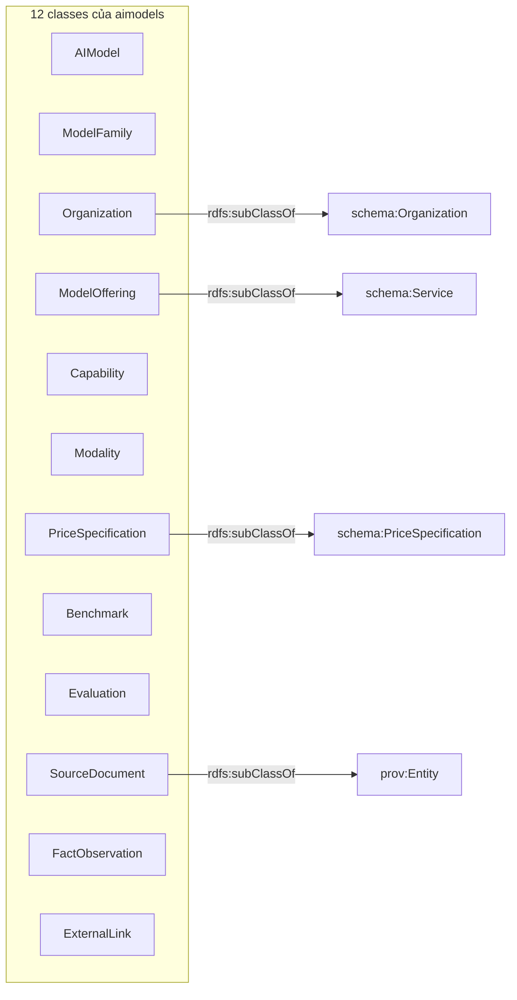
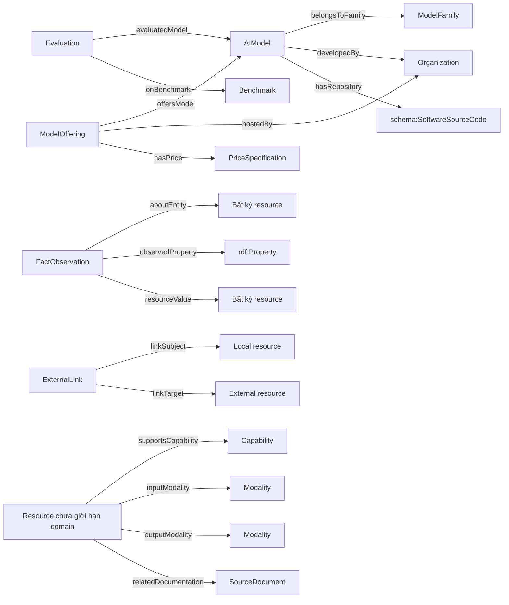
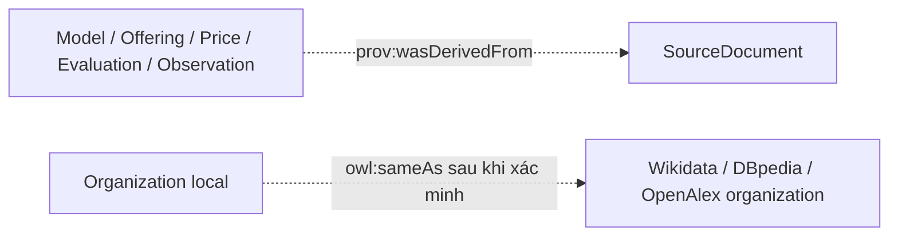
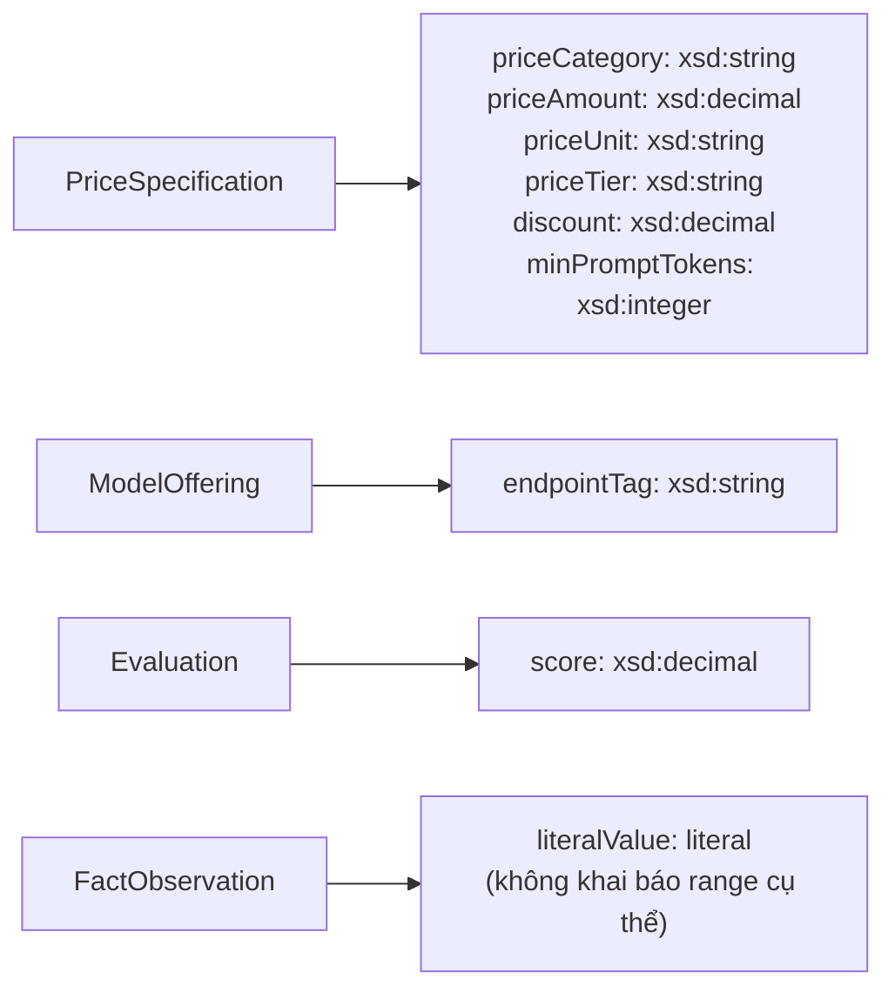
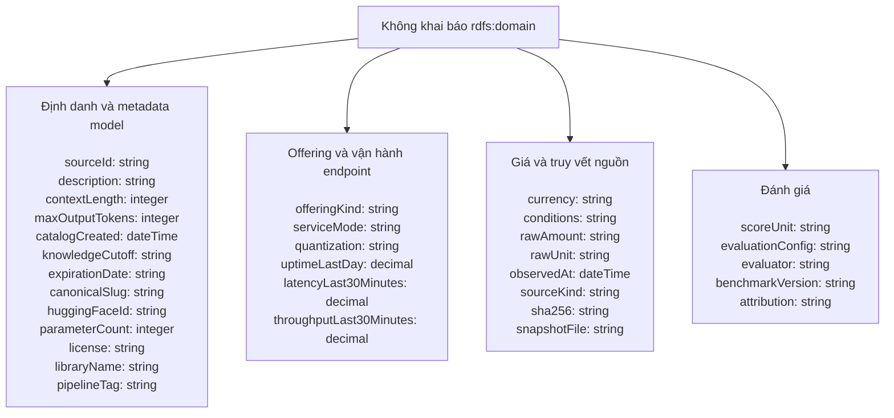

# Sơ đồ toàn bộ ontology `aimodels`

Nguồn chuẩn của các sơ đồ này là [`res/ontology.ttl`](../res/ontology.ttl), phiên bản 2.0.
Ontology hiện có **12 classes, 17 object properties và 41 datatype properties**.

## 1. Toàn bộ classes và quan hệ kế thừa

Mũi tên `subClassOf` là quan hệ kế thừa RDFS. Bốn lớp chuẩn bên phải được tái sử dụng
thay vì định nghĩa lại trong namespace của project.



`ModelFamily` không phải lớp cha của `AIModel`. Quan hệ model thuộc một family được
biểu diễn bằng `belongsToFamily`. Tương tự, developer và API provider là vai trò của
`Organization`, không phải các subclass khác nhau.

## 2. Toàn bộ 17 object properties

Mỗi mũi tên dưới đây là một object property. `Bất kỳ resource` nghĩa là ontology chủ
động không khai báo `rdfs:range` cụ thể. Ba quan hệ đi từ `Resource chưa giới hạn domain`
cũng không có `rdfs:domain`, vì cả model và offering có thể mang modality/capability hoặc
liên kết tài liệu tùy dữ liệu nguồn.



`FactObservation` còn có datatype property `literalValue`. Vì vậy object của một phát
biểu có thể là resource qua `resourceValue`, hoặc literal qua `literalValue`.

Hai property chuẩn dưới đây được dùng trong graph nhưng không được project định nghĩa lại:



## 3. Toàn bộ 41 datatype properties

### Các property có `rdfs:domain` cụ thể



### Các property không khóa `rdfs:domain`

Các nhóm dưới đây chỉ giúp đọc sơ đồ. Chúng **không phải class** và việc đặt cạnh nhau
không tạo ra axiom mới. Validator và pipeline quyết định entity nào sử dụng property dựa
trên loại record nguồn.



## 4. Sơ đồ ontology hoàn chỉnh

Sơ đồ này ghép 12 lớp thành một hình duy nhất. Các nút màu xám là lớp hoặc resource
từ vocabulary bên ngoài; chúng không làm tăng số class do project tự định nghĩa.

```mermaid
flowchart TB
  subgraph CORE["Model và API"]
    MODEL["AIModel"] -- "belongsToFamily" --> FAMILY["ModelFamily"]
    MODEL -- "developedBy" --> ORG["Organization"]
    MODEL -- "hasRepository" --> REPO["schema:SoftwareSourceCode"]
    MODEL -- "supportsCapability" --> CAP["Capability"]
    MODEL -- "inputModality" --> MOD["Modality"]
    MODEL -- "outputModality" --> MOD

    OFFER["ModelOffering"] -- "offersModel" --> MODEL
    OFFER -- "hostedBy" --> ORG
    OFFER -- "hasPrice" --> PRICE["PriceSpecification"]
    OFFER -- "supportsCapability" --> CAP
    OFFER -- "inputModality / outputModality" --> MOD
  end

  subgraph BENCHMARKS["Đánh giá"]
    EVAL["Evaluation"] -- "evaluatedModel" --> MODEL
    EVAL -- "onBenchmark" --> BENCH["Benchmark"]
  end

  subgraph PROVENANCE["Nguồn và quan sát"]
    OBS["FactObservation"] -- "aboutEntity" --> SUBJECT["Bất kỳ resource"]
    OBS -- "observedProperty" --> PROP["rdf:Property"]
    OBS -- "resourceValue" --> RVALUE["Resource value"]
    OBS -- "literalValue" --> LVALUE["Literal value"]
    OBS -. "prov:wasDerivedFrom" .-> SOURCE["SourceDocument"]
    MODEL -- "relatedDocumentation" --> SOURCE
    OFFER -- "relatedDocumentation" --> SOURCE
    PRICE -. "prov:wasDerivedFrom" .-> SOURCE
    EVAL -. "prov:wasDerivedFrom" .-> SOURCE
  end

  subgraph IDENTITY["Identity chỉ ở cấp tổ chức"]
    LINK["ExternalLink"] -- "linkSubject" --> ORG
    LINK -. "prov:wasDerivedFrom" .-> SOURCE
    ORG -. "owl:sameAs" .-> WD["Wikidata organization"]
    ORG -. "owl:sameAs" .-> DBP["DBpedia organization"]
    ORG -. "owl:sameAs" .-> OA["OpenAlex Institution"]
    LINK -- "linkTarget" --> WD
    LINK -- "linkTarget" --> DBP
    LINK -- "linkTarget" --> OA
  end

  ORG -. "rdfs:subClassOf" .-> SORG["schema:Organization"]
  OFFER -. "rdfs:subClassOf" .-> SERVICE["schema:Service"]
  PRICE -. "rdfs:subClassOf" .-> SPRICE["schema:PriceSpecification"]
  SOURCE -. "rdfs:subClassOf" .-> PENTITY["prov:Entity"]
```



`AIModel` không nối `owl:sameAs` tới nguồn ngoài. Nó nối tới `Organization` bằng
`developedBy`. Chính `Organization` mới nối `sameAs` tới organization tương ứng trong
Wikidata, DBpedia hoặc OpenAlex. `ExternalLink` lưu bằng chứng cho các identity links đó.

## 5. Cách kiểm tra sơ đồ với file ontology

```bash
cd /home/puda14/Desktop/Project/semantic-web/aimodels

# Kiểm tra Turtle có parse được
.venv/bin/python -c "from rdflib import Graph; print(len(Graph().parse('res/ontology.ttl')))"

# Mở ontology bằng Protégé
../Protege-5.6.9/run.sh
```

Trong Protégé, mở `aimodels/res/ontology.ttl`, xem `Entities` để duyệt class/property và
`OntoGraf` để xem đồ thị. File dữ liệu `models.ttl` lớn hơn nhiều và phù hợp để query bằng
Fuseki; nó không phải file định nghĩa ontology.
