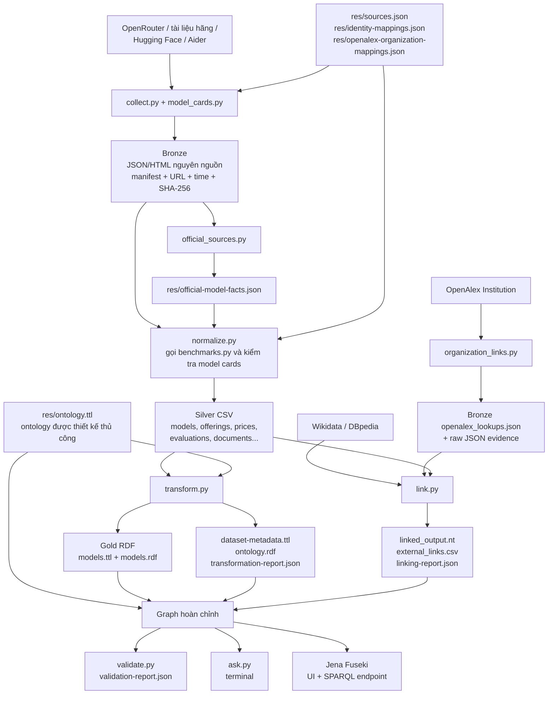
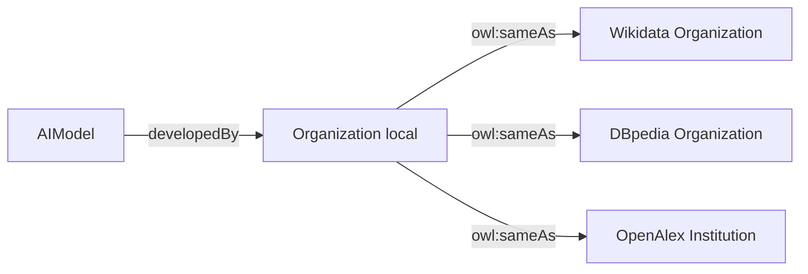

# Luồng toàn bộ project `aimodels`

Tài liệu này trả lời ba câu hỏi:

1. Project đã đáp ứng năm yêu cầu capstone đến đâu?
2. Mỗi file Python nhận đầu vào gì, xử lý gì và tạo file nào?
3. Khi query offline hoặc nạp Fuseki, graph được ghép từ những file nào?

## 1. Kết luận theo năm yêu cầu

| Yêu cầu | Trạng thái | Bằng chứng trong repo |
|---|---|---|
| 1. Define an ontology | **Đạt** | `res/ontology.ttl`: 12 classes, 17 object properties, 41 datatype properties; có domain/range, subclass, label/comment và tái sử dụng vocabulary chuẩn |
| 2. Collect relevant data | **Đạt** | 573 source snapshots trong Bronze từ OpenRouter, trang hãng, Hugging Face và Aider; cache identity từ Wikidata, DBpedia và OpenAlex |
| 3. Transform into 4-star data | **Đã có đủ artifact; public sau khi Pages deploy** | CSV Silver → RDF Turtle/RDF/XML, HTTP URI GitHub Pages, typed literals, vocabulary chuẩn, provenance và license |
| 4. Establish links for 5-star | **Đã có liên kết; public sau khi Pages deploy** | 14 `owl:sameAs` cấp Organization: 9 OpenAlex và 5 Wikidata/DBpedia; graph kết hợp được workflow xuất bản thành Turtle |
| 5. SPARQL endpoint/terminal | **Đạt** | `src/ask.py` query offline hoặc gọi endpoint; Fuseki cung cấp UI và `/aimodels/sparql` sau khi người dùng khởi động/nạp graph |

Với phạm vi một capstone chạy local, project có đủ năm phần để trình bày và demo. Trong
báo cáo nên dùng câu **“RDF 4-star và liên kết hướng tới 5-star đã được triển khai;
public deployment còn là bước triển khai”**. Không nên khẳng định dataset đã là 5-star
trên Web khi URI `https://brodsmaster.github.io/semantic-web-ai-models/data/aimodels.ttl#` chưa phục vụ dữ liệu của project.

## 2. Project đang xây dựng cái gì?

Project tạo knowledge graph về:

- model và model family;
- tổ chức phát triển model;
- API offering và tổ chức cung cấp API;
- giá input/output/cache và điều kiện giá;
- capability, modality và thông số;
- benchmark/evaluation;
- source document và provenance;
- liên kết organization tới Wikidata, DBpedia và OpenAlex.

Ví dụ một đường query:

```text
Claude Opus 4.6
  → được cung cấp qua offering nào?
  → offering do provider nào vận hành?
  → offering có giá input/output bao nhiêu?
  → giá được lấy từ URL nào và vào thời điểm nào?
```

## 3. Sơ đồ toàn bộ pipeline



## 4. Ý nghĩa các thư mục

| Thư mục | Vai trò |
|---|---|
| `res/` | Ontology, cấu hình nguồn/mapping, RDF links và các báo cáo sinh ra |
| `src/data/bronze/` | Dữ liệu nguyên gốc: JSON/HTML, URL, thời điểm và checksum |
| `src/data/silver/` | CSV đã chuẩn hóa theo các entity/relationship của ontology |
| `src/data/gold/` | RDF catalog ở Turtle và RDF/XML |
| `src/model_catalog/` | Code thu thập, chuẩn hóa, biến đổi, liên kết và kiểm tra |
| `queries/` | Các competency questions viết bằng SPARQL |
| `scripts/` | Khởi động Fuseki và nạp graph |
| `tests/` | Unit/regression tests |
| `docs/` | Tài liệu ontology, pipeline, linking, Fuseki và validation |
| `run/` | Dữ liệu runtime của Fuseki/TDB2; không phải source dataset |

`res/` hiện chứa cả file được viết thủ công và file sinh tự động. Cần phân biệt chúng
theo các bảng bên dưới.

## 5. Bước 1 — ontology được tạo thế nào?

### File viết thủ công

[`res/ontology.ttl`](../res/ontology.ttl) là nguồn chuẩn của ontology. File này không
được tạo từ OpenRouter hay từ CSV. Nó được thiết kế trước dựa trên phạm vi, kịch bản và
các câu hỏi cần query.

Ontology có 12 lớp:

```text
AIModel, ModelFamily, Organization, ModelOffering,
Capability, Modality, PriceSpecification,
Benchmark, Evaluation, SourceDocument,
FactObservation, ExternalLink
```

Một số quan hệ chính:

```text
AIModel       --developedBy------> Organization
AIModel       --belongsToFamily--> ModelFamily
ModelOffering --offersModel------> AIModel
ModelOffering --hostedBy---------> Organization
ModelOffering --hasPrice---------> PriceSpecification
Evaluation    --evaluatedModel---> AIModel
Evaluation    --onBenchmark------> Benchmark
Organization  --owl:sameAs-------> organization bên ngoài
```

Ontology tái sử dụng RDF/RDFS/OWL, XSD, Schema.org, PROV-O và Dublin Core. Ví dụ,
`Organization` là subclass của `schema:Organization`; `SourceDocument` là subclass của
`prov:Entity`.

### File liên quan

| File | Được tạo thế nào? | Có nạp Fuseki? |
|---|---|---:|
| `res/ontology.ttl` | Viết thủ công; nguồn chuẩn | Có |
| `res/ontology.rdf` | `transform.py` chuyển cùng ontology sang RDF/XML | Không cần, vì trùng nội dung với `.ttl` |
| `res/example-data.ttl` | Dữ liệu giả để minh họa ontology | Không |
| `docs/ONTOLOGY_DIAGRAM.md` | Sơ đồ giải thích ontology | Không |

## 6. Bước 2 — thu thập dữ liệu

### 6.1 `collect.py`

Lệnh online:

```bash
PYTHONPATH=src .venv/bin/python -m model_catalog.collect
```

| Thành phần | Nội dung |
|---|---|
| Input | OpenRouter `/api/v1/models`; endpoint của từng model; các URL trong `res/sources.json` |
| Xử lý | HTTP GET; kiểm tra schema; tính SHA-256; lưu response bytes; ghi URL và thời điểm |
| Output chính | `src/data/bronze/manifest.json` |
| Output aggregate | `openrouter_models.json`, `openrouter_endpoints.json` |
| Output immutable | `src/data/bronze/snapshots/catalog-*.json`, `endpoints-*.json` |
| Output raw | `src/data/bronze/documents/*.json` và `*.html` |

`manifest.json` cho biết mỗi tài liệu đến từ URL nào, lưu ở file nào, được lấy lúc nào
và có checksum gì. Các bước sau đọc file mà manifest chỉ tới thay vì âm thầm gọi mạng.

### 6.2 `model_cards.py`

```bash
PYTHONPATH=src .venv/bin/python -m model_catalog.model_cards
```

Module đọc `hugging_face_id` do OpenRouter cung cấp, chỉ lấy repository thuộc publisher
namespace đã cho phép, rồi gọi Hugging Face API.

```text
Input:  Bronze catalog + manifest
Output: Bronze documents/hf-*.json
        Bronze snapshots/model-cards-*.json
        manifest.json được bổ sung model_cards_file
```

Project chỉ tạo `AIModel --hasRepository--> Hugging Face repository`; repository không
được coi là `owl:sameAs` với model.

### 6.3 `official_sources.py`

```bash
PYTHONPATH=src .venv/bin/python -m model_catalog.official_sources
```

```text
Input:  HTML official đã lưu trong Bronze + manifest
Xử lý:  chỉ parse bảng/mẫu HTML đã nhận dạng; không đoán dữ liệu từ text tùy ý
Output: res/official-model-facts.json
        res/official-extraction-report.json
```

Hiện parser trích record có cấu trúc cho OpenAI, Anthropic, MiniMax và Z.AI. Các trang
hãng khác vẫn được giữ làm source document khi chưa có parser field-level phù hợp.

### 6.4 `benchmarks.py`

Module này không cần chạy riêng. `normalize.py` gọi hàm `add_aider()`.

```text
Input:  Bronze HTML Aider
        res/identity-mappings.json
        model ID đã chuẩn hóa
Output: rows Benchmark và Evaluation trong Silver
        row không map chắc chắn → unmatched.csv
```

Điểm Artificial Analysis hiện được đọc từ trường attribution trong dữ liệu OpenRouter;
project không gọi Artificial Analysis API trực tiếp.

## 7. Bước 3 — Bronze thành Silver rồi RDF Gold

### 7.1 `normalize.py`: Bronze → Silver

```bash
PYTHONPATH=src .venv/bin/python -m model_catalog.normalize
```

Input:

```text
Bronze manifest
Bronze catalog/endpoints snapshots
Bronze Hugging Face model-card snapshots
res/official-model-facts.json
Bronze Aider HTML + res/identity-mappings.json
```

Xử lý chính:

- tạo HTTP URI ổn định từ source ID;
- tách developer khỏi API provider;
- tách model khỏi offering;
- chuyển giá token sang USD/1 triệu token bằng `Decimal`;
- giữ giá 0 khác với giá không biết;
- giữ standard/batch/free và pricing tier riêng;
- tạo `FactObservation` có source/time;
- gắn benchmark đúng model bằng mapping rõ ràng;
- kiểm tra lại checksum/ID model card Hugging Face.

Output là các bảng trong `src/data/silver/`:

| CSV | Chứa gì? |
|---|---|
| `models.csv` | Model, family, developer, source ID |
| `families.csv` | Model family |
| `organizations.csv` | Developer và API provider |
| `offerings.csv` | Cách truy cập model qua một provider/service |
| `prices.csv` | Giá, loại phí, currency, unit, tier, điều kiện, nguồn |
| `capabilities.csv` | Capability/parameter API |
| `modalities.csv` | Text, image, audio, video, file |
| `benchmarks.csv` | Benchmark/protocol |
| `evaluations.csv` | Điểm model trên benchmark |
| `documents.csv` | Source documents và provenance |
| `observations.csv` | Phát biểu có subject/property/value/source/time |
| `unmatched.csv` | Record không map đủ chắc chắn |
| `external_links.csv` | Được `link.py` ghi ở bước 4 |

`normalize.py` cũng tạo [`res/coverage.json`](../res/coverage.json). Lưu ý: normalize
khởi tạo lại `external_links.csv`; vì vậy phải chạy `link.py` sau normalize/transform.

### 7.2 `transform.py`: Silver → RDF

```bash
PYTHONPATH=src .venv/bin/python -m model_catalog.transform
```

```text
Input:  toàn bộ Silver CSV
        res/ontology.ttl

Output: src/data/gold/models.ttl   (Turtle)
        src/data/gold/models.rdf   (RDF/XML của cùng graph)
        res/ontology.rdf           (ontology ở RDF/XML)
        res/dataset-metadata.ttl   (DCAT/Dublin Core metadata)
        res/transformation-report.json
```

`models.ttl` và `models.rdf` là hai serialization của cùng dữ liệu, không nạp cả hai
vào Fuseki. Project chọn `models.ttl` khi query/nạp server.

Đây là phần kỹ thuật 4-star:

- dữ liệu có cấu trúc RDF;
- dùng HTTP URI thay cho số dòng CSV;
- dùng format mở Turtle/RDF/XML;
- dùng vocabulary chuẩn;
- number/date/time có datatype XSD;
- mỗi fact/price có provenance.

Builder đã tạo dataset và license cần thiết. Bước còn lại là push workflow để GitHub
Pages host URI, khi đó trình duyệt và chương trình có thể dereference file Turtle.

## 8. Bước 4 — liên kết organization tới dataset ngoài

Project không tạo `sameAs` cấp model. Luồng identity hiện tại là:



### 8.1 `organization_links.py`: bằng chứng OpenAlex

Lệnh lấy lại dữ liệu online:

```bash
PYTHONPATH=src .venv/bin/python -m model_catalog.organization_links
```

```text
Input:  res/openalex-organization-mappings.json
        OpenAlex Institution API
Xử lý:  kiểm tra local ID/name, OpenAlex ID/name, type company,
        homepage, ROR và QID khi mapping yêu cầu
Output: src/data/bronze/openalex_lookups.json
        src/data/bronze/documents/openalex-*.json
```

### 8.2 `link.py`: tạo RDF links

Chạy lại từ cache, không gọi mạng:

```bash
PYTHONPATH=src .venv/bin/python -m model_catalog.link --offline
```

Input:

```text
Silver organizations.csv
Bronze external_lookups.json            (Wikidata/DBpedia)
Bronze openalex_lookups.json            (OpenAlex)
Bronze OpenAlex raw evidence
res/openalex-organization-mappings.json
candidate Wikidata trong link.py
```

Output:

```text
res/linked_output.nt
  → 14 organization owl:sameAs triples
  → ExternalLink evidence entities

src/data/silver/external_links.csv
  → subject, target, reason, source URL, observed time

res/linking-report.json
  → số links, accepted/rejected decisions và warnings

res/coverage.json
  → cập nhật external_links = 14
```

Hiện có 9 links OpenAlex và 5 links Wikidata/DBpedia. Đây là outbound links thật tới
các dataset khác. Để gọi là 5-star public hoàn chỉnh, graph local này còn phải được
public theo các điều kiện ở bước 3.

## 9. Kiểm tra toàn bộ project

```bash
PYTHONPATH=src .venv/bin/python -m model_catalog.validate
```

[`validate.py`](../src/model_catalog/validate.py) gọi `load_model_graph()` để ghép:

```text
res/ontology.ttl
+ src/data/gold/models.ttl
+ res/linked_output.nt
+ res/dataset-metadata.ttl
= graph hoàn chỉnh
```

Sau đó module kiểm tra:

- checksum Bronze;
- ID trùng hoặc quan hệ dangling;
- số entity trong CSV và RDF;
- OpenAlex evidence và `sameAs` được phát lại từ raw JSON;
- toàn bộ 14 file query SPARQL;
- OWL RL trên fixture đại diện.

Output: [`res/validation-report.json`](../res/validation-report.json).

Trạng thái đã kiểm tra gần nhất:

```text
22 tests passed
14 SPARQL queries executed
354,622 combined triples
14 organization identity links
0 model identity links
0 validator errors
0 validator warnings
```

## 10. Query bằng terminal

[`src/ask.py`](../src/ask.py) dùng đúng bốn file tạo graph hoàn chỉnh như validator.

```bash
.venv/bin/python src/ask.py queries/claude_models.rq
.venv/bin/python src/ask.py queries/opus_providers_prices.rq
.venv/bin/python src/ask.py queries/external_links.rq
```

Luồng chạy:

```text
.rq file
  → ask.py đọc câu SPARQL
  → load_model_graph() ghép bốn file RDF
  → rdflib thực thi query
  → kết quả CSV in ra terminal
```

Không cần Fuseki cho chế độ này.

## 11. Nạp Fuseki

### 11.1 Bốn file được nạp

[`scripts/load_fuseki.sh`](../scripts/load_fuseki.sh) POST tuần tự đúng bốn file:

| Thứ tự | File | Nội dung |
|---:|---|---|
| 1 | `res/ontology.ttl` | Classes/properties/axioms |
| 2 | `src/data/gold/models.ttl` | Model, offering, price, evaluation, provenance |
| 3 | `res/linked_output.nt` | 14 organization sameAs và evidence |
| 4 | `res/dataset-metadata.ttl` | Metadata và danh sách nguồn dataset |

Không nạp `models.rdf`, `ontology.rdf` vì chúng trùng graph với bản Turtle. Không nạp
`example-data.ttl` vì đó là dữ liệu giả minh họa.

### 11.2 Chạy server và load

Terminal 1:

```bash
cd /home/puda14/Desktop/Project/semantic-web/aimodels
bash scripts/start_fuseki.sh
```

Terminal 2:

```bash
cd /home/puda14/Desktop/Project/semantic-web/aimodels
bash scripts/load_fuseki.sh
```

Sau đó:

```text
UI:       http://localhost:3030/
Dataset:  aimodels
Endpoint: http://localhost:3030/aimodels/sparql
```

Query endpoint từ terminal:

```bash
.venv/bin/python src/ask.py queries/opus_providers_prices.rq \
  --endpoint http://localhost:3030/aimodels/sparql
```

`load_fuseki.sh` chỉ **thêm** triples, không xóa graph cũ. Sau khi loại bỏ model
`sameAs`, dataset Fuseki cũ có thể vẫn giữ triples cũ. Khi demo bản hiện tại, hãy dùng
dataset sạch hoặc xóa dữ liệu cũ rồi mới chạy loader.

## 12. Hai cách chạy pipeline

### Cách A — tái tạo từ snapshot đang có, không gọi mạng

```bash
cd /home/puda14/Desktop/Project/semantic-web/aimodels
source .venv/bin/activate

PYTHONPATH=src python -m model_catalog.collect --offline
PYTHONPATH=src python -m model_catalog.model_cards --offline
PYTHONPATH=src python -m model_catalog.official_sources
PYTHONPATH=src python -m model_catalog.normalize
PYTHONPATH=src python -m model_catalog.transform
PYTHONPATH=src python -m model_catalog.link --offline
python -m unittest discover -s tests
PYTHONPATH=src python -m model_catalog.validate
```

Đây là cách ổn định nhất để demo vì dùng đúng snapshot đã được kiểm tra.

### Cách B — thu thập snapshot mới từ Internet

```bash
cd /home/puda14/Desktop/Project/semantic-web/aimodels
source .venv/bin/activate

PYTHONPATH=src python -m model_catalog.collect
PYTHONPATH=src python -m model_catalog.model_cards
PYTHONPATH=src python -m model_catalog.official_sources
PYTHONPATH=src python -m model_catalog.normalize
PYTHONPATH=src python -m model_catalog.transform
PYTHONPATH=src python -m model_catalog.link
python -m unittest discover -s tests
PYTHONPATH=src python -m model_catalog.validate
```

Cách B phụ thuộc schema và nội dung nguồn tại thời điểm chạy. Nếu nguồn đổi HTML/API,
parser có thể cảnh báo hoặc từ chối record thay vì âm thầm tạo dữ liệu sai.

## 13. Tóm tắt file Python: input → output

| File | Input | Xử lý | Output |
|---|---|---|---|
| `common.py` | Path, URL, record | I/O, fetch, hash, URI, CSV/JSON helpers | Được các module khác gọi |
| `collect.py` | API/URL + `sources.json` | Thu thập và checksum | Bronze raw + snapshots + manifest |
| `model_cards.py` | Catalog + HF API | Xác minh publisher repo ID | Bronze HF JSON + manifest |
| `official_sources.py` | Bronze official HTML | Parse schema được nhận dạng | `official-model-facts.json`, extraction report |
| `benchmarks.py` | Aider HTML + mapping | Parse điểm và map exact model ID | Benchmark/evaluation rows trong Silver |
| `normalize.py` | Bronze + official facts | Chuẩn hóa entities, price, provenance | Silver CSV + `coverage.json` |
| `transform.py` | Silver + ontology | CSV → typed RDF | Gold TTL/RDF + metadata + report |
| `organization_links.py` | OpenAlex mapping + API | Xác minh organization identity | Bronze OpenAlex evidence/cache |
| `link.py` | Silver org + identity caches | Xuất sameAs cấp organization | `linked_output.nt`, external links, report |
| `validate.py` | Bronze + Silver + RDF + queries | Integrity/provenance/query checks | `validation-report.json` |
| `ask.py` | `.rq` + local graph/endpoint | Chạy SPARQL | CSV ở terminal |
| `scripts/build_site.py` | Silver CSV + bốn file RDF + license | Tạo catalog JSON, ghép graph và dựng trang tĩnh | `site/` để xem local hoặc deploy Pages |

Luồng ngắn nhất để nhớ:

```text
ontology.ttl được thiết kế thủ công
        +
Web/API → Bronze → normalize.py → Silver → transform.py → Gold RDF
                                    ↓
Wikidata/DBpedia/OpenAlex → link.py → linked_output.nt
                                    ↓
ontology + Gold + links + metadata → ask.py / validate.py / Fuseki
                                    → build_site.py → GitHub Pages + RDF public
```

## 14. Xuất bản website và URI công khai

`scripts/build_site.py` không thu thập thêm dữ liệu. Nó đọc đúng kết quả Silver/Gold
đã được pipeline tạo ra, rồi sinh:

```text
site/
├── index.html                  giao diện tổng quan
├── models/                    tìm model, offering, giá và evaluation
├── organizations/             xem organization và external links
├── ontology/                  giải thích 12 lớp
├── sparql/                    hướng dẫn Fuseki/CLI và query mẫu
├── dataset/                   tải dữ liệu và đọc license
├── data/catalog.json          dữ liệu gọn cho JavaScript giao diện
└── data/aimodels.ttl          graph kết hợp để tải và dereference URI
```

Chạy thử tại máy:

```bash
PYTHONPATH=src .venv/bin/python scripts/build_site.py
cd site
python -m http.server 8000
```

Khi code được push vào `main`, `.github/workflows/pages.yml` cài dependencies,
chạy lại builder và deploy artifact lên GitHub Pages. Namespace của project là:

```text
https://brodsmaster.github.io/semantic-web-ai-models/data/aimodels.ttl#
```

Phần trước dấu `#` tải được file RDF công khai. Phần sau dấu `#` định danh class,
property hoặc resource cụ thể trong graph. GitHub Pages chỉ host file tĩnh; endpoint
SPARQL `/aimodels/sparql` tiếp tục do Fuseki local cung cấp.
