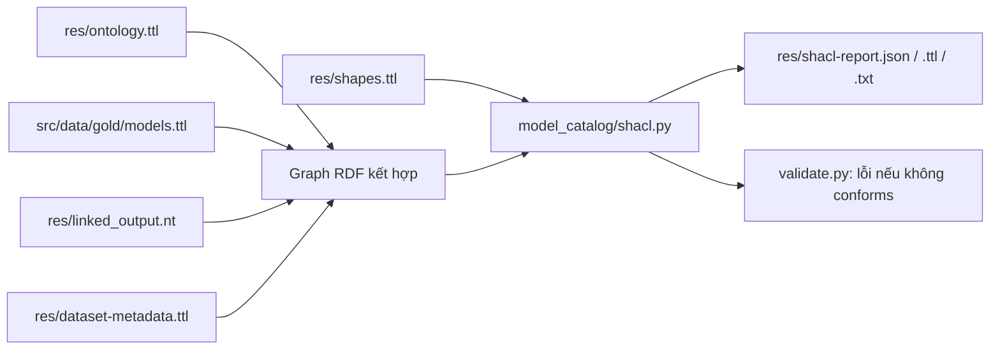

# Kiểm tra RDF bằng SHACL

SHACL là bộ luật kiểm tra graph RDF. Ví dụ, một giá phải có số tiền kiểu
`xsd:decimal`, đơn vị, tiền tệ và nguồn; một offering phải trỏ tới đúng model và
provider. Ontology mô tả ý nghĩa các lớp/quan hệ; SHACL kiểm tra dữ liệu có đáp ứng
các yêu cầu cụ thể của project hay không.

Project dùng [pySHACL](https://github.com/RDFLib/pySHACL), thực thi chuẩn
[SHACL của W3C](https://www.w3.org/TR/shacl/).

## Luồng và file



| File | Đầu vào → đầu ra / khi dùng |
|---|---|
| `res/shapes.ttl` | Luật SHACL được thiết kế cho cấu trúc dữ liệu aimodels; chỉnh khi thay đổi yêu cầu dữ liệu |
| `src/model_catalog/shacl.py` | Graph kết hợp + shapes → báo cáo JSON/Turtle/text; có CLI chạy riêng |
| `src/model_catalog/validate.py` | Tự gọi SHACL trên graph đã đọc, sau đó tiếp tục kiểm tra CSV, checksum, identity và query; đưa kết quả SHACL vào `validation-report.json` |
| `tests/test_shacl.py` | Các ca hợp lệ và các lỗi chủ động tạo ra; kiểm tra luật có bắt đúng lỗi |
| `tests/fixtures/shacl-valid.ttl` | Graph mẫu giả lập cho tests và demo; không phải dữ liệu nguồn thật |
| `tests/fixtures/shacl-invalid-price.ttl` | Graph mẫu có giá `"five"` thay vì decimal; dùng để demo lỗi |

Shapes và báo cáo là file kiểm tra riêng. Không cần nạp chúng vào default graph
catalog của Fuseki để chạy query dữ liệu. Validator đọc RDF local; nó không tự đọc
hoặc sửa server Fuseki, không recollect dữ liệu và không sửa Gold.

## Các luật cụ thể

| Đối tượng | Yêu cầu |
|---|---|
| Model | Có tên và đúng một source ID, family, developer; family/developer có đúng class; modality/capability/documentation phải đúng class nếu có; repository là URI đúng dạng Hugging Face, không yêu cầu import class của thực thể bên ngoài |
| Offering | Đúng một model và provider; provider là Organization hoặc schema:Service, không phải một offering khác; có kind, mode, nguồn và ngày lấy dữ liệu |
| Giá | Đúng một amount decimal ≥ 0, category, currency và unit; thuộc đúng một offering; có nguồn kiểu SourceDocument và timestamp dateTime; discount ≤ 1; minPromptTokens là integer ≥ 0 nếu có |
| SourceDocument | Có URL HTTP(S), source kind, SHA-256 đúng 64 ký tự hex thường, đường dẫn snapshot và timestamp |
| FactObservation | Có subject là model/offering, property, nguồn và timestamp; đúng một trong literalValue hoặc resourceValue, không được cả hai hoặc thiếu cả hai |
| Evaluation | Có đúng model, benchmark, score decimal, đơn vị, cấu hình, attribution và nguồn |
| Organization / family / capability / modality / benchmark | Có URI và nhãn chuỗi không rỗng |
| ExternalLink | Có subject organization/service, target HTTP(S), lý do, URL bằng chứng, SHA-256, snapshot và timestamp; cặp subject/target phải tồn tại dưới dạng sameAs |
| sameAs | Mỗi đích liên kết phải có ExternalLink tương ứng; không cho phép model-level sameAs theo phạm vi hiện tại của project |
| Giới hạn token / số tham số | Nếu có phải là integer ≥ 0 |

Không bắt buộc thông tin nguồn không có: model không phải có benchmark, giá,
repository, số tham số hay modality để được chấp nhận. Giá 0 hợp lệ, thiếu giá không
được thay bằng 0. Mode/unit/category giữ tính mở để nhận các giá trị được nguồn
cung cấp. Không giới hạn mọi benchmark vào khoảng 0–100 vì thang đo khác nhau.

Validator dùng `inference="none"` để kiểm tra phát biểu thực tế đã xuất; không dùng
suy luận để bù trường hoặc class bị thiếu. Các luật được kiểm tra bằng Meta-SHACL.
Shapes không đóng (`sh:closed`): thuộc tính bổ sung được phép. Các convenience facts
như contextLength có thể giữ nhiều giá trị có nguồn; SHACL không tự chọn giá trị đúng.

## Cài và chạy

Tại thư mục `aimodels`, cập nhật thư viện một lần:

```bash
.venv/bin/python -m pip install -r requirements.txt
```

Kiểm tra riêng SHACL trên toàn bộ graph local:

```bash
PYTHONPATH=src .venv/bin/python -m model_catalog.shacl
```

Hoặc kiểm tra toàn pipeline, đã tích hợp SHACL:

```bash
PYTHONPATH=src .venv/bin/python -m model_catalog.validate
```

Chạy tuần tự, chờ lệnh hoàn tất. Graph có hàng trăm nghìn triples nên kiểm tra đầy
đủ có thể mất vài phút. Không cần tạo lại dữ liệu hoặc khởi động Fuseki để chạy.

## Đọc báo cáo

- `res/shacl-report.json`: `conforms`, số kết quả, thời gian và từng lỗi.
- `res/shacl-report.ttl`: báo cáo RDF chuẩn `sh:ValidationReport`.
- `res/shacl-report.txt`: báo cáo văn bản dễ xem.
- `res/validation-report.json`: thêm phần `shacl` khi chạy validator toàn pipeline.

`conforms: true` nghĩa là graph đạt các luật đã thiết kế. Khi không đạt, mỗi kết quả
cho biết `focus_node` (thực thể lỗi), `path` (thuộc tính), `value` (giá trị nếu có),
`constraint` (luật bị vi phạm) và `messages` (mô tả). Path của luật ở cấp node có
thể không xuất hiện; đường dẫn inverse có thể được biểu diễn bằng blank node trong
JSON, với định nghĩa đầy đủ trong báo cáo Turtle.

CLI trả exit code 0 khi đạt; 1 khi RDF vi phạm. Lỗi cài đặt, parse hoặc shapes không
hợp lệ làm lệnh thất bại, không được coi là graph đạt.

## Demo lỗi cho video

Dùng fixtures riêng để không sửa dữ liệu project:

```bash
PYTHONPATH=src .venv/bin/python -m model_catalog.shacl \
  --data tests/fixtures/shacl-valid.ttl --output-dir /tmp/aimodels-shacl-valid

PYTHONPATH=src .venv/bin/python -m model_catalog.shacl \
  --data tests/fixtures/shacl-invalid-price.ttl --output-dir /tmp/aimodels-shacl-invalid

cat /tmp/aimodels-shacl-invalid/shacl-report.txt
```

Lệnh thứ nhất phải đạt. Lệnh thứ hai chủ động không đạt (exit 1):
`https://example.test/price` có `priceAmount "five"`, trong khi luật yêu cầu
`xsd:decimal`. Báo cáo demo nằm trong `/tmp`, không ghi đè báo cáo graph thật.

## SHACL kiểm chứng được gì?

SHACL kiểm tra cấu trúc, kiểu dữ liệu và sự tồn tại của bằng chứng. Nó không khẳng
định giá API đang đúng ngoài đời, không xác minh nội dung một file chỉ bằng định
dạng checksum, và không chứng minh hai tổ chức cùng danh tính. Kiểm tra bytes
snapshot và đối chiếu danh tính Wikidata/DBpedia/OpenAlex vẫn được thực hiện trong
validator và các module link hiện có. Hai lớp kiểm tra bổ sung cho nhau.

## Kết quả trên snapshot hiện tại

Ngày 10/10/2026: kiểm tra 355.218 triples, `conforms: true`, 0 vi phạm.
SHACL mất 78,82 giây trong lần chạy này; thời gian thay đổi theo máy.
15 query SPARQL của validator toàn pipeline đều thực thi thành công.
