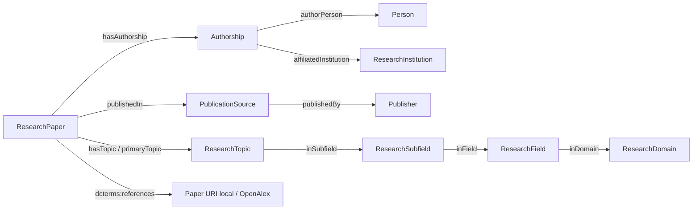

# Thiết kế ontology theo Ontology Engineering Skill

Nguồn phương pháp: [ONTOLOGY_ENGINEERING_SKILL.md](../../ONTOLOGY_ENGINEERING_SKILL.md).
Artifact: [ontology.ttl](../res/ontology.ttl), version `1.0.0`.
Namespace: `https://example.org/aimodels/`. Đây là namespace mẫu, chưa có
dịch vụ dereference public. Tác giả dự án và giấy phép riêng của code/ontology
chưa được chủ dự án chỉ định; không tự nhận danh tính hoặc gán license.

Phạm vi, kịch bản và CQs được xác định trước các lớp; xem
[requirements](requirements.md), [glossary](glossary.md),
[competency questions](competency-questions.md).

## Taxonomy và cấu trúc

Diagram là quan hệ giữa instances. Subclass thực tế:

- Mọi ResearchPaper là schema:ScholarlyArticle.
- Mọi Person là schema:Person.
- Mọi ResearchInstitution và Publisher là schema:Organization.
- Mọi lớp classification là skos:Concept.
- Mọi Authorship là schema:Role.
- PublicationSource giữ định nghĩa riêng vì journal/repository/conference
  không có một external class hẹp chắc chắn bao phủ tất cả.

Topic **thuộc** subfield, nhưng không phải mọi Topic là Subfield. Bốn cấp
phân loại nối bằng object properties/subproperties của skos:broader, không
dùng quan hệ subclass để biểu diễn việc thuộc một cấp.

## Identity, rigidity, unity và composition

| Lớp | Identity criterion | Type hay role / rigidity | Unity, ranh giới và composition |
|---|---|---|---|
| ResearchPaper | OpenAlex W ID | Loại công trình nghiên cứu trong scope | Một bài riêng lẻ thuộc scope; loại collection/paratext, book/chapter/report; version phụ thuộc nguồn |
| Person | OpenAlex A ID, ORCID nếu có | Loại người; vẫn là người khi hết làm nghiên cứu | Một người, không lấy tên làm identity; nguồn có thể gộp/tách tác giả sai |
| ResearchInstitution | OpenAlex I ID, ROR/QID nếu có | Vai trò tổ chức tham gia nghiên cứu trong mẫu | Một tổ chức; không giả định là bộ phận của mọi tổ chức trong lineage |
| PublicationSource | OpenAlex S ID | Loại venue/resource xuất bản | Một source; không đồng nhất với tổ chức quản lý hoặc các bài trong source |
| Publisher | OpenAlex P ID | Vai trò xuất bản của Organization | Có thể cũng là institution; hai lớp không disjoint |
| ResearchTopic | OpenAlex T ID | Loại concept theo cấp phân loại | Concept có thể được đổi label; hierarchy theo snapshot |
| ResearchSubfield | URI OpenAlex subfields/N | Loại concept theo cấp | Không suy ra composition vật lý từ skos:broader |
| ResearchField | URI OpenAlex fields/N | Loại concept theo cấp | Nhóm subfields trong hệ phân loại; không phân loại con người |
| ResearchDomain | URI OpenAlex domains/N | Loại concept theo cấp | Nhóm fields; không phải một website/domain name |
| Authorship | Cặp W ID + A ID | Vai trò/association theo một bài | Một association gom nhiều affiliation; phụ thuộc đúng paper và person |

Không đặt loại rigid Person/Organization dưới lớp vai trò Authorship,
Publisher hoặc ResearchInstitution. Không dùng functional/inverse-functional
property để ép identity, vì metadata mẫu không bảo đảm tính đầy đủ hay tuyệt
đối chính xác. Không tạo object composition axiom chưa có bằng chứng.

## Object properties: hướng, domain/range và ví dụ

| Property | Domain → range | Ví dụ đọc bằng ngôn ngữ tự nhiên | Đặc tính logic |
|---|---|---|---|
| hasAuthorship | ResearchPaper → Authorship | Bài W1 có participation W1-A1 | inverseOf authoredPaper; không functional |
| authoredPaper | Authorship → ResearchPaper | Participation W1-A1 thuộc bài W1 | Suy luận inverse |
| authorPerson | Authorship → Person | W1-A1 có người A1 | Không dùng OWL cardinality; validator kiểm tra một người trên mỗi record xuất |
| affiliatedInstitution | Authorship → ResearchInstitution | A1 báo affiliation I1 trong W1 | Có thể nhiều tổ chức; không gắn lên Person |
| publishedIn | ResearchPaper → PublicationSource | W1 ở source S1 | Không bắt buộc có trong metadata |
| publishedBy | PublicationSource → Publisher | S1 do P1 xuất bản | Chỉ host P; không ép repository do I quản lý thành P |
| hasTopic | ResearchPaper → ResearchTopic | W1 được OpenAlex gán T1 | Classification có thể nhiều topics |
| primaryTopic | ResearchPaper → ResearchTopic | T1 là primary topic W1 | subPropertyOf hasTopic |
| inSubfield | ResearchTopic → ResearchSubfield | T1 thuộc AI | subPropertyOf skos:broader |
| inField | ResearchSubfield → ResearchField | AI thuộc Computer Science | subPropertyOf skos:broader |
| inDomain | ResearchField → ResearchDomain | Computer Science thuộc Physical Sciences | subPropertyOf skos:broader |
| doi | ResearchPaper → identifier URI | W1 có DOI resolver URI | Không đặt range paper để tránh phân loại nhầm identifier |
| orcid | Person → identifier URI | A1 có ORCID URI | Không suy ra loại Person lên trang profile từ property này |
| ror | ResearchInstitution → identifier URI | I1 có ROR URI | Định danh dùng cho matching P6782 |

Tái sử dụng schema:author cho cạnh paper → person phục vụ truy vấn đơn giản;
dcterms:references cho cạnh trích dẫn; dcterms:source để truy ngược nguồn.
Các term này được dùng theo ý nghĩa của vocabulary, không định nghĩa lại
domain/range toàn cục của chúng.

## Data properties và literals

| Property | Domain | Range | Ví dụ |
|---|---|---|---|
| publicationYear | ResearchPaper | xsd:gYear | `"2024"^^xsd:gYear` |
| citationCount | ResearchPaper | xsd:nonNegativeInteger | `"15"^^xsd:nonNegativeInteger` ở lúc lấy mẫu |
| isOpenAccess | ResearchPaper | xsd:boolean | true/false, bỏ nếu chưa biết |
| workType | ResearchPaper | xsd:string | article/preprint |
| countryCode | ResearchInstitution | xsd:string | VN |
| institutionType | ResearchInstitution | xsd:string | education/company |
| sourceType | PublicationSource | xsd:string | journal/repository |
| issnL | PublicationSource | xsd:string | Một ISSN-L giữ nguyên từ nguồn |
| authorPosition | Authorship | xsd:string | first/middle/last |
| isCorresponding | Authorship | xsd:boolean | Trạng thái theo bài |
| collectionSearch | Không đặt domain | xsd:string | Search lưu trong metadata dataset |

Tái sử dụng rdfs:label, dcterms:title/identifier và dcterms:issued (xsd:date)
thay vì tạo các property đồng nghĩa không cần thiết. Country, year, DOI,
author position là values/relations, không thêm class để đủ số lượng.
Topic assignment score ở silver vì score thuộc cạnh paper-topic; không
gắn score toàn cục lên Topic khi chưa tạo n-ary TopicAssignment.

## Axioms, kiểm tra và open-world assumption

- Disjoint group: ResearchPaper, Person, Authorship, schema:Organization,
  skos:Concept. Không disjoint Publisher và ResearchInstitution.
- Domain/range có thể **suy ra type**, không có nghĩa “bắt buộc điền field”.
  Không dùng minimum cardinality để kiểm tra CSV thiếu.
- `validate.py` kiểm tra export theo closed-world: label/title, typed
  literals, một person và một paper cho mỗi Authorship, không có global
  Person affiliation. Đây là data checks, không phải toàn bộ logic OWL.
- OWL RL closure kiểm tra inverse/subclass/domain/range, disjoint collisions,
  owl:Nothing và lỗi báo bởi owlrl. Không khẳng định đây là chứng minh tính
  nhất quán của mọi biểu thức OWL DL; ontology dùng tập axioms đơn giản.
- Không tự import toàn bộ DBpedia/Wikidata type axioms. sameAs mạnh về
  danh tính; nếu mở rộng/import nguồn ngoài cần kiểm tra collisions lại.

Ví dụ nhỏ có nhãn rõ “synthetic” tại [example-data.ttl](../res/example-data.ttl).
Ontology RDF/XML được tạo từ cùng Turtle, mở bằng Protégé được.

## Review theo skill

Phạm vi và exclusions có tài liệu; CQs có câu hỏi/formal query/expected
answers; glossary phân biệt class/instance/role/value; tất cả lớp có label,
definition, identity/rigidity/unity; hierarchy vượt qua phép “Every A is B”;
properties có hướng/domain/range; các axioms dùng thận trọng; reuse có lý do;
provenance và giới hạn rõ; RDF parse, OWL RL và endpoint được kiểm tra thực.
Xem kết quả chạy trong [validation](VALIDATION.md) và report JSON.
