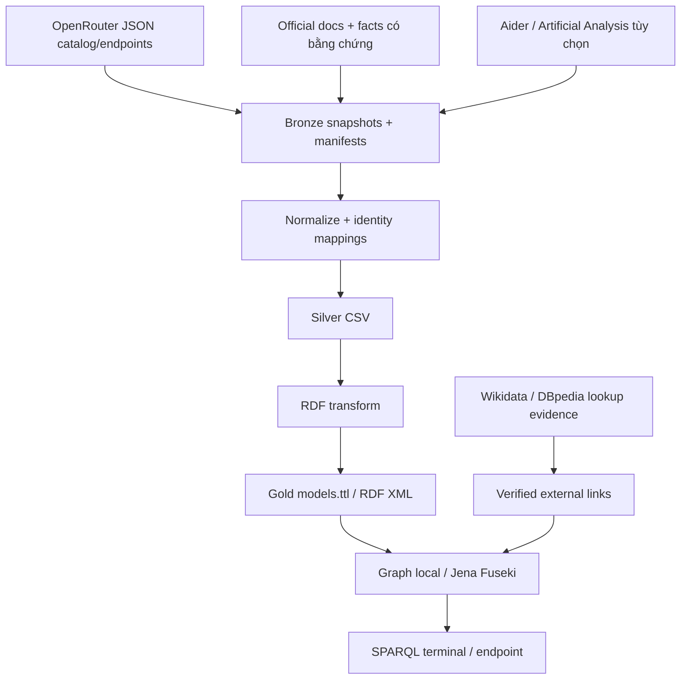

<!-- historical-before-split -->
> Lịch sử thiết kế trước khi tách project. Cấu trúc và lệnh hiện tại xem README.md của aimodels.

# Thiết kế mở rộng AI Models Knowledge Graph

Ngày: 2026-10-05. Trạng thái: đã được người dùng chỉ định triển khai và thu thập; xem README/PIPELINE.md và validation report cho trạng thái thực tế.

## Mục tiêu và yêu cầu đã xác nhận

Người dùng cần capstone LOD về **model AI**, gồm chức năng, cách sử dụng,
thông số, giá API và benchmark có nguồn. Bao phủ rộng GPT, Claude
(Opus/Sonnet/Haiku), MiniMax, Qwen, GLM, Mistral, Gemini, Llama và những model
khác có trong nguồn. `Qwen` là cách viết chuẩn của tên người dùng ghi `qween`.
OpenRouter là nguồn danh mục chính; bổ sung tài liệu chính thức của hãng.
OpenAlex hiện có trở thành nhánh nghiên cứu bổ trợ.

Giữ cấu trúc `aimodels/` theo dự án hiện tại: docs, res, queries, src và
bronze/silver/gold. Giữ RDFLib, OWL RL, Apache Jena Fuseki và năm bước capstone.
Thiết kế ontology theo [ONTOLOGY_ENGINEERING_SKILL.md](../../../../ONTOLOGY_ENGINEERING_SKILL.md).

**Ràng buộc của người dùng:** không tự chạy project. Trong triển khai có thể
đọc tài liệu và tải metadata công khai bằng HTTP GET; không khởi động pipeline,
Fuseki, unit tests hoặc gọi inference API. Viết các lệnh kiểm tra/chạy để người
dùng thực hiện; ghi rõ kết quả chưa được kiểm chứng bằng chạy chương trình.
Không đăng ký tài khoản, không mua quyền truy cập, không gửi lời nhắn ra ngoài.

## Các phương án và lựa chọn

1. **OpenRouter + nguồn chính thức + benchmark độc lập:** danh mục rộng,
   ingestion tự động từ JSON, enrichment có bằng chứng. Chọn phương án này.
2. Chỉ tài liệu của từng hãng: thông tin chính thức tốt nhưng cần nhiều adapter,
   dễ thiếu model, không có một catalog thống nhất.
3. Chỉ OpenRouter: nhanh nhưng giá/khả năng phản ánh dịch vụ OpenRouter;
   không thay thế công bố của hãng hoặc benchmark có phương pháp rõ ràng.

## Nguồn và cách thu thập

Các đường dẫn dưới đây đã được đọc để xác định vai trò nguồn. Đây là danh sách
nguồn thiết kế, chưa phải dữ liệu đã ingest hoặc cam kết mọi trang có parser tự động.

| Nguồn | Vai trò | Cách đưa vào dataset |
|---|---|---|
| [OpenRouter Models API](https://openrouter.ai/docs/api/api-reference/models/get-models) | Danh mục rộng, mô tả, modality, context, tham số, pricing | GET `https://openrouter.ai/api/v1/models`; xử lý pagination nếu có; lưu JSON và manifest |
| [OpenRouter endpoints](https://openrouter.ai/docs/api/api-reference/endpoints/list-all-endpoints-for-a-model) | Giới hạn và giá theo endpoint/provider | Enrichment tùy chọn, giới hạn số model bằng CLI; lỗi không xóa catalog đã thu được |
| [OpenAI models](https://developers.openai.com/api/docs/models/gpt-5.6-sol), [pricing](https://developers.openai.com/api/docs/pricing) | Thông số, mô tả và giá trực tiếp | Tải tài liệu công khai; bản ghi facts được trích xuất có nguồn và đối chiếu |
| [Anthropic models](https://platform.claude.com/docs/en/models/overview), [pricing](https://platform.claude.com/docs/en/about-claude/pricing) | Claude, Opus, Sonnet, Haiku | Như trên; không lấy giá subscription làm giá API |
| [Google models](https://ai.google.dev/gemini-api/docs/models), [pricing](https://ai.google.dev/gemini-api/docs/pricing) | Gemini | Phân biệt Gemini API và các offering trên nền tảng khác |
| [MiniMax pricing](https://platform.minimax.io/docs/guides/pricing-paygo) | MiniMax và giá trực tiếp | Giữ nguyên đơn vị, modality và mức giá áp dụng |
| [Z.AI pricing](https://docs.z.ai/guides/overview/pricing) | GLM và giá trực tiếp | Lưu model ID chính xác; không nhầm coding subscription với API |
| [Mistral models](https://docs.mistral.ai/models) | Model cards, khả năng và thông số | Bản ghi theo từng phiên bản được tài liệu xác nhận |
| [Alibaba Cloud models](https://www.alibabacloud.com/help/en/model-studio/models) | Qwen trên Model Studio | Offering Alibaba Cloud khác offering OpenRouter |
| [xAI models](https://docs.x.ai/developers/models) | Grok, thông số và pricing | Nguồn chính thức bổ sung |
| [Meta Llama trên Hugging Face](https://huggingface.co/meta-llama) | Model cards của tổ chức phát hành | Chỉ dùng repository chính thức đã xác nhận; không coi model card là giá API Meta |
| [Aider leaderboard](https://aider.chat/docs/leaderboards/) | Benchmark coding công khai, có điều kiện đánh giá | Collector bảng HTML có kiểm tra schema; lưu score, cấu hình, ngày và URL |
| [Artificial Analysis API](https://artificialanalysis.ai/api-reference/) | Benchmark độc lập, tốc độ/độ trễ, pricing tham khảo | Adapter tùy chọn khi có `ARTIFICIAL_ANALYSIS_API_KEY`; không có key thì báo skipped |
| Wikidata / DBpedia | Định danh tổ chức hoặc model có thực thể tương ứng | Liên kết có bằng chứng định danh, lưu kết quả lookup và trạng thái |

Không phụ thuộc vào inference API hay API key của OpenAI để đọc tài liệu công
khai. Artificial Analysis là enrichment tùy chọn, không chặn pipeline chính.
Benchmark có thể thiếu ở một số model; không tạo bản ghi giả để
đạt số lượng. Model không có trên OpenRouter vẫn có thể được thêm bằng nguồn
chính thức, ví dụ Sol/Astra nếu catalog tại thời điểm thu thập không có chúng.

Phần HTML tự động chỉ dùng parser cho bảng/schema đã hiểu và fixture đại diện.
Với công bố dạng blog/model card không có schema thống nhất, dùng facts JSON
có biên tập và URL/section/evidence cho từng trường. Bản cập nhật tài liệu
không tự biến thành facts mới nếu extraction chưa được xác nhận.

## Ontology: khái niệm, glossary và identity

Tạo ontology catalog riêng, namespace `https://example.org/aimodels/`;
ontology nghiên cứu hiện tại tiếp tục tồn tại. Có **12 class catalog** vì giá,
evaluation và quan sát theo nguồn cần danh tính riêng, không gộp thành thuộc tính
không có bằng chứng. Không tạo class cho từng thương hiệu hay model.

| Class | Định nghĩa / ví dụ | Tiêu chí identity |
|---|---|---|
| `AIModel` | Model/version được tài liệu xác định | ID theo namespace nguồn; gộp nguồn chỉ bằng mapping đã xác minh |
| `ModelFamily` | Họ GPT, Claude, Qwen; có nhiều phiên bản | Tổ chức phát triển + mã họ được xác nhận |
| `Organization` | Tổ chức; developer và host là các vai trò qua quan hệ | Định danh tổ chức có bằng chứng |
| `ModelOffering` | Cách cung cấp model qua một dịch vụ/endpoint | Nguồn dịch vụ + ID model + endpoint ID nếu có |
| `Capability` | Khả năng có tên, như tool calling | Mã vocabulary cục bộ, định nghĩa công khai |
| `Modality` | Text/image/audio/video | Mã vocabulary; input/output là quan hệ khác nhau |
| `PriceSpecification` | Quan sát một mức giá của offering | Offering + nguồn + thời điểm snapshot + loại giá + điều kiện |
| `Benchmark` | Định nghĩa bài đánh giá và phiên bản | Nhà đánh giá + benchmark + version nếu có |
| `Evaluation` | Một kết quả model trên benchmark trong cấu hình cụ thể | Nguồn + run/row ID hoặc hash cấu hình và nội dung |
| `SourceDocument` | Trang tài liệu/API snapshot dùng làm bằng chứng | URL + checksum nội dung snapshot |
| `FactObservation` | Giá trị/nhận định về một entity từ một nguồn | Subject + predicate + source snapshot + value |
| `ExternalLink` | Bằng chứng ánh xạ identity ra dataset bên ngoài | Subject + target + loại mapping + nguồn xác nhận |

`ModelOffering` tái sử dụng `schema:Service`; `Organization` tái sử dụng
`schema:Organization`; `PriceSpecification` tái sử dụng
`schema:PriceSpecification`; `SourceDocument` là `prov:Entity`.
Những class còn lại có định nghĩa cục bộ rõ ràng;
không ép AIModel thành một SoftwareApplication nếu ngữ nghĩa không phù hợp.
Capability và Modality là các concept có thể gắn SKOS label/definition.

Không có quan hệ subclass giữa family và model, giữa developer và model,
hoặc giữa model và offering. Một model thuộc một họ, không phải là một họ.
Không có class `CheapModel`, `BestModel`, `LatestModel`: đó là kết quả lọc
theo thời điểm và điều kiện. Không áp đặt OWL cardinality theo số liệu mẫu.
Missing metadata theo open-world semantics; thiếu capability không đồng nghĩa
với không hỗ trợ. Constraints bắt buộc của dữ liệu đặt ở validator, không dùng
domain/range để tự xác nhận dữ liệu nhập sai.

### Quan hệ và attributes

- `AIModel → belongsToFamily → ModelFamily`; `AIModel → developedBy → Organization`.
- `ModelOffering → offersModel → AIModel`; `ModelOffering → hostedBy → Organization`.
- `ModelOffering → hasPrice → PriceSpecification`.
- `FactObservation → aboutEntity → resource`; `observedProperty → rdf:Property`;
  có `resourceValue` hoặc `literalValue`, `prov:wasDerivedFrom → SourceDocument`.
- Capability được quan sát cho model hoặc offering; modality phân biệt
  `inputModality` và `outputModality`; context/output giới hạn lưu theo offering
  khi nguồn chỉ công bố giới hạn endpoint.
- `Evaluation → evaluatedModel → AIModel`; `Evaluation → onBenchmark → Benchmark`;
  lưu score, metric, unit, evaluator, config, thời gian và source.
- `ExternalLink` có subject, target, relation, source và evidence; xuất
  `owl:sameAs` chỉ cho identity đã xác nhận.

Mỗi property mới phải có label, comment, domain/range, hướng và ví dụ trong
glossary/ontology-design. Dùng RDFS/OWL, Dublin Core, schema.org, SKOS, PROV-O,
DCAT; literal dùng XSD integer/decimal/date/dateTime/boolean thích hợp.
URI dùng source ID được percent-encode, không dùng số thứ tự dòng hoặc tên
hiển thị; observation/evaluation dùng SHA-256 của các trường identity.
Alias như `latest` và biến thể `:free` là offering/source identifier; không
tự coi đó là một phiên bản model độc lập hoặc gộp vào một snapshot cụ thể.

## Giá, benchmark và thông tin có nguồn

- OpenRouter prompt/completion price chuyển USD/token sang USD/1M tokens bằng
  Decimal. Giữ cả giá gốc và đơn vị gốc. Image/request/audio không chuyển sang
  token nếu nguồn không xác nhận đơn vị. Giá zero hợp lệ; null không phải zero.
- Giá lưu currency, quantity/unit, token category, service/mode, region,
  context tier, điều kiện và source. Giá từ hãng và OpenRouter là hai offering.
- `observedAt` là lúc thu thập, không phải `validFrom`. Chỉ ghi ngày hiệu lực,
  ngày phát hành, cutoff hoặc ngày ngừng hoạt động khi nguồn thực sự công bố.
  `created` của catalog không được đổi tên thành release date.
- Không ghi đè thông số mâu thuẫn giữa các nguồn. Lưu observations riêng;
  truy vấn trả source và thời điểm. “Mạnh về coding” là claim được attribution,
  không biến thành điểm hiệu năng hoặc support boolean không có bằng chứng.
- Benchmark giữ score scale, reasoning effort, thinking budget, edit format,
  harness/version và nguồn. Aider cost là chi phí một lần chạy benchmark,
  không phải giá mỗi triệu token. Không xếp hạng chung các phép đo khác nhau.
- Matching benchmark/model card qua mapping ID đã duyệt; fuzzy tên
  chỉ tạo candidate để kiểm tra. Row không ghép chắc chắn lưu ở unmatched.
- Tài liệu là `dcterms:source`/PROV, không phải model `owl:sameAs`.
  OpenRouter và HF URL thường là catalog/document resource; không khẳng định
  identity RDF với model khi nguồn không có semantics tương ứng.
- Dataset metadata ghi license theo từng nguồn, không kế thừa CC0 của
  OpenAlex cho dữ liệu mới.

## Kiến trúc và thay đổi file

Tạo `src/model_catalog/` với module riêng: `common.py`, `collect.py`,
`official_sources.py`, `benchmarks.py`, `normalize.py`, `transform.py`,
`link.py`, `validate.py`. Tránh thay các schema OpenAlex trong `src/common.py`.

- Bronze mới: `src/data/bronze/`; raw JSON/HTML, source URL, retrieved
  time, checksum, trạng thái; snapshot không chứa secrets.
- Silver mới: `src/data/silver/`: models, families, organizations,
  offerings, prices, capabilities, modalities, observations, evaluations,
  benchmarks, documents, external_links, unmatched CSV.
- Gold mới: `src/data/gold/models.ttl` và `models.rdf`.
- Config mới: `res/sources.json`, `res/identity-mappings.json` và
  `res/official-model-facts.json` có source per record.
- Ontology/examples mới: `res/ontology.ttl`, `res/model-example-data.ttl`.
- Links/metadata mới: `res/linked_output.nt`, `res/dataset-metadata.ttl`.
- Query mới: `queries/`; giữ nguyên các research queries hiện có.
- `src/ask.py` thêm `--dataset models|research|all`; giữ default research
  để tương thích lệnh cũ. Hướng dẫn catalog luôn truyền `--dataset models`.
- Fuseki models dùng service `aimodels-models`, cấu hình và TDB2 location riêng;
  không tự load/chỉnh graph server hiện tại. Hướng dẫn người dùng load graph
  catalog cùng ontology, links và metadata.
- README chuyển phần mở đầu sang model catalog; nhánh research có mục riêng.
  Bổ sung walkthrough theo năm bước, bảng input/output từng module, sơ đồ và
  query có kết quả mong đợi từ fixtures; tách khỏi thống kê dataset thật.

Collector lấy toàn bộ catalog được endpoint trả về, không lọc chỉ các hãng đã
liệt kê, không đặt giới hạn 200 như OpenAlex. CLI hỗ trợ filter/limit tùy chọn,
offline replay, endpoint enrichment có giới hạn và timeout/retry có giới hạn.
Manifest ghi model count và coverage theo hãng/loại dữ liệu. Pagination chỉ
theo link thuộc host/endpoint nguồn cho phép, tránh vòng lặp và trùng ID.
Snapshot mới chỉ thay thế current snapshot khi catalog có schema hợp lệ và
không rỗng; enrichment lỗi tạo warning, không phá dữ liệu đã hợp lệ.

## Competency questions và tiêu chí chấp nhận

1. Liệt kê model của từng hãng, family và ID nguồn.
2. Tra một model: description, modality, context/output limit, source/time.
3. Tìm model hỗ trợ tools/structured output với context tối thiểu.
4. So giá input/output/cache của offering có cùng currency/unit/mode.
5. Tìm offering dưới ngân sách và trả cả điều kiện giá.
6. So offering OpenRouter và direct provider khi identity đã xác nhận.
7. Tra benchmark của model cùng metric, scale, config và evaluator.
8. Tìm kết quả coding cao nhất trong cùng benchmark/version/config.
9. Tra nguồn chính thức về capabilities/claims của model.
10. Tìm observations mâu thuẫn, dữ liệu thiếu và rows chưa ghép model.
11. Tra Wikidata/DBpedia links và bằng chứng identity.
12. Đếm coverage theo hãng và theo nguồn dữ liệu.
13. Tra phiên bản mới nhất theo release date đã xác minh; kết quả chỉ trong
    corpus, loại alias và ghi rõ unknown release date.

Mỗi CQ có SPARQL `.rq`, fixture và expected answers. Chỉ viết câu hỏi thành
truy vấn mà ontology thực sự hỗ trợ, không thêm chatbot suy đoán từ tên model.

Tiêu chí kiểm tra được giao cho người dùng chạy:

- Schema/unit normalization: 0, null, numeric strings, precision, giá request
  khác giá token, context tiers và mode khác nhau.
- Identity: tên giống nhưng phiên bản khác, alias/free variants, matched và
  unmatched evaluations; provider host khác developer.
- Collector: pagination, duplicate IDs, timeout/429/schema đổi, offline replay,
  thiếu key tùy chọn và snapshot rỗng không ghi đè dữ liệu.
- RDF/ontology: parse, kiểu literal, price/source/evaluation links, OWL RL
  không suy ra organization là model hay family là model.
- Query: mọi CQ fixture có expected output; graph models không phụ thuộc
  vào bronze/silver research; graph all chỉ được bật rõ ràng.
- Fuseki: local/endpoint cho cùng câu trả lời khi người dùng load cùng graph.

Không ghi “tests pass”, số triples hoặc “đã đạt 5★ public” khi chưa có bằng
chứng. Namespace example.org vẫn cần được thay bằng URI dereferenceable khi
muốn công bố LOD thật trên Web. Benchmark coverage có thể thưa và phải
hiển thị rõ trong manifest/README thay vì hứa mọi model có đủ mọi trường.

## Mapping năm bước capstone

| Bước | Deliverable |
|---|---|
| 1. Ontology | Requirements, CQs, glossary, taxonomy/properties, identity decisions, model ontology và examples |
| 2. Collect | Public catalog/doc/benchmark snapshots và manifests |
| 3. RDF 4★ | CSV chuẩn hóa, HTTP URI ổn định, vocabulary chuẩn, typed RDF Turtle/RDF XML |
| 4. Links 5★ | Wikidata/DBpedia identity links có evidence; nguồn docs là provenance riêng |
| 5. Query | CLI chọn catalog graph, SPARQL queries và cấu hình Apache Jena Fuseki |

## Trạng thái bàn giao

Người dùng đã chỉ định “triển khai code và thu thập luôn”. Nhánh catalog đã
được triển khai, thu thập public metadata và tạo silver/RDF; giữ nhánh research.
Chi tiết kiểm chứng ở res/validation-report.json và docs/VALIDATION.md.
Không inference hoặc khởi động/nạp Fuseki. API trực tiếp Artificial Analysis
chưa có adapter trong bản này: dùng embedded metrics qua OpenRouter và Aider;
giới hạn này được ghi rõ. Câu hỏi newest release chưa có dữ liệu ngày phát hành
xác minh, không thay bằng catalog timestamp. Bổ sung publisher model-card
metadata cho parameters/license/task, không tải weights. Workspace không có
Git repository thực, không tạo commit hoặc worktree giả.
