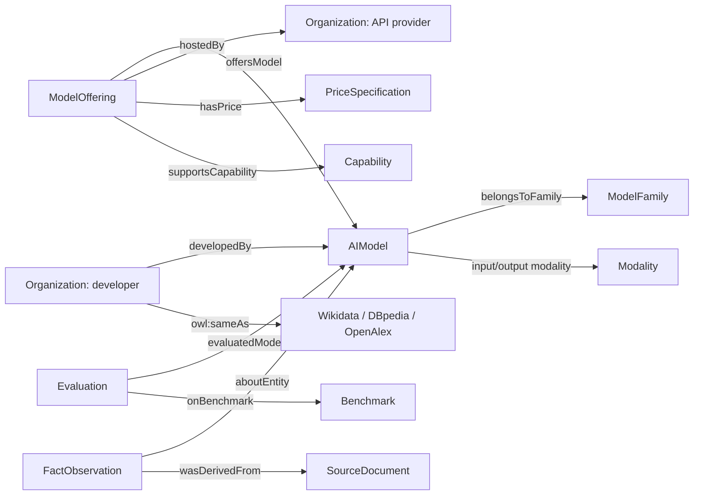
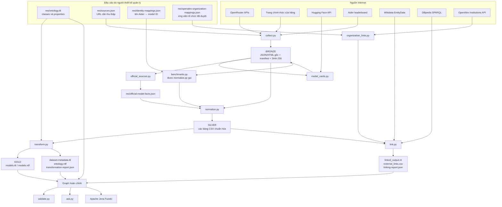
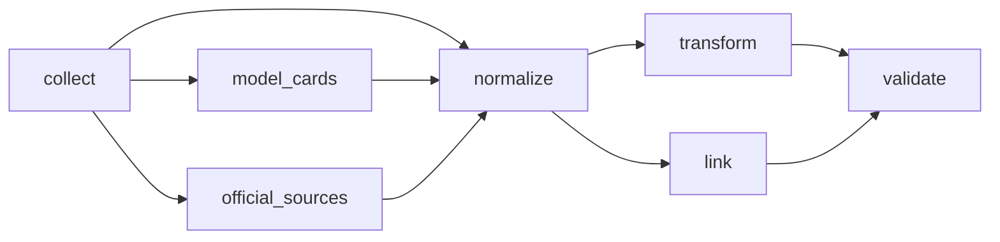
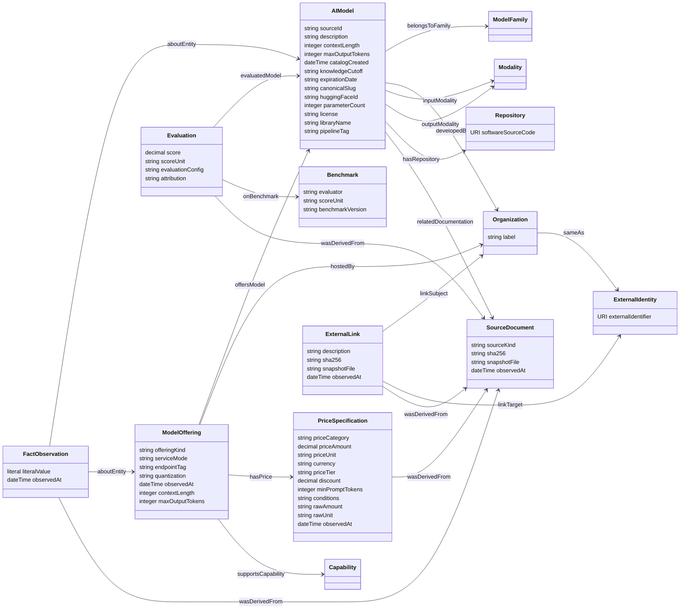
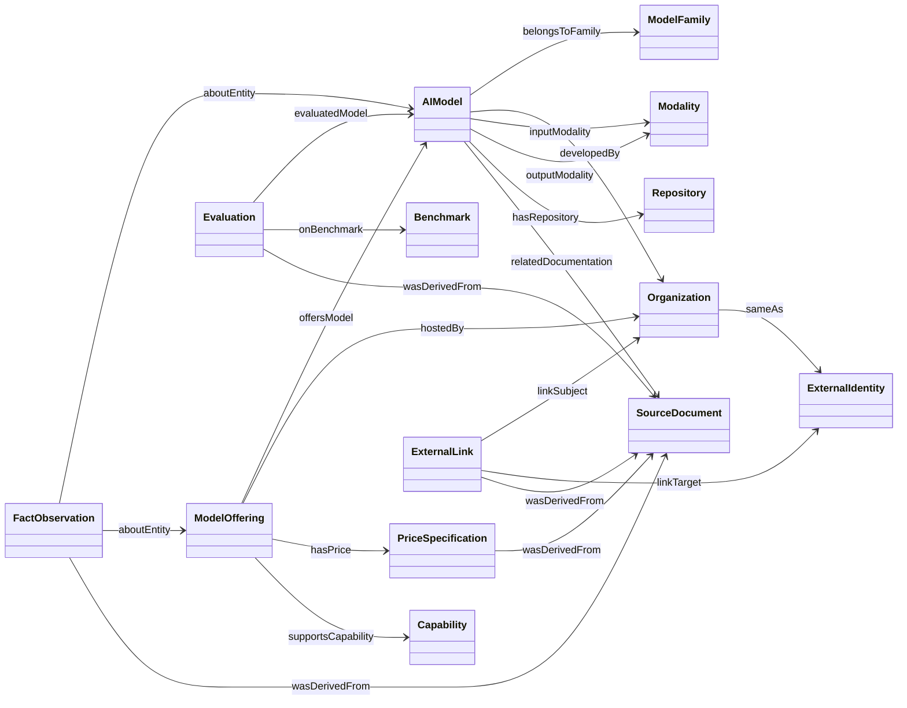
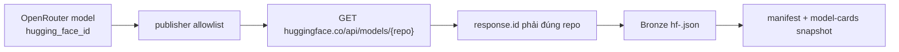
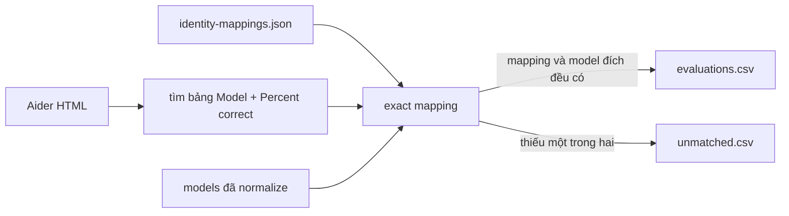
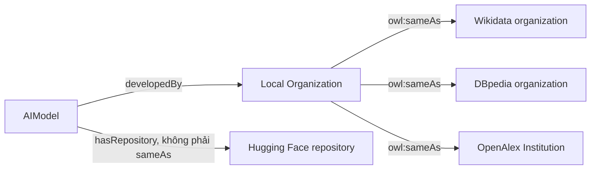
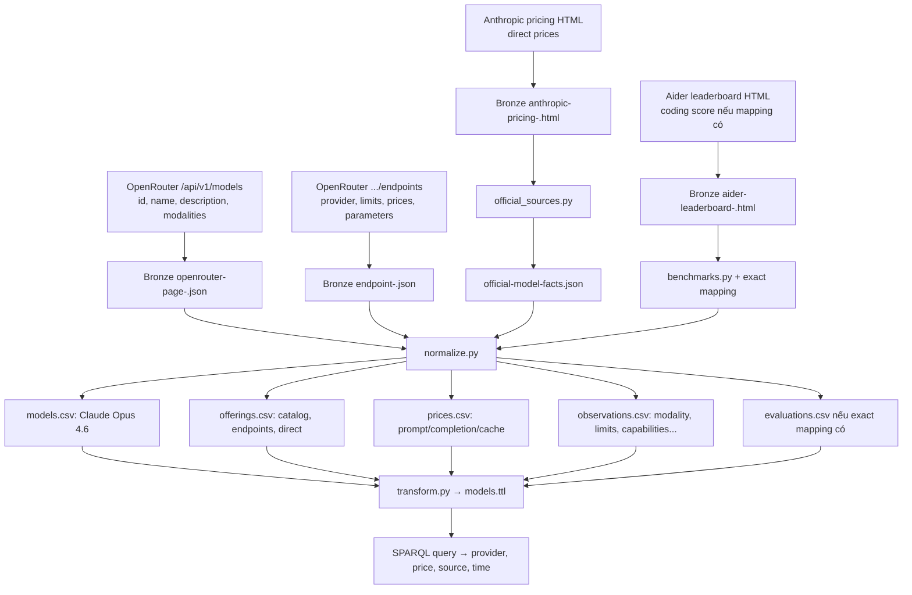

# Báo cáo toàn bộ luồng dữ liệu của `aimodels`

Tài liệu này giải thích project từ lúc lấy dữ liệu trên Internet đến lúc query bằng
SPARQL. Phạm vi chỉ gồm dữ liệu, ontology, source code xử lý và Fuseki. Phần website,
GitHub Pages và GitHub Actions không được trình bày.

## 1. Project tạo ra sản phẩm gì?

`aimodels` tạo một **knowledge graph về model AI và dịch vụ API**. Graph cho phép trả
lời các câu hỏi như:

- Có những model nào thuộc họ Claude, GPT, Gemini, Qwen hoặc Llama?
- Một model do tổ chức nào phát triển?
- Model được cung cấp qua những API provider nào?
- Giá input, output và cache của từng offering là bao nhiêu?
- Model nhận text, image hay audio và hỗ trợ tham số API nào?
- Model có repository Hugging Face nào và metadata repository nói gì?
- Model có kết quả benchmark nào, do ai đánh giá và lấy từ nguồn nào?
- Tổ chức local nào đã được xác minh là cùng thực thể với Wikidata, DBpedia hoặc
  OpenAlex?

Project không gộp mọi trang web thành một bảng lớn. Nó mô hình hóa các thực thể và
quan hệ riêng:



Điểm quan trọng là **model**, **dịch vụ cung cấp model**, **provider** và **giá** là
những thực thể khác nhau. Ví dụ Claude Opus 4.6 là model; một endpoint của Amazon
Bedrock qua OpenRouter là một offering; Amazon Bedrock là provider; giá input của
offering đó là một `PriceSpecification`.

## 2. Sơ đồ toàn bộ pipeline



Ba tầng dữ liệu có ý nghĩa như sau:

| Tầng | Ý nghĩa | Có nên sửa tay? |
|---|---|---:|
| Bronze | Phản hồi JSON/HTML gần nguyên gốc, kèm URL, thời điểm và checksum | Không |
| Silver | Các bảng CSV đã tách thành model, offering, price, source... | Không |
| Gold | RDF được tạo từ Silver để query và nạp Fuseki | Không |

Nếu cần thay đổi cách mô hình hóa hoặc mapping, sửa code/ontology/config rồi chạy lại
pipeline. Không sửa trực tiếp Silver hoặc Gold vì lần chạy sau sẽ ghi đè.

## 3. Hai nhóm file cần phân biệt

### 3.1 File được viết hoặc duyệt thủ công

| File | Vai trò |
|---|---|
| `res/ontology.ttl` | Định nghĩa ontology: lớp, quan hệ, kiểu dữ liệu và ý nghĩa |
| `res/sources.json` | Danh sách trang tài liệu chính thức và trang benchmark cần tải |
| `res/identity-mappings.json` | Mapping chính xác tên model trong Aider sang ID model của OpenRouter |
| `res/openalex-organization-mappings.json` | Danh sách ứng viên OpenAlex đã duyệt và các điều kiện phải khớp |
| `res/fuseki-config.ttl` | Cấu hình dataset `/aimodels` và nơi lưu TDB2 của Fuseki |
| `res/example-data.ttl` | Dữ liệu giả nhỏ để minh họa ontology; không thuộc catalog thật |

### 3.2 File sinh tự động

| File/nhóm file | Chương trình tạo |
|---|---|
| `src/data/bronze/**` | `collect.py`, `model_cards.py`, `organization_links.py`, `link.py` |
| `res/official-model-facts.json` | `official_sources.py` |
| `res/official-extraction-report.json` | `official_sources.py` |
| `src/data/silver/*.csv` | `normalize.py`; riêng `external_links.csv` do `link.py` ghi lại |
| `res/coverage.json` | `normalize.py`, sau đó `link.py` cập nhật số external links |
| `src/data/gold/models.ttl`, `models.rdf` | `transform.py` |
| `res/ontology.rdf` | `transform.py` chuyển từ `ontology.ttl` |
| `res/dataset-metadata.ttl` | `transform.py` |
| `res/transformation-report.json` | `transform.py` |
| `res/linked_output.nt`, `linking-report.json` | `link.py` |
| `res/validation-report.json` | `validate.py` |

`res/opus-provider-prices.csv` và `res/opus-4.6-price-sample.json` là kết quả demo đã
lưu để kiểm chứng. Pipeline chính không đọc hai file này làm input.

## 4. Thứ tự chạy chuẩn

Chạy từ thư mục `aimodels/`:

```bash
cd /home/puda14/Desktop/Project/semantic-web/aimodels
source .venv/bin/activate
```

Pipeline online đầy đủ:

```bash
PYTHONPATH=src python -m model_catalog.collect
PYTHONPATH=src python -m model_catalog.model_cards
PYTHONPATH=src python -m model_catalog.official_sources
PYTHONPATH=src python -m model_catalog.normalize
PYTHONPATH=src python -m model_catalog.transform
PYTHONPATH=src python -m model_catalog.link
PYTHONPATH=src python -m model_catalog.validate
```

Quan hệ phụ thuộc giữa các lệnh:



`model_cards` và `official_sources` đều cần kết quả của `collect`. `normalize` cần kết
quả của cả ba bước. Sau `normalize`, `transform` và `link` cùng đọc Silver; quy trình
chuẩn chạy transform trước rồi link. `validate` chỉ chạy khi tất cả artifact đã có.

Nếu chỉ muốn dựng lại mọi thứ từ snapshot đã lưu, không gọi Internet:

```bash
PYTHONPATH=src python -m model_catalog.collect --offline
PYTHONPATH=src python -m model_catalog.model_cards --offline
PYTHONPATH=src python -m model_catalog.official_sources
PYTHONPATH=src python -m model_catalog.normalize
PYTHONPATH=src python -m model_catalog.transform
PYTHONPATH=src python -m model_catalog.link --offline
PYTHONPATH=src python -m model_catalog.validate
```

## 5. Bước 1 — thiết kế ontology

### 5.1 File chính

`res/ontology.ttl` được thiết kế thủ công. Nó không được suy ra tự động từ OpenRouter
và không phải dữ liệu model. Ontology là “bộ từ vựng và luật” để tất cả dữ liệu về sau
dùng cùng một nghĩa.

Ontology hiện có 12 lớp local:

| Class | Ý nghĩa |
|---|---|
| `AIModel` | Một model hoặc phiên bản có ID từ nguồn |
| `ModelFamily` | Họ model như Claude, GPT, Gemini |
| `Organization` | Tổ chức phát triển model hoặc cung cấp dịch vụ |
| `ModelOffering` | Một cách truy cập model qua catalog/API endpoint |
| `Capability` | Tham số hoặc khả năng API được nguồn công bố |
| `Modality` | Dạng input/output như text, image, audio |
| `PriceSpecification` | Một mức giá có loại phí, số tiền, đơn vị và điều kiện |
| `Benchmark` | Phép đo hoặc protocol đánh giá |
| `Evaluation` | Kết quả của một model trên một benchmark |
| `SourceDocument` | URL và snapshot dùng làm nguồn |
| `FactObservation` | Một phát biểu có subject, property, value, nguồn và thời gian |
| `ExternalLink` | Bản ghi bằng chứng cho một liên kết danh tính ngoài project |

### 5.2 Sơ đồ ontology

Sơ đồ dưới đây là sơ đồ ontology của project, không phải sơ đồ chạy chương trình.
Mỗi hộp là một class; chữ trên mũi tên là object property nối hai class. Những class
có tiền tố `schema:` hoặc `prov:` là vocabulary chuẩn được tái sử dụng.



#### Sơ đồ rút gọn: chỉ class và quan hệ

Đây là bản sao của sơ đồ class chi tiết phía trên nhưng đã bỏ toàn bộ datatype
attribute. Vị trí có thể được Mermaid tự sắp xếp khác nhau tùy chiều rộng cửa sổ, nhưng
các class và đường nối được giữ nguyên.



Trong sơ đồ rút gọn, `wasDerivedFrom` là `prov:wasDerivedFrom` và `sameAs` là
`owl:sameAs`. Hai prefix được bỏ khỏi nhãn để sơ đồ ngắn và tránh lỗi parser Mermaid.

Đọc một đường trong sơ đồ như sau:

```text
ModelOffering --offersModel--> AIModel
ModelOffering --hostedBy-----> Organization
ModelOffering --hasPrice-----> PriceSpecification
```

Nghĩa là một dịch vụ API cung cấp một model, được một tổ chức vận hành và có các bản
ghi giá riêng. Giá thuộc offering vì cùng một model có thể có giá khác nhau ở từng
provider.

Phần provenance được đọc như sau:

```text
FactObservation / PriceSpecification / Evaluation
                    |
                    └── prov:wasDerivedFrom ──> SourceDocument
```

Nhờ vậy, một giá hoặc thông số không chỉ có giá trị mà còn truy được URL, snapshot,
checksum và thời điểm lấy dữ liệu.

`ExternalIdentity` và `Repository` trong sơ đồ là hai hộp giúp biểu diễn URI ngoài
project. Chúng không phải hai class local trong nhóm 12 class:

- `ExternalIdentity` đại diện URI tổ chức của Wikidata, DBpedia hoặc OpenAlex;
- `Repository` dùng range chuẩn `schema:SoftwareSourceCode` cho repository Hugging
  Face;
- `Organization owl:sameAs ExternalIdentity` là quan hệ đồng nhất đã xác minh;
- `AIModel hasRepository Repository` chỉ là quan hệ tới repository, không phải
  `owl:sameAs`.

Một số quan hệ trung tâm:

```text
AIModel       --developedBy------> Organization
AIModel       --belongsToFamily--> ModelFamily
ModelOffering --offersModel------> AIModel
ModelOffering --hostedBy---------> Organization
ModelOffering --hasPrice---------> PriceSpecification
Evaluation    --evaluatedModel---> AIModel
Evaluation    --onBenchmark------> Benchmark
FactObservation --aboutEntity----> AIModel hoặc ModelOffering
FactObservation --prov:wasDerivedFrom--> SourceDocument
Organization  --owl:sameAs-------> tổ chức trong dataset ngoài
```

Ontology tái sử dụng RDF, RDFS, OWL, XSD, Schema.org, PROV-O và Dublin Core. Ví dụ
`Organization` là subclass của `schema:Organization`; giá tiền sử dụng literal
`xsd:decimal`; thời gian snapshot dùng `xsd:dateTime`; provenance dùng
`prov:wasDerivedFrom`.

### 5.3 Input và output

```text
Input tư duy:
  phạm vi model/API
  + kịch bản truy vấn
  + competency questions
  + glossary

Thiết kế thủ công:
  res/ontology.ttl

transform.py chuyển định dạng:
  res/ontology.rdf
```

`ontology.ttl` và `ontology.rdf` chứa cùng ontology ở hai serialization khác nhau.
Turtle dễ đọc hơn; RDF/XML phù hợp với phần mềm cần XML. Khi nạp Fuseki chỉ chọn một
bản, thường là `ontology.ttl`.

## 6. Bước 2 — thu thập dữ liệu vào Bronze

### 6.1 `src/model_catalog/common.py`

Đây là thư viện dùng chung, không chạy riêng.

| Thành phần | Công việc |
|---|---|
| `ROOT`, `BRONZE`, `SILVER`, `GOLD`, `RES` | Xác định các thư mục chuẩn |
| `BASE` | Namespace URI public của thực thể RDF |
| `now()` | Tạo thời gian UTC ISO 8601 |
| `digest()` | Tính SHA-256 cho dữ liệu hoặc object JSON |
| `uri(kind, key)` | Tạo HTTP URI ổn định và URL-encode ID |
| `fetch()` | HTTP GET, retry lỗi tạm thời tối đa ba lần |
| `atomic_write()` | Ghi file tạm rồi thay thế để tránh file dở dang |
| `read_json()`/`write_json()` | Đọc/ghi JSON UTF-8 |
| `read_tables()`/`write_tables()` | Đọc/ghi các bảng CSV Silver |

Ví dụ:

```text
kind = model
key  = openrouter:anthropic/claude-opus-4.6

→ https://brodsmaster.github.io/semantic-web-ai-models/data/aimodels.ttl
  #resource/model/openrouter%3Aanthropic%2Fclaude-opus-4.6
```

Phần sau dấu `#` định danh đúng một thực thể model trong tài liệu RDF public.

### 6.2 `src/model_catalog/collect.py`

Đây là collector chính.

#### Input ngoài Internet

1. Danh mục model OpenRouter:

```http
GET https://openrouter.ai/api/v1/models
```

Dạng phản hồi rút gọn:

```json
{
  "data": [
    {
      "id": "anthropic/claude-opus-4.6",
      "name": "Anthropic: Claude Opus 4.6",
      "description": "...",
      "context_length": 1000000,
      "architecture": {
        "input_modalities": ["text", "image", "file"],
        "output_modalities": ["text"]
      },
      "pricing": {"prompt": "...", "completion": "..."},
      "supported_parameters": ["tools", "temperature"]
    }
  ]
}
```

2. Endpoint cho từng listing model:

```http
GET https://openrouter.ai/api/v1/models/{author}/{slug}/endpoints
```

Dạng phản hồi rút gọn:

```json
{
  "data": {
    "endpoints": [
      {
        "provider_name": "...",
        "tag": "...",
        "context_length": 200000,
        "max_completion_tokens": 32000,
        "pricing": {"prompt": "...", "completion": "..."},
        "supported_parameters": ["tools"]
      }
    ]
  }
}
```

Đây là JSON của REST API, không phải XML/RDF. API này cung cấp dữ liệu nguồn; RDF chỉ
được tạo ở bước transform.

3. Mười bốn URL trong `res/sources.json`:

- tài liệu OpenAI, Anthropic, Google, MiniMax, Z.AI, Mistral, Alibaba, xAI và Meta;
- Aider coding leaderboard.

Các trang này được tải dưới dạng HTML. Việc đã tải một trang không có nghĩa mọi câu
trong trang đều được tự động biến thành fact. Parser chỉ trích các schema mà code nhận
dạng rõ ràng.

#### Xử lý

- kiểm tra catalog phải có `data` là danh sách và mỗi model phải có ID;
- đi qua pagination an toàn trong đúng domain/path OpenRouter;
- tải endpoint song song, tối đa 12 worker;
- tính SHA-256 trên bytes thật nhận được;
- đặt tên snapshot theo hash nội dung;
- ghi URL, thời gian, checksum và đường dẫn vào manifest;
- chỉ sau khi toàn bộ catalog hợp lệ mới cập nhật snapshot hiện hành.

#### Output

| Output | Nội dung |
|---|---|
| `src/data/bronze/manifest.json` | Chỉ mục trung tâm: URL, thời gian, file, SHA-256 và aggregate file đang dùng |
| `bronze/documents/openrouter-page-<sha>.json` | Từng trang catalog nguyên gốc |
| `bronze/documents/endpoint-<sha>.json` | Phản hồi endpoint nguyên gốc của từng model |
| `bronze/documents/<source-id>-<sha>.html` | Trang tài liệu/benchmark nguyên gốc |
| `bronze/snapshots/catalog-<sha>.json` | Aggregate catalog bất biến dùng cho lần build này |
| `bronze/snapshots/endpoints-<sha>.json` | Aggregate endpoint bất biến dùng cho lần build này |
| `bronze/openrouter_models.json` | Bản aggregate tiện xem của catalog hiện hành |
| `bronze/openrouter_endpoints.json` | Bản aggregate tiện xem của endpoints hiện hành |

`manifest.json` mới là nơi quyết định snapshot nào được pipeline đọc. Một file cũ còn
nằm trong `documents/` nhưng không được manifest trỏ tới sẽ không tự động trở thành
nguồn của lần build hiện tại.

### 6.3 `src/model_catalog/model_cards.py`

Module này bổ sung metadata repository từ Hugging Face.



#### Input

- `src/data/bronze/manifest.json`;
- aggregate catalog mà manifest chỉ tới;
- trường `hugging_face_id` do OpenRouter cung cấp;
- API `https://huggingface.co/api/models/{repository-id}`.

Chỉ repository thuộc các namespace publisher cho phép được lấy: Qwen, Meta Llama,
Mistral, Z.AI, MiniMax, DeepSeek, Google và OpenAI.

#### Kiểm tra danh tính

- namespace phải thuộc publisher allowlist;
- `id` trong JSON Hugging Face phải đúng bằng repository được yêu cầu;
- khi đọc offline, bytes phải còn đúng SHA-256;
- URL API phải khớp ID repository.

#### Output

| Output | Nội dung |
|---|---|
| `bronze/documents/hf-<sha>.json` | JSON nguyên gốc của từng repository |
| `bronze/snapshots/model-cards-<sha>.json` | Aggregate metadata của các card hợp lệ |
| `manifest.json` | Được bổ sung `model_cards_file`, `publisher_cards` và document records |

Hugging Face repository được nối bằng `hasRepository`, không bằng `owl:sameAs`. Một
repository là code/model card/checkpoint; nó không chắc đồng nhất hoàn toàn với model
đang chạy tại một API provider.

### 6.4 Nội dung Bronze hiện tại

Snapshot hiện tại có:

| Thành phần trong manifest | Số lượng |
|---|---:|
| OpenRouter catalog pages | 1 |
| OpenRouter endpoint responses | 466 |
| Official/benchmark HTML | 14 |
| Hugging Face model-card JSON | 92 |
| Tổng source documents | 573 |
| Model listings OpenRouter | 466 |
| Provider endpoint entries ghi trong manifest | 1.399 |

`1.399` là số entry thô trả về từ các endpoint responses. Silver có `1.390`
`openrouter_endpoint` offerings vì `normalize.py` dùng URI ổn định làm khóa và gộp
các entry có cùng model, tag và configuration đã chuẩn hóa. Cộng thêm 466 catalog
offerings và 53 direct offerings thì tổng là 1.909.

Ngoài các file do manifest quản lý còn có dữ liệu identity:

| File | Nguồn |
|---|---|
| `bronze/external_lookups.json` | Wikidata EntityData và kết quả DBpedia SPARQL |
| `bronze/openalex_lookups.json` | Chỉ mục tới các snapshot OpenAlex đã tải |
| `bronze/documents/openalex-<ID>-<sha>.json` | JSON OpenAlex Institution nguyên gốc |

## 7. Trích thông tin từ nguồn chính thức

### `src/model_catalog/official_sources.py`

Chạy sau `collect.py`, trước `normalize.py`.

#### Input

```text
src/data/bronze/manifest.json
  → HTML Bronze của:
     openai-sol
     openai-astra
     anthropic-pricing
     zai-pricing
     minimax-pricing
```

Các trang Google, Mistral, Qwen, xAI và Meta vẫn được lưu làm tài liệu liên quan,
nhưng hiện chưa có parser field-level trong file này.

#### Xử lý

- `TextParser` bỏ `script/style` và lấy text hiển thị;
- `TableParser` đọc bảng HTML;
- regex và header chính xác nhận dạng schema của từng hãng;
- `dollars()` chỉ nhận giá rõ ràng; `Free` trở thành `0`;
- mỗi record giữ `source_url` và `source_sha256`;
- nếu schema trang thay đổi, ghi warning thay vì đoán giá.

Parser hiện tạo:

- OpenAI: GPT-5.6 Sol và GPT-6 Astra, giá/giới hạn và một số mô tả nhận dạng được;
- Anthropic: các dòng Claude trong bảng giá chuẩn;
- Z.AI: các dòng GLM đúng pattern;
- MiniMax: model M-series, gồm tier/context đã được bảng phân biệt.

#### Output

| File | Nội dung hiện tại |
|---|---|
| `res/official-model-facts.json` | 53 model/offering fact records: OpenAI 2, Anthropic 19, Z.AI 21, MiniMax 11 |
| `res/official-extraction-report.json` | Số record và warning parser; hiện 53 facts, 0 warning |

File facts này là dữ liệu trung gian có cấu trúc, chưa phải RDF. `normalize.py` kiểm tra
checksum của mỗi fact với source snapshot trước khi nhận.

## 8. Bước 3A — chuẩn hóa Bronze thành Silver

### 8.1 `src/model_catalog/normalize.py`

Đây là file hợp nhất dữ liệu chính.

#### Input

```text
manifest.json
catalog snapshot
endpoints snapshot
verified Hugging Face cards
res/official-model-facts.json
Aider HTML + res/identity-mappings.json
```

#### Các biến đổi chính

1. Tạo URI ổn định bằng `common.uri()`.
2. Dựa trên prefix OpenRouter để xác định developer và family đã biết.
3. Tách `AIModel` khỏi `ModelOffering`.
4. Tách developer khỏi API provider.
5. Tạo một offering catalog cho mỗi listing OpenRouter.
6. Tạo một offering endpoint cho mỗi provider/configuration.
7. Tạo offering `direct` cho các mức giá lấy từ trang chính thức.
8. Chuẩn hóa giá token thành USD trên một triệu token bằng `Decimal`.
9. Giữ riêng giá gốc, đơn vị gốc, discount, tier và điều kiện.
10. Tạo observation có source và thời điểm cho mô tả, giới hạn, modality,
    capability, repository và metadata Hugging Face.
11. Chuyển benchmark embedded trong OpenRouter thành `Benchmark`/`Evaluation`.
12. Gọi `benchmarks.add_aider()` để xử lý Aider.

Quy tắc giá:

```text
OpenRouter token price thường là USD/token
→ amount × 1.000.000
→ áp dụng effective amount = raw amount × (1 - discount)
→ lưu priceUnit = million_tokens
```

Giá `0` là miễn phí và khác với giá bị thiếu. Giá request/image/search giữ đúng loại
đơn vị; loại không xác định được giữ `unknown` thay vì tự suy đoán.

#### Output Silver

| CSV | Số dòng hiện tại | Một dòng đại diện cho |
|---|---:|---|
| `models.csv` | 481 | Một model/listing có family và developer |
| `families.csv` | 60 | Một họ model |
| `organizations.csv` | 140 | Một developer hoặc API provider |
| `offerings.csv` | 1.909 | Một cách truy cập model qua catalog/endpoint/direct API |
| `prices.csv` | 8.174 | Một loại giá của một offering |
| `capabilities.csv` | 26 | Một capability/parameter API |
| `modalities.csv` | 5 | Một loại input/output |
| `observations.csv` | 31.553 | Một fact có subject, property, value và nguồn |
| `benchmarks.csv` | 4 | Một phép đo benchmark |
| `evaluations.csv` | 471 | Một điểm của một model trên benchmark |
| `documents.csv` | 573 | Một source document đã snapshot |
| `unmatched.csv` | 63 | Record không nối đủ chắc chắn |
| `external_links.csv` | 14 | Link identity; file này được `link.py` ghi sau normalize |

`normalize.py` khởi tạo `external_links.csv` rỗng. Vì vậy mỗi khi chạy lại normalize,
phải chạy lại `link.py` để khôi phục 14 link đã xác minh.

### 8.2 `src/model_catalog/benchmarks.py`

File này không có lệnh CLI riêng. `normalize.py` gọi `add_aider()`.



`res/identity-mappings.json` hiện chỉ phục vụ **Aider label → OpenRouter source ID**.
Nó không phải mapping tổng quát cho Hugging Face, Wikidata hay OpenAlex.

Ví dụ:

```json
"gpt-5 (high)": "openai/gpt-5"
```

`high` được giữ trong `evaluationConfig`; các cấu hình high/medium/low vẫn nối tới
cùng model GPT-5. Code không fuzzy-match tên vì hai tên gần giống có thể là hai version
khác nhau. Hiện có 8 mapping và 63 Aider record chưa nối được. Ngay cả khi mapping có
trong JSON, record vẫn unmatched nếu ID đích không tồn tại trong `models.csv`.

### 8.3 `res/coverage.json`

Đây là report do `normalize.py` tạo. Nó ghi số dòng từng bảng, số model theo developer,
số offering theo loại, thời gian snapshot và các warning thu thập. `link.py` cập nhật
trường `external_links` sau khi xuất link.

## 9. Bước 3B — chuyển Silver thành RDF Gold

### `src/model_catalog/transform.py`

#### Input

- toàn bộ `src/data/silver/*.csv`;
- `res/ontology.ttl`.

#### Xử lý

- tạo RDF resource cho từng dòng entity;
- gắn `rdf:type` và `rdfs:label`;
- đổi foreign key CSV thành object property;
- đổi string/number/time thành typed literal XSD phù hợp;
- gắn `prov:wasDerivedFrom` tới `SourceDocument`;
- với mỗi observation, tạo cả bản ghi provenance và convenience triple;
- serialize cùng graph dữ liệu sang Turtle và RDF/XML;
- tạo metadata cấp dataset bằng DCAT/Dublin Core.

Ví dụ từ bảng sang RDF:

```text
prices.csv:
amount = 15
unit = million_tokens
currency = USD

→
<price-uri> a ex:PriceSpecification ;
    ex:priceAmount "15"^^xsd:decimal ;
    ex:priceUnit "million_tokens" ;
    ex:currency "USD" .
```

Đây là phần chính tạo dữ liệu 4-star: format mở RDF, HTTP URI, vocabulary rõ nghĩa và
liên kết nội bộ bằng URI thay cho ID dòng cục bộ.

#### Output

| File | Ý nghĩa | Nạp Fuseki? |
|---|---|---:|
| `src/data/gold/models.ttl` | Toàn bộ instance data ở Turtle | Có |
| `src/data/gold/models.rdf` | Cùng graph instance ở RDF/XML | Không cần nếu đã nạp TTL |
| `res/ontology.rdf` | Cùng ontology ở RDF/XML | Không cần nếu đã nạp TTL |
| `res/dataset-metadata.ttl` | `dcat:Dataset`, distribution, license và mọi source URL | Có |
| `res/transformation-report.json` | Số triple, ontology triple và số record | Không |

`dataset-metadata.ttl` dài vì `transform.py` thêm một `dcterms:source` cho mỗi document
trong `documents.csv`. Nó mô tả **toàn bộ dataset**, không mô tả một model riêng.

`models.ttl` và `models.rdf` là hai cách viết của cùng graph. Không nạp cả hai vì sẽ
không thêm thông tin mới.

## 10. Bước 4 — tạo liên kết ngoài hướng tới 5-star

Project hiện tạo `owl:sameAs` ở cấp **Organization**, không tạo `sameAs` ở cấp model.



### 10.1 `src/model_catalog/organization_links.py`

File này chuyên thu thập và kiểm tra OpenAlex.

#### Input

- `res/openalex-organization-mappings.json`;
- tổ chức trong `silver/organizations.csv`;
- API `https://api.openalex.org/institutions/{OpenAlex-ID}`.

Mỗi candidate thủ công ghi local key/name, OpenAlex ID/name, loại `company`, homepage
domain, ROR và QID nếu có. **ROR** là mã định danh tổ chức nghiên cứu; **QID** là ID
thực thể Wikidata, ví dụ `Q380`.

#### Điều kiện chấp nhận

Link chỉ được nhận nếu cùng lúc khớp:

- URI và tên organization local;
- OpenAlex ID ở URL và trong JSON;
- display name;
- loại organization;
- ROR;
- domain homepage chính thức;
- QID Wikidata nếu mapping yêu cầu;
- SHA-256 của JSON evidence.

#### Output

- `bronze/documents/openalex-<ID>-<sha>.json`: bytes bằng chứng;
- `bronze/openalex_lookups.json`: local key, OpenAlex ID, URL, checksum, file và thời
  gian;
- các link được chấp nhận được chuyển tiếp cho `link.py`.

Hiện có 9 link OpenAlex được chấp nhận: OpenAI, Anthropic, Google, Meta, Mistral AI,
DeepSeek, xAI, Moonshot AI và Cohere.

### 10.2 `src/model_catalog/link.py`

File này hợp nhất Wikidata, DBpedia và OpenAlex thành RDF link.

#### Wikidata

Code có bốn QID ứng viên được review: Anthropic, Google, Meta và Alibaba. Với từng QID,
nó gọi:

```http
GET https://www.wikidata.org/wiki/Special:EntityData/{QID}.json
```

Link chỉ được xuất khi `P856` trong Wikidata chứa đúng domain website chính thức đã
duyệt. Google hiện không qua điều kiện website trong snapshot nên không có Wikidata
link từ nhánh này.

#### DBpedia

Sau khi QID Wikidata đã được xác minh, code query DBpedia để tìm resource mà chính
DBpedia công bố `owl:sameAs` tới QID đó. Code không tự ghép URI DBpedia từ tên công ty.

#### Output

| File | Nội dung |
|---|---|
| `bronze/external_lookups.json` | Cache JSON Wikidata và DBpedia dùng cho offline replay |
| `res/linked_output.nt` | Triple `owl:sameAs` và resource `ExternalLink` chứa evidence |
| `silver/external_links.csv` | Một dòng cho mỗi subject/target đã xác minh |
| `res/linking-report.json` | Số link, quyết định OpenAlex và warning |

Hiện có tổng 14 identity links: 9 OpenAlex và 5 Wikidata/DBpedia. “5-star” ở đây có
nghĩa dữ liệu RDF dùng HTTP URI và có liên kết tới URI của dataset khác. Số lượng link
không quyết định số sao; độ đúng và khả năng truy cập của URI mới quan trọng.

### 10.3 Vì sao các URL khác không phải `sameAs`?

| Nguồn | Quan hệ đúng |
|---|---|
| OpenRouter listing/endpoint | Nguồn catalog hoặc offering |
| Trang tài liệu hãng | `prov:wasDerivedFrom`/`relatedDocumentation` |
| Hugging Face repository | `hasRepository` |
| Aider/Artificial Analysis | Nguồn của `Evaluation` |
| Wikidata/DBpedia/OpenAlex organization | Có thể `owl:sameAs` sau kiểm chứng identity |

`owl:sameAs` nói hai URI nhận diện chính xác cùng một thực thể. Một trang giá, một bài
benchmark và một repository có liên quan tới model nhưng không phải chính thực thể
model đó.

## 11. Bước 5A — kiểm tra toàn bộ graph

### `src/model_catalog/validate.py`

#### Input

```text
Bronze manifest và source files
Silver CSV
res/ontology.ttl
Gold models.ttl
res/linked_output.nt
res/dataset-metadata.ttl
queries/*.rq
OpenAlex evidence cache
```

#### Kiểm tra

- price phải trỏ tới offering và source document tồn tại;
- evaluation phải trỏ tới model và source document tồn tại;
- mọi source file trong manifest còn đúng SHA-256;
- OpenAlex evidence còn đúng checksum và còn thỏa mọi điều kiện identity;
- ID trong các bảng quan trọng không trùng;
- số entity giữa CSV và RDF khớp;
- mọi query `.rq` chạy được;
- các query demo bắt buộc phải có kết quả;
- OWL RL trên fixture đại diện không suy ra class sai.

#### Output

`res/validation-report.json` chứa error, warning, số triple, entity count, số dòng và
thời gian của từng query. Nếu có error, chương trình kết thúc với exit code 1.

Kết quả hiện tại:

| Kiểm tra | Kết quả |
|---|---:|
| Error | 0 |
| Graph kết hợp | 354.630 triples |
| Model | 481 |
| Offering | 1.909 |
| Price | 8.174 |
| Observation | 31.553 |
| Evaluation | 471 |
| External identity link | 14 |
| Repository relation | 102 |

`src/model_catalog/__init__.py` chỉ đánh dấu `model_catalog` là Python package; file
này không đọc hoặc tạo dữ liệu.

## 12. Bước 5B — query bằng terminal

### `src/ask.py`

`ask.py` đọc một file SPARQL và có hai chế độ.

#### Chế độ local

```bash
python src/ask.py queries/opus_providers_prices.rq
```

`load_model_graph()` trong `transform.py` ghép bốn file:

```text
res/ontology.ttl
+ src/data/gold/models.ttl
+ res/linked_output.nt
+ res/dataset-metadata.ttl
= graph dùng để query
```

Kết quả `SELECT` được in ra stdout ở dạng CSV. Có thể ghi thành file:

```bash
python src/ask.py queries/opus_providers_prices.rq > result.csv
```

Thêm `--reasoning` để chạy OWL RL closure trong bộ nhớ trước khi query:

```bash
python src/ask.py queries/coverage.rq --reasoning
```

#### Chế độ Fuseki endpoint

```bash
python src/ask.py queries/opus_providers_prices.rq \
  --endpoint http://localhost:3030/aimodels/sparql
```

Ở chế độ này, `ask.py` POST SPARQL tới server và yêu cầu kết quả JSON, sau đó in CSV.
Nó không tự nạp dữ liệu lên Fuseki.

## 13. Bước 5C — chạy và nạp Apache Jena Fuseki

### 13.1 `res/fuseki-config.ttl`

Cấu hình:

- service name: `aimodels`;
- query endpoints: `/aimodels/sparql` và `/aimodels/query`;
- upload endpoint: `/aimodels/upload`;
- Graph Store: `/aimodels/data`;
- TDB2 storage: `run/tdb2-models`.

### 13.2 `scripts/start_fuseki.sh`

#### Input

- binary `tools/apache-jena-fuseki-6.2.0/fuseki-server`;
- `res/fuseki-config.ttl`;
- biến `FUSEKI_PORT`, mặc định 3030.

#### Xử lý/output

Script tạo thư mục runtime nếu thiếu rồi chạy Fuseki ở localhost. Output là server đang
chạy, không phải file RDF mới.

```bash
bash scripts/start_fuseki.sh
```

UI: `http://localhost:3030/`

### 13.3 `scripts/load_fuseki.sh`

Script POST lần lượt bốn graph file vào default graph:

1. `res/ontology.ttl`;
2. `src/data/gold/models.ttl`;
3. `res/linked_output.nt`;
4. `res/dataset-metadata.ttl`.

```bash
bash scripts/load_fuseki.sh
```

Script **chỉ thêm**, không xóa dữ liệu cũ. Chạy nhiều lần không nhất thiết làm tăng số
triple nếu cùng triple, nhưng nếu source snapshot/URI thay đổi thì dữ liệu nhiều lần có
thể cùng tồn tại. Muốn demo snapshot sạch, dùng dataset TDB2 sạch hoặc xóa qua chức
năng quản trị có chủ đích trước khi nạp.

Tạo lại Gold RDF trên đĩa không tự cập nhật Fuseki. Sau khi chạy lại pipeline phải nạp
lại các file vào server.

## 14. Các file query có sẵn

| Query | Câu hỏi trả lời |
|---|---|
| `benchmarks.rq` | Tất cả model, benchmark, score, config và nguồn |
| `cheap_tool_models.rq` | Model hỗ trợ tools, context lớn và input price thấp |
| `claude_models.rq` | Các model thuộc family Claude |
| `conflicting_observations.rq` | Thuộc tính quan trọng có nhiều giá trị từ các nguồn |
| `coverage.rq` | Số model theo developer |
| `direct_vs_router.rq` | So các dòng giá direct với OpenRouter catalog |
| `external_links.rq` | Tất cả identity link và bằng chứng |
| `model_details.rq` | Fact có provenance cho `openai/gpt-5.6-sol` |
| `model_repositories.rq` | Model và repository Hugging Face đã xác minh |
| `official_sources.rq` | Fact đến từ trang hãng hoặc model card publisher |
| `open_weight_specs.rq` | License, parameter count, library và pipeline tag |
| `openalex_organizations.rq` | Organization sameAs OpenAlex kèm evidence |
| `opus_providers_prices.rq` | Offering/provider/price của các model chứa `opus` |
| `vision_models.rq` | Model có image input |
| `examples/model_everything.rq` | Dạng dọc: gần như mọi dữ liệu liên quan một model |

Muốn đổi model trong query tổng hợp, sửa đúng một dòng trong
`queries/examples/model_everything.rq`:

```sparql
?model ex:sourceId "anthropic/claude-opus-4.6" .
```

Rồi chạy:

```bash
python src/ask.py queries/examples/model_everything.rq
```

## 15. Ví dụ lineage hoàn chỉnh: Claude Opus 4.6



Khi query giá Opus, một dòng kết quả không có nghĩa “đây là giá duy nhất của Opus”.
Nó có nghĩa: tại thời điểm snapshot, một offering cụ thể, do một provider cụ thể vận
hành, có một category giá cụ thể, theo điều kiện và source URL đi cùng dòng đó.

## 16. Bảng input/output của toàn bộ source code cần chạy

| File | Dùng khi nào | Input | Output |
|---|---|---|---|
| `src/model_catalog/common.py` | Mọi bước | Path/JSON/URL/value | Hàm HTTP, hash, URI, JSON, CSV; không tự sinh file khi chạy riêng |
| `src/model_catalog/collect.py` | Cập nhật nguồn chính | OpenRouter + `sources.json` | Bronze JSON/HTML, aggregates, snapshots, `manifest.json` |
| `src/model_catalog/model_cards.py` | Sau collect | Catalog + Hugging Face API | `hf-*.json`, model-card aggregate, manifest cập nhật |
| `src/model_catalog/official_sources.py` | Sau collect | Official HTML + manifest | `official-model-facts.json`, extraction report |
| `src/model_catalog/benchmarks.py` | Bên trong normalize | Aider HTML + mapping + models | Benchmark/evaluation/unmatched rows trong bộ nhớ |
| `src/model_catalog/normalize.py` | Sau collect/cards/official | Bronze + official facts + mappings | Silver CSV + coverage report |
| `src/model_catalog/organization_links.py` | Khi tạo/cập nhật link | OpenAlex mappings + API + organizations | OpenAlex raw snapshots/cache; verified link rows |
| `src/model_catalog/link.py` | Sau normalize | Silver orgs + Wikidata/DBpedia/OpenAlex | link RDF, external link CSV, linking report, identity caches |
| `src/model_catalog/transform.py` | Sau normalize | Silver CSV + ontology | Gold RDF, ontology RDF/XML, dataset metadata, report |
| `src/model_catalog/validate.py` | Cuối pipeline | Bronze + Silver + RDF + queries | Validation report; exit 1 nếu lỗi |
| `src/model_catalog/__init__.py` | Python import | Không | Đánh dấu package |
| `src/ask.py` | Khi query | `.rq` + local graph hoặc endpoint | CSV trên terminal/stdout |

## 17. Khi nào cần chạy lại phần nào?

| Thay đổi | Chạy lại |
|---|---|
| Muốn lấy catalog/giá/endpoint mới | `collect → model_cards → official_sources → normalize → transform → link → validate` |
| Chỉ sửa parser trang chính thức | `official_sources → normalize → transform → link → validate` |
| Chỉ bổ sung mapping Aider | `normalize → transform → link → validate` |
| Chỉ sửa OpenAlex organization mapping | `link → validate` (`link --offline` chỉ dùng được nếu cache đã có đúng candidate) |
| Chỉ sửa ontology | `transform → validate` |
| Chỉ sửa query `.rq` | `validate` hoặc chạy trực tiếp `ask.py` |
| Chỉ muốn query snapshot hiện tại | Không build lại; chạy `ask.py` |
| Đã build lại RDF và muốn query Fuseki | Nạp lại bốn file bằng `load_fuseki.sh` |

## 18. Những điều không nên hiểu nhầm

1. **OpenRouter là nguồn danh mục trung tâm, không phải nguồn duy nhất.** Trang hãng bổ
   sung giá/fact trực tiếp; Hugging Face bổ sung repository metadata; Aider và các
   trường attribution trong OpenRouter bổ sung evaluation.
2. **Một model có nhiều offerings.** Do đó query một model có thể trả hàng trăm dòng
   price/property hợp lệ.
3. **Provider không luôn là developer.** Anthropic có thể phát triển model, nhưng một
   offering có thể do nền tảng khác cung cấp.
4. **`hasRepository` không phải `sameAs`.** Repository liên quan và đã xác minh ID,
   nhưng không được tuyên bố là cùng thực thể với model API.
5. **`identity-mappings.json` ít là có chủ đích nhưng chưa bao phủ rộng.** Chỉ exact
   mappings được chấp nhận; phần còn lại ở `unmatched.csv` để review.
6. **`dataset-metadata.ttl` không phải ontology và không phải model data.** Nó mô tả
   dataset, distribution, license và nguồn.
7. **RDF/XML và Turtle không phải hai dataset khác nhau.** Chúng là hai serialization.
8. **Bronze là bằng chứng tái tạo.** Manifest và checksum quyết định file nào thuộc lần
   thu thập hiện hành.
9. **Giá là snapshot.** Query trả giá đã lưu ở thời điểm thu thập, không gọi live API.
10. **Validation thành công không nói dữ liệu không bao giờ lỗi thời.** Nó chứng minh
    artifact hiện tại nhất quán với snapshot và các quy tắc kiểm tra của project.
